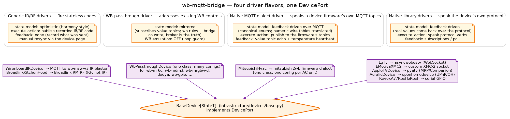
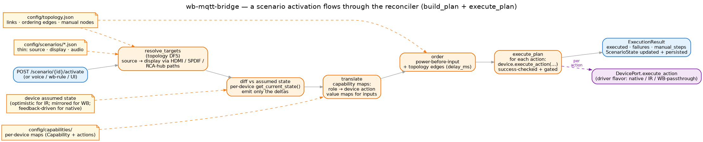

# Devices and scenarios

A **driver** is the code that knows how to talk to one physical thing. A **scenario**
is a thin declaration that asks the right combination of drivers to enter a coordinated
state — Logitech Harmony's "activity" idea. They sit on different floors of the same
hexagon: a driver is a *driven adapter* (it implements `DevicePort`); a scenario is
*domain logic* that runs through a reconciler and reaches drivers only through the port.

## Three driver flavors, one DevicePort



There are eight driver classes registered as entry-points in `pyproject.toml`. They
fall into three flavors, and each flavor exists because the *underlying* world
behaves differently — not because the architecture wanted variety.

### Native-library drivers (5) — speak the device's own protocol

The device has its own API; we use a Python library that speaks it. State comes back
real, not assumed.

| Driver | Library / protocol | Notes |
|---|---|---|
| `LgTv` | `asyncwebostv` (WebSocket, SSL) | Subscriptions for input/volume/foreground app; SSL cert pinned per TV. |
| `EMotivaXMC2` | `pymotivaxmc2` (XMC-2 socket protocol) | Bidirectional, zone-aware (main / zone2). |
| `AppleTVDevice` | `pyatv` (MRP + Companion) | Pairing tokens persisted; app-launching planned. |
| `AuralicDevice` | `openhomedevice` (UPnP / OpenHome) | OpenHome, not DLNA — Roon is the only alternative and needs a Core. |
| `RevoxA77ReelToReel` | serial GPIO via a tiny purpose-built board | Custom transport, but the same `DevicePort` contract. |

Trade-off: each one needs its own connection lifecycle (auth, reconnect, subscriptions);
state-reflection costs almost nothing because the protocol pushes events.

### Generic IR / RF drivers (2) — fire stateless codes

The device only accepts one-way IR or RF — no feedback path. The driver records what it
sent and *assumes* the device followed (Harmony's "optimistic state" model).

| Driver | Transport | Devices it covers |
|---|---|---|
| `WirenboardIRDevice` | MQTT publish to a Wirenboard IR blaster (`wb-msw-v3` IR codes by name) | The IR fleet: `mf_amplifier`, `ld_player`, `vhs_player`, `video`, `upscaler`. |
| `BroadlinkKitchenHood` | RF codes fired by a Broadlink RM (`broadlink` Python lib) | One appliance today — the kitchen hood — but the pattern is reusable. |

Trade-off: cheap and reliable to fire, but the driver can be *wrong* about the device
(someone used the real remote, the device timed out into standby, etc.), and its own
"skip if already there" check would then swallow the correcting command. Two ways out,
both with a human as the missing feedback channel: on the **device page**, a press that
was skipped because the bridge believes the device is already in that state offers a
short "tap again to send anyway" window — the second tap bypasses the check and fires
the code regardless; and on a **running scenario's page**, the "Device states…" dialog
lists every participating device (believed vs wanted state) and lets you re-send any
one device's commands, waits included. That's a deliberate trade — borrowed straight
from Harmony.

### WB-passthrough driver (1) — addresses existing Wirenboard controls

This one is special. Wirenboard already exposes every native control as
`/devices/{wb-device}/controls/{ctrl}`; the bridge doesn't need to "own" those
devices — it needs to *speak about them*. `WbPassthroughDevice` is a single driver
class fanned out by config: ~57 device configs across the house's 10 rooms, each
pointing at a real WB control (`wb-mr6c`, `wb-mdm3`, `wb-mrgbw-d`, `dooya` cover
motors, `wb-gpio` heating actuators, `hvac_*`, …).

Two structural details set it apart:

- **WB virtual-device emulation is OFF** for this flavor (`enable_wb_emulation = false`).
  That's the loop guard: if the bridge republished an incoming value-topic update as if
  it owned the device, it would feed back to the same value topic and oscillate with
  the real device. The fix is structural, not heuristic — the
  `WBVirtualDeviceService.publish_device_state_changes` callback is never added to the
  chain for this driver.
- **State is mirrored, not owned.** The driver subscribes to each `state_topic` and to
  its `…/meta/error` companion (a Wirenboard MQTT convention combining `r`/`w`/`p`
  error codes). Every incoming value flows through `update_state()` — the single
  chokepoint that triggers SQLite persistence + SSE callbacks. The broker is the
  truth; the bridge mirrors.

This driver is what makes "Irene controls the whole house through one catalog"
plausible: a native WB heating actuator and a non-WB LG TV are both visible through the
same `/devices/{id}` API surface, with the same room + capability metadata, even though
the bridge "owns" only one of them.

## How the three flavors differ on state

| Aspect | Native | Generic IR/RF | WB-passthrough |
|---|---|---|---|
| Who knows the real state | The device (we ask via the library) | Nobody — we record what we sent | The broker (`wb-mqtt-serial` publishes value topics) |
| How state arrives | Protocol subscriptions / poll | Inferred from the last command | MQTT `state_topic` subscription |
| Recovery from drift | Re-query the device | Manual resync (the device page button) | Automatic — next value-topic publish resets it |
| WB virtual device emulation | ON (configurable) | ON (configurable) | OFF (always — loop guard) |
| Outbound MQTT command | Optional (some drivers also publish) | Yes (IR code via MQTT) | Yes (one `/on`-suffixed publish per command) |

The reconciler doesn't care which flavor it's talking to — `DevicePort.execute_action`
and `get_current_state` look the same from inside.

## Scenarios on top

A scenario is **thin**. Its config is essentially:

```json
{
  "scenario_id": "movie_appletv",
  "room_id": "living_room",
  "roles": {"source": "apple_tv", "display": "lg_oled", "audio": "xmc2"}
}
```

The full set of which devices participate, what input each one needs, and in what
order — all of that is *derived at runtime* by the **reconciler** from three
declarative inputs: the **topology** (`config/topology.json` — the room's wiring,
declared once), the per-device **capability maps** (`config/capabilities/` — role →
device-action translation, with value maps), and each device's current **assumed
state**.



The pipeline runs in `build_plan` + `execute_plan`
(`domain/scenarios/reconciler.py`):

1. **Resolve targets.** DFS the topology graph from the chosen source to the chosen
   display (and from there to audio): each link's destination port is the input
   value that node needs to select. RCA-hub and other manual-only nodes drop into
   `manual_steps` — to be surfaced in the UI, not executed.
2. **Diff vs assumed state.** For each involved device, read
   `device.get_current_state()` and emit only the deltas. A device already in the
   right power state + right input contributes zero actions to the plan.
3. **Translate.** Capability maps turn symbolic role/input names into concrete device
   actions (e.g. `input: "hdmi3"` → "press the HDMI3 button" for an IR device, or
   "send `SetSource 3`" for the XMC-2). Value maps handle the asymmetric cases
   (multi-zone, toggle-only).
4. **Order.** Power-before-input by convention; topology-declared `first → then`
   ordering edges (with optional `delay_ms`) encode the observed HDMI-ARC + startup
   timing requirements.
5. **Execute.** For each `PlannedAction`, call `device.execute_action(action, params)`
   through the port. Success is *checked* — a failed step records the failure and
   does not block the rest; gated waits (poll for feedback / fixed IR delay) give a
   device time to actually transition before the next action arrives.

The result is an `ExecutionResult { executed, failures, manual_steps }`. The scenario's
own state (active / inactive, last switch time, last failure reason) is persisted
through `StateRepositoryPort` like any device's.

`switch_scenario` is the same pipeline run as a diff between two scenarios' target
states, **scoped to the scenario's room** — rooms activate independently, so two
rooms can each run their own scenario concurrently. `deactivate` runs the dedicated
power-off plan for its room and clears that room's persisted active-scenario
record, so a later bridge restart cannot resurrect a scenario the user explicitly
turned off. Each scenario-bearing room also appears on the Wirenboard side as one
«Сценарии» virtual device: an enum control showing the room's active scenario
(write a scenario id to activate, `none` to deactivate) plus a few transport
buttons (play/pause/stop, volume) that the bridge routes to whichever device holds
that role in the room's active scenario. **Process shutdown is deliberately transparent to the
hardware** — closing the bridge does *not* power devices off (and *keeps* the
active-scenario record: a still-active scenario picks up where it left off); doing
so would corrupt the optimistic assumed state the reconciler relies on when the
bridge comes back up.

## Where to go next

- **[Key concepts](key-concepts.md)** — the declarative inputs (topology, capability
  maps, configs) in depth, and how a scenario "inherits capabilities from devices".
- **[Interfaces](interfaces.md)** — the REST + MQTT surface the drivers and scenarios
  expose.
- **[Rooms](rooms.md)** — how `room_id` on the scenario constrains which devices it
  can name, and what that means for the voice assistant.
- **[How-to: a new device with an existing driver](../guides/howto-new-device.md)**
  and **[a new driver with a native library](../guides/howto-new-driver.md)** —
  the practical paths in.
