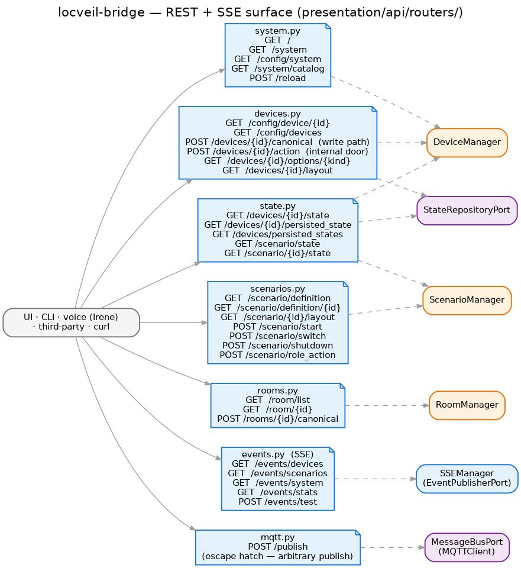
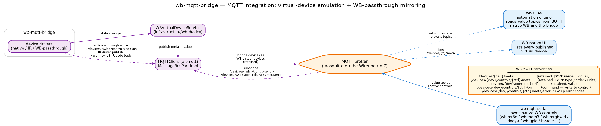

# Interfaces

The bridge presents itself two ways. **Over HTTP** it serves a typed REST + SSE
surface for the UI, the CLI, the voice assistant, and any third-party caller.
**Over MQTT** it is a participant on the Wirenboard broker — both publishing its
own devices as Wirenboard virtual devices, and subscribing back to existing WB
controls (the WB-passthrough flavor of driver). Both surfaces are driven by the
same domain managers behind the four ports.

## REST + SSE surface

Routers live in `presentation/api/routers/`. Each one is a thin adapter: it parses
the request, calls into a domain manager (or directly into a port), and returns a
typed Pydantic model the OpenAPI generator picks up — that's how the UI's TypeScript
client is regenerated without a Python dependency.

### System

| Method | Path | Purpose |
|---|---|---|
| `GET` | `/` | Service liveness — `ServiceInfo`. |
| `GET` | `/system` | Full system info — `SystemInfo`. |
| `GET` | `/config/system` | The redacted system config — `SystemConfigResponse`. |
| `GET` | `/system/catalog` | The voice / UI catalog — devices, scenarios, rooms, capabilities, in one payload. |
| `POST` | `/reload` | Reload configs at runtime — `ReloadResponse`. The reload sequence runs as an application-layer service; the router only schedules it. |

### Devices

| Method | Path | Purpose |
|---|---|---|
| `GET` | `/config/device/{id}` | The typed device config (the discriminated-union shape the UI codegen consumes). |
| `GET` | `/config/devices` | All device configs, keyed by id. |
| `POST` | `/devices/{id}/canonical` | **The public write path** — capability-language dispatch, the workhorse for "make a device do X" since the canonical-first cutover (both the web UI and a voice assistant drive it). Body `{capability, action, params, wait}`, resolved through the device's capability map to the native command (or the ordered steps of a sequence-form macro, inter-step delays included). Selection-style capabilities answer the reserved `set` action — `{"capability": "input", "action": "set", "params": {"value": "cd"}}` — whether the device switches inputs with one parametric command or a distinct command per input; the difference stays internal. With `wait` (the default) it holds briefly for the state echo and returns the post-action state — what a voice assistant speaks back; the web UI sends `wait: false` so rapid button presses fire-and-return. Also the seam the per-room Scenario Manager entities answer on. |
| `POST` | `/devices/{id}/action` | **The documented internal door** — the native, per-device dispatch through `DevicePort.execute_action` that `/canonical` resolves down to. Body: `{action, params, source}`; returns `CommandResponse` (typed per device). Kept as the imperative escape hatch (and the reserved `force`/`assume_state` desync path); not the public write contract. |
| `GET` | `/devices/{id}/options/{inputs\|apps}` | Option enumeration as a read: the available-inputs / installed-apps list, resolved through the capability's declared `list` query — or, for devices whose input set is fixed (one command per input, no list query), served straight from the capability map. Populates the UI dropdowns; keeps the action path purely imperative. |
| `GET` | `/devices/{id}/layout` | The backend-served runtime **layout manifest** — what UI controls go where, in which zones, in what order. The UI renders it; nothing about placement is baked into the UI bundle. |

### Scenarios

| Method | Path | Purpose |
|---|---|---|
| `GET` | `/scenario/definition` | All scenarios — list of `ScenarioDefinition`. |
| `GET` | `/scenario/definition/{id}` | One scenario's typed definition. |
| `GET` | `/scenario/{id}/layout` | Per-scenario layout manifest (the UI uses one tab per active scenario). |
| `POST` | `/scenario/start` | Activate a scenario — runs `build_plan` against the all-devices-off baseline. |
| `POST` | `/scenario/switch` | Switch the active scenario — runs `build_plan` against current assumed state and emits only the deltas. |
| `POST` | `/scenario/shutdown` | Deactivate — runs the power-off plan. |
| `POST` | `/scenario/role_action` | Send an action to a device by *role* (`source` / `display` / `audio`) on the active scenario rather than by id. The Harmony idea: "volume up the active activity's audio" without the caller knowing which device that is. |

### Rooms

| Method | Path | Purpose |
|---|---|---|
| `GET` | `/room/list` | All rooms — `RoomDefinitionResponse` list. |
| `GET` | `/room/{id}` | One room. |
| `POST` | `/rooms/{id}/canonical` | Room-scoped group actuation — body `{group, action, params, scope, wait}`. For utterances that name a capability rather than a device ("turn on the lights", "close the curtains"): the bridge resolves which devices the group means in that room and either drives the room's configured default device or fans out to every member, per `scope` (`auto`/`all`/`one`). Returns a per-member results list — which devices executed, were already at the target, were skipped, or failed — so the caller's confirmation can be honest. Fan-out is allowed only for benign groups (lights, covers); consequential groups like raw power refuse it. |

Membership is derived from the device fleet (each device's `room` field), not
from a `devices` array in `rooms.json`. See **[Rooms](rooms.md)** for the full
story.

### Problem reports

| Method | Path | Purpose |
|---|---|---|
| `POST` | `/reports` | The UI's "Report a problem" button. Body: `{free_text, context, ui_evidence}` — the user's words, the page they were on, and the browser-side evidence rings. The backend snapshots the rest (device states, persisted-vs-live diffs, active scenarios, scoped configs, today's logs, the recent-dispatch and MQTT-traffic rings), redacts credentials, packages one bundle, and files a ticket into the private reports repo (offline filings spool to disk and retry). Rate-limited; disabled unless `system.json` enables reporting. |
| `GET` | `/reports/evidence` | The same evidence, redacted, as a plain read — no ticket filed. `?entity_id=` anchors the scoping to a device and its topology neighbors. This is the seam the voice assistant calls when one of *its* problem reports involves the smart home, folding bridge evidence into its own bundle. Always available. |

### State

| Method | Path | Purpose |
|---|---|---|
| `GET` | `/devices/{id}/state` | Live in-memory state — typed per device. |
| `GET` | `/devices/{id}/persisted_state` | What's currently in the SQLite store for this device. |
| `GET` | `/devices/persisted_states` | All persisted device states, in one shot. |
| `GET` | `/scenario/state` | The active scenario's `ScenarioState`. |
| `GET` | `/scenario/{id}/state` | A specific scenario's persisted state. |

### Events (Server-Sent Events)

Three channels, each a long-lived `GET` that the UI subscribes to once and listens
to forever:

| Endpoint | Channel | Carries |
|---|---|---|
| `GET /events/devices` | `devices` | Device state-change + action-progress events. |
| `GET /events/scenarios` | `scenarios` | Scenario activate / switch / deactivate events; manual-step prompts. |
| `GET /events/system` | `system` | Reload, MQTT-broker connect/disconnect, errors. |
| `GET /events/stats` | — | Operational SSE stats (subscriber counts, queue depth). |
| `POST /events/test` | — | Test broadcast — dev affordance. |

Drivers emit through the injected `EventPublisherPort`; `SSEManager` (the only
implementation) fans events out per channel. A driver never imports presentation.

### MQTT escape hatch

`POST /publish` — arbitrary publish through `MessageBusPort`. Useful for one-off
diagnostics or wb-rule-side triggers from a script that's already talking REST. The
typed path for "make a device do X" is `POST /devices/{id}/canonical`, not this.

## MQTT integration with Wirenboard

The bridge is *both* a producer and a consumer on the same broker. That symmetry is
deliberate — it's what lets `wb-rules`, the WB native UI, and the bridge's own
managers share one view of the home.

### What gets published — virtual-device creation

`WBVirtualDeviceService` (`infrastructure/wb_device/service.py`) publishes each
bridge device as a **Wirenboard virtual device**: retained MQTT messages following
the Wirenboard convention, so the WB native UI and `wb-rules` discover them with no
extra configuration.

The convention, in five topic shapes:

| Topic | Retained | Payload | Purpose |
|---|---|---|---|
| `/devices/{dev}/meta` | yes | JSON: `{name, driver, …}` | Device-level metadata; lists it in the WB UI. |
| `/devices/{dev}/controls/{ctrl}/meta` | yes | JSON: `{type, order, units, …}` | Per-control metadata; declares its render type (`switch`, `range`, `text`, `pushbutton`, …) and display order. |
| `/devices/{dev}/controls/{ctrl}` | yes | scalar value | The control's current value — the topic both the bridge and `wb-rules` read. |
| `/devices/{dev}/controls/{ctrl}/on` | no | scalar value | The *write* topic — publishing here is how `wb-rules` (or the WB UI) commands a control. |
| `/devices/{dev}/controls/{ctrl}/meta/error` | yes | `r`/`w`/`p` codes (combined) | Per-control error flags; `r` = read error, `w` = write error, `p` = parse error. |

Setup happens once per device, *after* the MQTT client has connected and subscribed:

1. **Publish device meta** (retained). Name, driver, optional `device_type`.
2. **Publish each control's meta** (retained). The control list is derived from the
   device's capability map — each canonical command becomes a control with the
   right `type` (e.g. `power` ⇒ `switch`, `set_brightness` ⇒ `range`,
   `play` ⇒ `pushbutton`). One capability domain, `pointer`, is excluded
   (UI-only). Order is reused from the capability map's declaration order, so
   the UI renders controls in a stable, author-chosen sequence.
3. **Subscribe to each control's `/on`** so a command from `wb-rules` reaches the
   driver via `DevicePort.execute_action`.
Besides the device fleet, each **scenario-bearing room** gets one «Сценарии»
virtual device (`scenario_manager_<room>`): a text control holding the room's
active scenario id (write an id to activate, `none` to deactivate) plus a curated
row of transport pushbuttons (play/pause/stop, volume up/down) that the bridge
resolves against the room's active scenario at press time.

4. **Republish value topics** on every state change. The driver's
   `update_state(...)` chokepoint fires a callback chain: the WB service reads the
   capability-keyed slice of the state and publishes only the values that match
   declared controls.

WB emulation is **gated by `enable_wb_emulation`** in the device config (default
`true` for native + IR drivers, **always `false` for the WB-passthrough driver** —
that's the structural loop guard: the WB-passthrough driver mirrors an existing WB
control by subscribing to its value topic, so republishing the same value would
feed back to the same topic and oscillate).

### What gets subscribed — driver-side reads

Subscriptions vary by driver flavor:

- **Native-library drivers** typically don't subscribe to MQTT at all — they talk
  to the device's own protocol. The exception is the `power` topic if `wb-rules`
  needs to react to it, but that's the inbound side of WB emulation, not a driver
  subscription.
- **The IR driver** publishes IR codes by writing to the IR-blaster's MQTT control
  (`wb-msw-v3` IR-out topic). It subscribes to nothing — IR has no return channel.
- **The Broadlink driver** owns its own RF hardware; it doesn't touch MQTT directly,
  it only emits SSE state-change events through the bridge.
- **The WB-passthrough driver** subscribes to each declared `state_topic`
  (`/devices/<wb-dev>/controls/<ctrl>`) and its per-control `…/meta/error`
  companion. Every incoming value flows through `update_state()` (the single
  chokepoint for SQLite persistence + SSE callbacks), so the bridge's view stays
  in sync with whatever the real WB device + `wb-rules` are doing.

### Two writers, one truth

A WB-passthrough device often has *two* writers: `wb-rules` (or the WB UI) on one
side, and the bridge on the other. Both write to `/devices/<wb-dev>/controls/<ctrl>/on`;
both read `/devices/<wb-dev>/controls/<ctrl>` for the value. The broker's retained
value topic is the truth. The bridge mirrors it; it does not own it. This is what
lets the voice assistant "turn on kitchen light" through the bridge while a wall
switch + a `wb-rules` automation are also driving the same light — no fight, no
duplicated state machine.

## SSE channels in practice

Three channels, all multiplexed onto one HTTP connection per channel:

- **`devices`** — every device's state-change events plus action-progress messages
  (e.g. "scenario X executing step 3 of 6"). High-volume; the UI uses it to drive
  per-device pages live.
- **`scenarios`** — scenario lifecycle (`activated`, `switched`, `deactivated`) +
  any `manual_steps` the reconciler emits.
- **`system`** — reload, MQTT broker connect/disconnect, top-level errors. Low
  volume; intended for an operator dashboard.

The event format embeds `eventType` inside the JSON payload rather than using the
SSE `event:` field — this keeps the consumer code uniform regardless of channel.
Event ids are millisecond timestamps; SSE Last-Event-ID resumes are not used
(the channels are fire-and-forget; the UI re-reads state on reconnect).

## Home Assistant — planned

Today the integration target is Wirenboard. A future direction adds Home
Assistant: rather than publishing each device as a *Wirenboard* virtual device,
publish it as an HA MQTT-discoverable entity (`homeassistant/{component}/{node_id}/{object_id}/config`).
The same `WBVirtualDeviceService` shape applies — it would gain a sibling
`HADiscoveryService`, picking the right topic prefix and config shape per device
category. Nothing in the domain changes. No implementation today; flagged here so
the place to add it is obvious.

## Where to go next

- **[Devices and scenarios](devices-and-scenarios.md)** — driver flavors and what
  each one publishes / subscribes.
- **[Key concepts](key-concepts.md)** — how the capability map drives which
  controls a virtual device exposes.
- **[Rooms](rooms.md)** — what `/room/*` and the room field do for voice
  addressing.
- **[UI](ui.md)** — how the layout manifests at `/devices/{id}/layout` and
  `/scenario/{id}/layout` are consumed.
