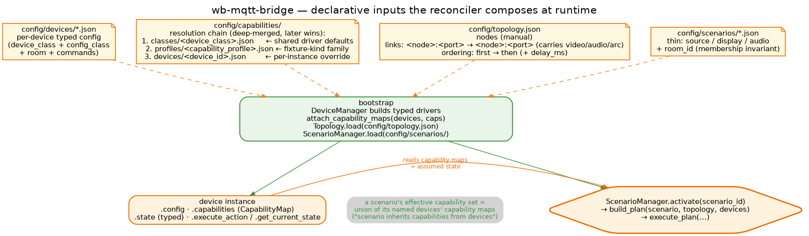
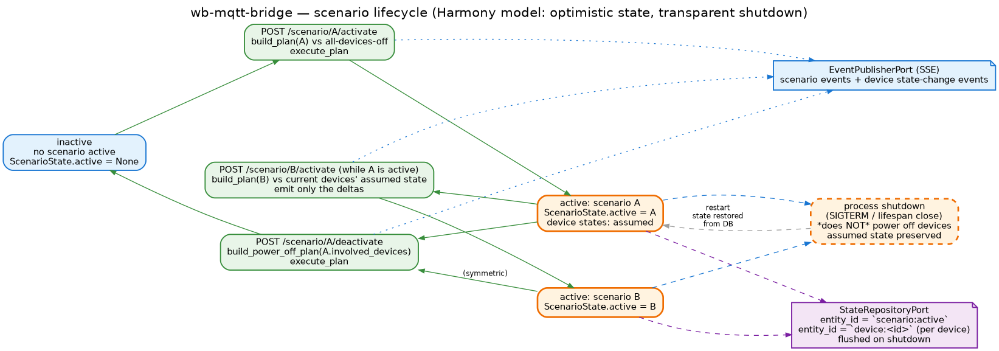

# Key concepts

Four declarative inputs — device configs, capability maps, the topology, scenarios —
are all the runtime needs. The reconciler reads them at activation time and decides
which actions to fire. This page is about how the pieces fit, and what
"a scenario inherits capabilities from devices" actually means at runtime.

## The four inputs, side by side



| Input | Lives at | What it declares | What it does not declare |
|---|---|---|---|
| **Device configs** | `config/devices/*.json` | The driver to instantiate (`device_class`), its typed config (`config_class`), the device's commands, its room, MQTT details. | What the device can *do* in scenario terms — that's the capability map. |
| **Capability maps** | `config/capabilities/{classes,profiles,devices}/*.json` | The canonical-domain view of a device: `power`, `input`, `volume`, `brightness`, `climate`, … each with its `kind`, `actions`, `select`, `gate`, optional `source_modes`, optional `fields`. | The wiring between devices — that's the topology. |
| **Topology** | `config/topology.json` | The physical signal graph: nodes (driver-backed *or* manual), links (`<node>:<port>` ⇒ `<node>:<port>`, `carries: ["video"|"audio"|"arc"]`), and ordering edges (`first → then` with optional `delay_ms`). | What scenarios exist — only the wiring. |
| **Scenarios** | `config/scenarios/*.json` | A *thin* selection: `source`, `display`, `audio`, optional `roles`, optional `room_id`. | Per-step sequences — derived from the three above. |

All four are hot-fixable JSON. Typed-Pydantic models validate every one of them at
load; an invalid file raises a clear `pydantic.ValidationError` at startup rather than
limping at runtime.

## The capability map, in detail

This is the linchpin. A capability map is a `{domain: Capability}` dictionary —
domains being `power`, `input`, `volume`, `brightness`, `climate`, `sensor`, etc. Each
`Capability` describes one canonical surface:

- **`kind`** — `stateful` (drives the reconciler's diff) or `momentary` (one-shot, no
  state-tracking).
- **`reconcile`** — defaults to `true`. Set to `false` when the device is reachable on
  the page / WB / HTTP but the *scenario* should not drive it (e.g. the upscaler
  auto-powers with its source — the reconciler should not also try).
- **`state_field` + `on_value`** — the field on `device.state` the reconciler reads to
  compute the diff. `on_value` defaults to `"on"` but can be `True`, `1`, or any other
  marker the driver actually publishes.
- **`actions`** — `{canonical_name: CapabilityAction}` mapping a canonical action
  (`turn_on`, `set_brightness`, …) to a native `command` (or a `sequence`), with
  optional `param_map` (rename canonical params to native) and fixed `params`
  (e.g. `{"zone": 2}` for an XMC-2 zone-2 action).
- **`select`** — input selection. Two forms: parametric (`command` + `param_map`, e.g.
  LG's `set_input_source(source=…)`) or value-mapped (`by_value`: one command per
  input, e.g. the IR amp's `input_cd`, `input_aux2`, …).
- **`gate`** — timing for stateful actions: `poll_timeout_ms` for feedback devices
  (poll the `state_field` to the target value), `delay_ms` for no-feedback IR.
- **`source_modes`** *(opt-in)* — for the *symmetric* source-side path: when a source
  device's `select` declares `source_modes`, the reconciler will engage the source's
  own output mode if the topology routes through it (e.g. LG TV `arc` → "be in
  internal mode" via `handle_home`).
- **`fields`** — read-only state surfaces (`sensor.temperature`,
  `climate.room_temperature`, `brightness.level`) with typed coercion and catalog
  metadata; drives parsing in the WB-passthrough driver and per-field display in the
  UI / voice catalog.

### Sequence actions (macros)

An action doesn't have to be a single native command. When one canonical intent
requires several presses on the real device, the action carries a **`sequence`** — an
ordered list of steps, each a small action of its own with its own `param_map` and
fixed `params`, plus an optional **`delay_after_ms`** pause before the next step (IR
gear in particular needs breathing room between presses). The bridge flattens the
sequence and executes the steps in order; if a step fails, the whole action fails and
the error names exactly which step broke.

Two theoretical examples make the shape concrete. A laser-disc player that must be
woken before its tray responds could expose a single canonical `playback.open_tray`:

```json
"open_tray": {
  "sequence": [
    { "command": "wake", "delay_after_ms": 500 },
    { "command": "tray" }
  ]
}
```

An old amplifier whose "direct" mode takes a mode press followed by a confirm press
could still present it as one canonical action:

```json
"direct_mode": {
  "sequence": [
    { "command": "mode", "delay_after_ms": 300 },
    { "command": "enter", "params": { "confirm": true } }
  ]
}
```

Callers never see the choreography: to the UI, the voice assistant, and the
Wirenboard card, `open_tray` is just another action — the canonical endpoint and the
scenario proxy expand and run the steps identically. No shipped capability map uses a
sequence yet; the mechanism exists so that when a device needs a macro, it is a JSON
edit to its map rather than driver code.

### Three-layer resolution

When `attach_capability_maps()` builds a device's effective map at bootstrap, it
walks three files in this order (later wins; deep-merged):

1. **`classes/<device_class>.json`** — *shared driver defaults*. Used by AV devices
   where the driver class *is* the capability shape (`LgTv.json`,
   `EMotivaXMC2.json`, `AppleTVDevice.json`, `AuralicDevice.json`,
   `RevoxA77ReelToReel.json`).
2. **`profiles/<capability_profile>.json`** — *fixture-kind family*. Used by
   WB-passthrough where one driver class hosts many distinct shapes: every relay
   light is `light_switch`, every paired switch+slider is `dimmable_light`, every
   `dooya` cover motor is `cover`, every heating loop is `heating_loop`, etc. The
   profile keeps the map authored once for the whole family.
3. **`devices/<device_id>.json`** — *per-instance override*. Home for the generic IR
   devices (`ld_player`, `mf_amplifier`, `vhs_player`, `video`, `upscaler`) and any
   one-off tweak.

Any of the three may be absent; an empty map means the device exposes nothing through
the scenario layer (it stays directly controllable — its public write path is
`POST /devices/{id}/canonical`, with `/action` as the documented internal door).

## The topology, in detail

The topology graph is the room's wiring declared *once* — every scenario references
it by source/display/audio names, never repeats it.

A **link** is one physical cable:

```json
{ "from": "appletv_living:hdmi", "to": "processor:source2", "carries": ["video", "audio"] }
```

`from` / `to` are `<node>:<port>`. The *destination* port is also the input value the
sink device must select — `processor:source2` means "the eMotiva on its `source2`
input" *and* "to receive this signal, the eMotiva must be switched to `source2`".

**Manual nodes** are signal elements switched by hand — typically because no driver
exists or none is wanted. The living-room topology declares the Dodocus RCA hub
(positions: `ld` / `vhs` / `reel` / `tape` / `phono`), the Revox B215 tape deck, the
Kuzma turntable, and the Sugden phono pre. When the reconciler resolves a path that
crosses one of these, the relevant `positions` text is surfaced as a `manual_step`
in the activation result — the UI prompts the human, the reconciler doesn't try to
automate it.

**Ordering edges** make wall-clock dependencies explicit:

```json
{ "first": "living_room_tv.power", "then": "processor.power",
  "reason": "TV must be on before the eMotiva (ARC handshake)" }
```

`delay_ms` adds a fixed wait when `first` is a no-feedback device (the upscaler's
4500 ms warm-up after the LD's IR power-on, for instance) — otherwise the
reconciler's gate polls the device's `state_field` until it transitions or the
timeout fires.

## "A scenario inherits capabilities from devices"

Scenarios declare *what* — which device plays which role — and the reconciler reads
the named devices' capability maps to learn *how*. The scenario file itself contains
no actions, no sequences, no commands, no params; that's what "thin" means in
`ScenarioDefinition`.

Concretely, when `ScenarioManager.activate("movie_appletv")` runs:

1. **Read the scenario.** `source = "apple_tv"`, `display = "lg_oled"`,
   `audio = "xmc2"`, `room_id = "living_room"`.
2. **Resolve targets via topology.** DFS from `apple_tv` to `lg_oled`, then
   `lg_oled` → `xmc2` for audio; collect each link's destination port as the input
   value its sink needs.
3. **Per involved device, look up its capability map.** `lg_oled` has a `power`
   capability (`stateful`, `feedback=true`, `state_field=power`) and an `input`
   capability with `source_modes=["arc"]`; the reconciler can now ask "should I turn
   the TV on?" and "should I tell it to enter ARC mode?".
4. **Diff & translate.** If `lg_oled.state.power != "on"`, emit `turn_on` (the
   canonical action) — translated by the capability map to `handle_power_on` (the
   driver method). If the input needs to change, emit `set_input(arc)` — translated
   by the capability map to whatever native `command` plus `param_map` the LG driver
   takes.
5. **Order & execute.** Apply ordering edges; execute through the port. Feedback
   devices wait on the `gate`'s `poll_timeout_ms`; IR devices wait `delay_ms`.

If a scenario references a device whose capability map lacks a needed domain (e.g.
the topology says the audio path goes through a device that has no `input`
capability), the reconciler logs a warning in the plan but does not abort — it
emits what it can and moves on, surfacing the warning back in the response.

The `room_id` invariant is enforced eagerly: `ScenarioManager` rejects a scenario at
load time if any device named by the scenario sits in a different room from
`room_id`. This is what lets the voice assistant scope scenario lookups to a room
without ambiguity.

## Lifecycle: activate, switch, deactivate, restart



Three calls cover the lifecycle. All three run the *same* `build_plan` +
`execute_plan` pipeline; the difference is what they diff against.

- **Activate** (`POST /scenario/start` when nothing's active in the room) — diff the
  scenario's target state against an "all-devices-off" baseline. Emits the full
  startup sequence. (The scenario id travels in the request body, not the path.)
- **Switch** (`POST /scenario/switch` while another is active in the room) — diff against
  the devices' *current* assumed state. The reconciler emits only the deltas; if
  scenario A and B share a display and an AVR, neither gets touched. This is the
  Harmony switching model.
- **Deactivate** (`POST /scenario/shutdown`) — power-off plan for the
  scenario's involved devices; topology ordering still applies in reverse.

**Rooms are the concurrency unit**: each scenario belongs to a room, and every
scenario-bearing room can have its own active scenario at the same time — starting
cartoons in the children's room leaves the living-room movie untouched. Each room's
active scenario id is persisted under its own `active_scenario:<room>` key. Each
involved device's state is persisted under its own `device:<id>` key — that's the
assumed state the next reconciler run will diff against.

### The Scenario Manager

Every scenario-bearing room is represented by one **Scenario Manager** entity
(`scenario_manager_<room>`), reachable exactly like a device through the canonical
command endpoint and listed in the catalog. Its `scenario` capability activates
(`set` with a scenario id) or deactivates (`off`) the room; any *other* capability
fired at it — volume, playback, menu — is resolved **at fire time** against the
room's active scenario: the bridge looks up which device holds that role right now
and executes there (the response's `executed_on` names it). The scenario page in
the web UI, voice, and the per-room «Сценарии» card in the Wirenboard UI all drive
this same entity — one resolution path for every client. When the room has no
active scenario, or the active one doesn't bind the role, the command fails with a
clear conflict error instead of guessing.

### Process shutdown is transparent

Closing the bridge — SIGTERM, lifespan close, `docker restart` — *does not* power
devices off. There is no "scenario shutdown sequence" run on process exit. The
reasoning is concrete: the optimistic assumed state the reconciler relies on would
go stale if the bridge powered everything down without way to verify. A clean
"deactivate" is the explicit user action, not a side effect of process lifecycle.

On restart, `DeviceManager` loads device states from the store (last known assumed
state per device), `ScenarioManager` rehydrates the active scenario id, and the
system is back where it was — the next scenario action diffs against the restored
state. Rehydration is tracking-only: the bridge marks the scenario active and sends
**no device commands at boot**, so a restart — whether a crash recovery, a software
update, or power returning after an outage — never turns equipment on or off by
itself. If the room drifted while the bridge was down, the scenario page shows the
difference and offers to reconcile on demand.

## Where to go next

- **[Devices and scenarios](devices-and-scenarios.md)** — the driver flavors that
  back the capability maps, and the reconciler diagram in its full glory.
- **[Interfaces](interfaces.md)** — the REST + MQTT surface the scenarios reach
  through.
- **[Rooms](rooms.md)** — how `room_id` constrains scenarios and what the voice
  assistant gets from it.
- **[How-to: a new AV scenario](../guides/howto-new-scenario.md)** — the practical
  path: thin definition + capability-map check + topology check.
