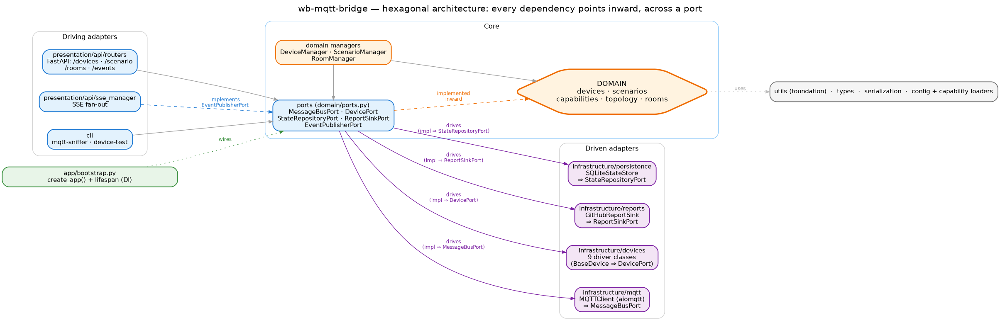

# Architecture overview

`locveil-bridge` is built as a **hexagon** — ports and adapters. The point isn't dogma;
it's that the parts that change often (device drivers, MQTT transport, persistence)
can be swapped without touching the parts that shouldn't (the domain logic: managers,
scenarios, capability maps, topology). Everything is wired by configuration and
discovered at startup; drivers are setuptools entry-points, configs are typed Pydantic
models, and the composition root is a single `lifespan` in `app/bootstrap.py`.

## The layers, and the one rule

Read it inside-out:

- **Domain — `domain/`.** Devices, scenarios, capabilities, topology, rooms — and the
  ports. The managers (`DeviceManager`, `ScenarioManager`, `RoomManager`) live here
  because they coordinate domain entities and depend only on the ports. The domain
  reaches none of the outer layers.
- **Ports — `domain/ports.py`.** Five small abstract contracts: `MessageBusPort`,
  `DevicePort`, `StateRepositoryPort`, `EventPublisherPort`, `ReportSinkPort`. These are the seams.
- **Driven adapters — `infrastructure/`.** The implementations: the nine device
  drivers (`BaseDevice` ⇒ `DevicePort`), the MQTT client (⇒ `MessageBusPort`), the
  SQLite store (⇒ `StateRepositoryPort`), the GitHub report sink (⇒ `ReportSinkPort`).
  Plus support code that doesn't sit on a port:
  the Wirenboard virtual-device emulator, the capability loader, the config manager.
- **Driving adapters — `presentation/api/` and `cli/`.** FastAPI routers, the SSE
  fan-out, and the console tools. They call *into* the domain through the ports.
- **Composition root — `app/bootstrap.py`.** `create_app()` + a `lifespan` context
  manager wires everything together: loads configs, opens the store, creates the MQTT
  client, instantiates the device fleet from typed configs, attaches capability maps,
  and injects each driver's `EventPublisherPort` (the SSE manager) — so a driver can
  surface a state-change without importing presentation.
- **Foundation — `utils/`, plus the `infrastructure/config` + `infrastructure/capabilities`
  loaders.** Pure cross-cutting code; depends on nothing upward.

The rule the whole thing rests on: **every dependency points inward, across a port.**
A driver depends on `DevicePort`, not the other way around; a manager depends on
`StateRepositoryPort`, not on SQLite. As of 2026-05-25 the rule holds structurally —
`domain/` imports nothing from `infrastructure/` or `presentation/`, and
`infrastructure/` imports nothing from `presentation/`. There are no exceptions: the
last back-edge (the `POST /reload` handler once constructed an MQTT client directly)
has been removed — the reload sequence lives in an application-layer service
(`app/reload_service.py`) that the composition root wires, and the router only
schedules it. The rule is enforced in CI — six `import-linter` contracts
(`lint-imports` from `backend/`) fail the build on any backwards or cross-layer
import, with an empty exception list.

## The five ports

Defined in `domain/ports.py`; implemented by infrastructure (mostly) and one by
presentation (`EventPublisherPort`).

| Port | Shape (in one line) | Used by | Implemented by |
|---|---|---|---|
| `MessageBusPort` | `publish` / `subscribe` / `connect` / `disconnect` | `ScenarioManager`, WB virtual-device service | `infrastructure/mqtt/MQTTClient` (aiomqtt) |
| `DevicePort` | the application-facing device contract: lifecycle, `execute_action`, state access, command introspection, message routing, room | `DeviceManager`, every `Scenario` | `infrastructure/devices/base.BaseDevice` (each of the 9 drivers subclasses it) |
| `StateRepositoryPort` | `load` / `save` / `bulk_save` / `delete` / `list_entities` | `DeviceManager`, `ScenarioManager` | `infrastructure/persistence/sqlite.SQLiteStateStore` |
| `EventPublisherPort` | `publish_device_event(event_type, data, event_id)` | every driver (`BaseDevice`) | `presentation/api/sse_manager.SSEManager` |
| `ReportSinkPort` | `file_report(...)` — hand a problem report to an external tracker | `ReportService` (problem reports) | `infrastructure/reports/GitHubReportSink` |

`DevicePort` is deliberately richer than a raw transport. The domain talks to a device
as "execute this action, give me current state, tell me your room", not "send this byte
sequence on that wire" — the transport (MQTT, HTTP, IR-via-Broadlink, serial) is the
adapter's private concern.

`EventPublisherPort` is the one port implemented by presentation rather than
infrastructure. Drivers emit state-change and progress events through it; the SSE
manager fans them out to `GET /events/{devices,scenarios,system,stats}` for the UI.
Injecting it at bootstrap is what lets a driver stay free of any presentation import.

## The boundary, in practice

A small set of conventions keeps the hexagon working — none of them are aspirations:

- **Configs are typed.** Every `config/devices/*.json` declares `device_class` (driver)
  and `config_class` (Pydantic model). The base lives in `domain/devices/config.py`;
  per-driver subclasses live in `infrastructure/config/models.py`. There is no
  dict-shaped config path.
- **State is typed.** Every driver is `BaseDevice[StateT]` where `StateT` extends
  `BaseDeviceState`. Drivers don't return free-form dicts; `execute_action` returns a
  typed `CommandResponse[StateT]`.
- **Drivers register as entry-points.** `pyproject.toml`
  `[project.entry-points."locveil_bridge.devices"]`. `DeviceManager.load_device_modules()`
  discovers them at startup; `config_class` and `device_class` resolve via
  `utils/class_loader.py`.
- **State is persisted through the port — and restored at startup.** `DeviceManager`
  keys device state under `device:{device_id}` via `SQLiteStateStore`, and each device
  re-hydrates its snapshot at boot *before* `setup()` runs (so anything the device
  learns live wins over the snapshot). Read back via
  `GET /devices/{id}/persisted_state`; flushed on shutdown. Scenarios persist their
  active state the same way: it survives a restart while the scenario is active, and
  is cleared by an explicit `deactivate`.
- **WB virtual-device emulation is a driven concern.** `WBVirtualDeviceService`
  publishes each device as a Wirenboard virtual device on MQTT (retained device meta +
  per-control meta + value topics) so the bridge's devices appear natively in the
  Wirenboard ecosystem. Gated by `enable_wb_emulation` in config; set up after MQTT
  connects.

## Lifecycle, in one sweep

`app/bootstrap.py::create_app()` returns a FastAPI app with a `lifespan` that runs:

1. Load `config/system.json` and `config/devices/*.json` (typed).
2. Open `SQLiteStateStore`.
3. Create `MQTTClient` (optionally wrapped by `WirenboardMaintenanceGuard`).
4. `DeviceManager` discovers driver entry-points, builds each driver from its typed
   config (a device that fails `setup()` is kept registered as disconnected, not
   dropped), attaches per-device capability maps, and injects the SSE
   `EventPublisherPort`.
5. Connect MQTT + subscribe each device's topics. Set up per-device WB emulation.
6. Initialise `RoomManager` (derives membership from the device fleet) and
   `ScenarioManager` (loads `config/scenarios/*.json`, attaches the reconciler).
7. Inject dependencies into the routers; install the OpenAPI override that adds the
   discriminated union of state models to `/openapi.json` (the contract the UI
   consumes).

On shutdown: SSE drain, flush pending state persistence, cancel background tasks, and
mark every published WB virtual-device card offline on the broker (so a stopped bridge's
devices don't keep looking live in the Wirenboard UI). The scenario and device shutdown
is **transparent to the hardware** — it does *not* power devices off; that would corrupt
the optimistic assumed state the reconciler relies on. Powering off is the explicit
`deactivate` action. Startup is symmetric about failure: if it dies partway, the
already-acquired resources (state store, MQTT connection, device sockets) are released
before the process exits, rather than leaking into a hung process.

## Where to go next

- **[Devices and scenarios](devices-and-scenarios.md)** — the nine drivers, the
  IR / native-library / WB-passthrough distinction, and how scenarios sit on top.
- **[Key concepts](key-concepts.md)** — topology, capability maps, configs, the
  reconciler; how the declarative pieces play together; scenario inheritance, startup
  and switching.
- **[Interfaces](interfaces.md)** — the REST + MQTT surface; virtual-device emulation;
  the SSE event channels.
- **[Rooms](rooms.md)** — what the room concept buys scenarios and the voice
  assistant, and how membership is derived.
- **[UI](ui.md)** — the Harmony-style remote, runtime layout manifests, build-time
  codegen across the `backend/`↔`ui/` seam.
