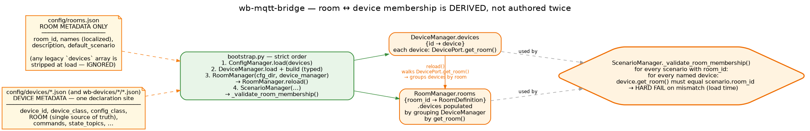
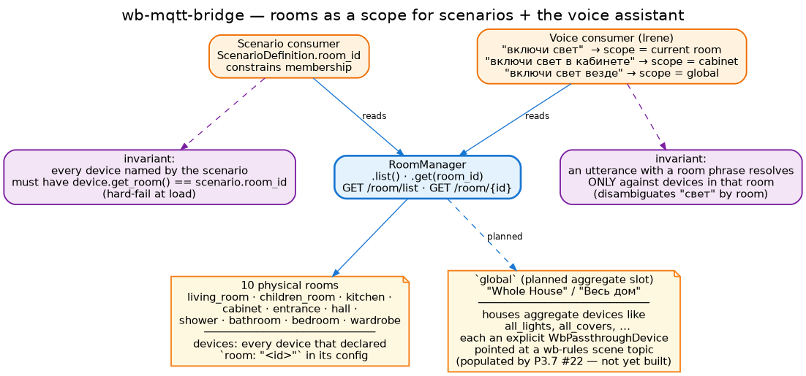

# Rooms

Rooms exist to **scope**. They are the unit a scenario constrains its devices to,
the unit a voice utterance resolves against, and the unit the UI uses to organise
its catalogs. They carry **no behaviour** — no automation logic, no state, no
side-effects — just spatial metadata and the membership the bridge derives from it.

## The room set

`config/rooms.json` declares 11 rooms — 10 physical + one special:

| Room id | Name (en) | Notes |
|---|---|---|
| `living_room` | Living Room | TV, processor, AV stack, scenarios. |
| `children_room` | Children Room | TV + Apple TV. |
| `kitchen` | Kitchen | Smart appliances. |
| `cabinet` | Study | Home office. |
| `entrance` | Entrance | Entry hall. |
| `hall` | Hall | — |
| `shower` | Shower | — |
| `bathroom` | Bathroom | — |
| `bedroom` | Bedroom | — |
| `wardrobe` | Wardrobe | — |
| `global` | Whole House | **Planned aggregate slot** — see below. |

Every room declares localised names (`en` / `ru` / `de`), a short description, and
an optional `default_scenario`. Nothing about which devices live in the room — that
comes from the devices themselves.

The `global` room is the home for **aggregate devices** (e.g. `all_lights`,
`all_covers`) that don't belong to one room but address several at once. Each
aggregate is an explicit `WbPassthroughDevice` whose `/on` topic a `wb-rules` scene
listens on; this lets a single voice utterance ("включи свет везде" — turn on the
lights everywhere) hit one device. The aggregate housing is in `rooms.json` today;
the aggregate devices themselves are not yet authored (planned).

## Membership is derived, not authored twice



Every device declares its room **once**, in its own config file:

```json
{
  "device_id": "cabinet_spots",
  "device_class": "WbPassthroughDevice",
  "config_class": "WbPassthroughDeviceConfig",
  "room": "cabinet",
  …
}
```

`DevicePort.get_room()` projects that to the domain. `RoomManager.reload()` walks
`DeviceManager.devices` at startup, groups them by `get_room()`, and populates
each `RoomDefinition.devices` array. Any legacy `devices` array still present in
`rooms.json` is stripped at load and ignored — there is one declaration site per
device, period.

This is a recent refactor. Before it, `rooms.json` carried its own `devices` lists
that had to be kept in sync with the device configs; during a bulk-onboarding pass
the two drifted by 19 devices before anyone noticed. The fix was structural, not
procedural: derive membership at runtime, drop the second source. Drift is now
impossible by construction.

Bootstrap order matters and is enforced in `app/bootstrap.py`:

1. `ConfigManager.load(devices)` — typed configs in memory.
2. `DeviceManager.load_device_modules()` + build — every device instantiated with
   `get_room()` available.
3. `RoomManager(cfg_dir, device_manager).reload()` — walks the populated
   `device_manager.devices` and groups.
4. `ScenarioManager(...)` — runs `_validate_room_membership()` and hard-fails on
   mismatch.

A device that declares `room: "kitchen"` while `"kitchen"` is missing from
`rooms.json` is still *functional* (its actions work, its state persists); it
simply won't appear in any room catalog projection. A warning lands in the log.

## The room-membership invariant

`ScenarioDefinition.room_id` is optional, but **if set**, every device named by the
scenario must declare the same room. `ScenarioManager._validate_room_membership()`
enforces this at load:

```
scenario movie_appletv (room_id="living_room")
  roles.source     = "apple_tv"      → get_room() == "living_room"  ✓
  roles.display    = "lg_oled"       → get_room() == "living_room"  ✓
  roles.audio      = "xmc2"          → get_room() == "kitchen"      ✗  HARD FAIL
```

The check is eager and noisy — a misconfiguration fails at startup rather than at
the first activate. The invariant is what makes the voice scope unambiguous: when
"movie_appletv" is offered as an activatable scenario in the living room, every
participating device is guaranteed to live there.

## Rooms in use



### As a scenario constraint

`room_id` on a scenario binds it to a room. It's not a tag; it's a scope check.
The benefit is operational: the voice assistant can list "what scenarios run in
the living room" without scanning every scenario's devices to infer the room — it
just filters by `room_id`. Same for the UI's per-room scenario picker.

The constraint is per-scenario, not global. A scenario without `room_id` can name
devices from any room (multi-room scenarios are legal — none exist today, but the
mechanism is there).

### As a voice-assistant scope

The voice assistant (Irene) addresses devices through this bridge using the
canonical catalog (`GET /system/catalog`), which is room-keyed. A typical
utterance flow:

- **Implicit scope** — "включи свет" (turn on the lights). The voice client knows
  which room it physically sits in (one Irene satellite per room, planned); the
  device lookup is scoped to that room. If two `light_switch`-capable devices
  exist in the room, capability + label disambiguates; if many, the catalog's
  `default` per capability picks one.
- **Explicit scope** — "включи свет в кабинете" (turn on the lights in the study).
  The room phrase resolves to `cabinet`; lookup is scoped there regardless of
  where the utterance came from.
- **Whole-house scope** — "включи свет везде" (turn on the lights everywhere).
  Resolves to the `global` room and addresses the aggregate device(s) housed
  there.

The room boundary is what disambiguates the "свет" (light) noun in a house with
many lights. It is also what bounds the *blast radius* of a misrecognition — a
heard-wrong utterance in the bathroom cannot accidentally drive the living-room
TV; the catalog won't surface it.

## Catalog and rooms

`GET /system/catalog` and `GET /room/list` are the two read paths used by the
voice client and the UI. The catalog projects devices, scenarios, and capabilities
grouped by room; the room list returns the metadata + derived membership of every
room. Both are populated from the same `RoomManager.rooms` dictionary, so they
can't disagree.

A device that declares no room appears in `GET /system/catalog` under no room
section (it is reachable through `/devices/{id}/*`, but no voice utterance with a
room scope will find it). This is a deliberate fallback rather than a hard error
— some devices (the IR fleet's video processor, for instance, in early
configurations) genuinely don't have a room until the topology assigns one.

## Where to go next

- **[Key concepts](key-concepts.md)** — where `room_id` lives in
  `ScenarioDefinition` and how the catalog uses it.
- **[Interfaces](interfaces.md)** — the `/room/*` and `/system/catalog` endpoints.
- **[Planned: voice setup](../planned/voice-setup.md)** — the voice-assistant
  integration that consumes rooms.
