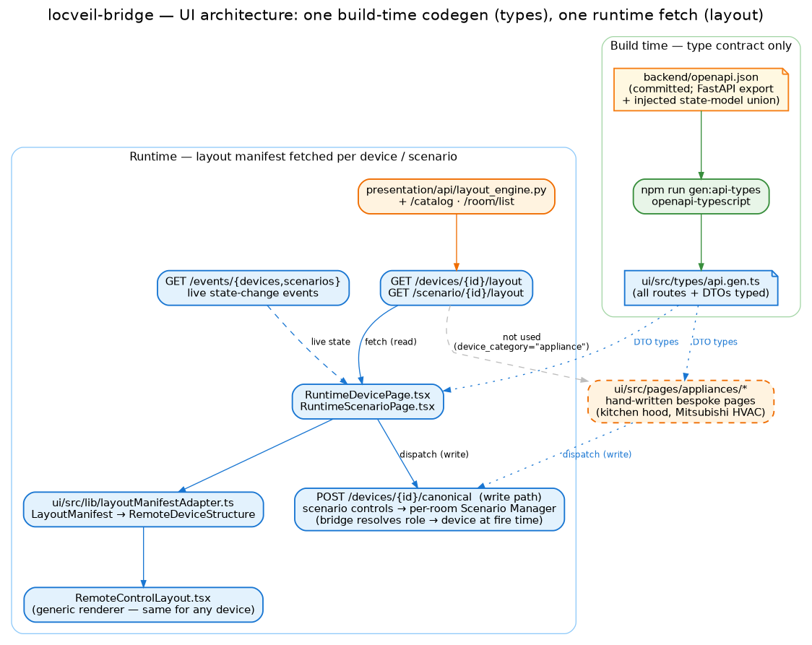
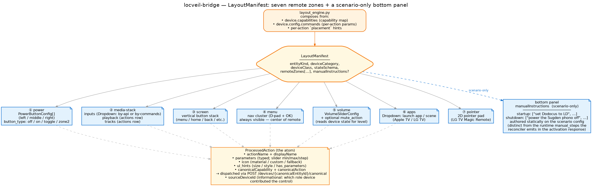

# UI

The UI consumes the backend through two contracts and nothing else. At **build
time** it generates TypeScript types from `backend/openapi.json` — no Python in the
build, no AST parsing of Pydantic classes. At **runtime** it fetches a
**layout manifest** per device or scenario and renders it through a single generic
component. Placement, ordering, parameters, icons — every visual decision is
data-driven; there is no hand-coded device page.

(Appliances are the deliberate exception — see the bottom of this page.)

## The two contracts

### Build-time — types, and only types

The UI build has one codegen step: `npm run gen:api-types` runs
`openapi-typescript` against `backend/openapi.json` to produce
`ui/src/types/api.gen.ts`. Every REST route and every DTO — including the
discriminated union of per-device state models that `_install_openapi_with_state_models`
injects into `/openapi.json` — lands in this one file. The UI imports its types
from `api.gen.ts` and from nothing else that originates on the backend.

This is what the rest of the architecture buys: no `pip install -e ./backend`
anywhere in the UI Dockerfile, no `python3 -c "ast.parse(...)"` subprocess, no
silent breakage when a Pydantic field is renamed. A backend type change either
shows up in the next `gen:api-types` run as a TypeScript diff or doesn't show up
at all (and then it's a backend bug — the model isn't reaching OpenAPI).

### Runtime — one fetch, one renderer

For every device and every scenario, the UI calls `GET /devices/{id}/layout`
or `GET /scenario/{id}/layout`. The backend's `layout_engine.py` composes a
`LayoutManifest` from the device's capability map, its config commands, and any
per-action `placement` hints; the response is typed in OpenAPI like every other
endpoint. The UI then:

1. Fetches the manifest in `RuntimeDevicePage.tsx` (or `RuntimeScenarioPage.tsx`).
2. Subscribes to `GET /events/devices` (or `/events/scenarios`) for live state.
3. Adapts the manifest via `layoutManifestAdapter.ts` into the
   `RemoteDeviceStructure` the renderer expects.
4. Renders through `RemoteControlLayout.tsx` — *the same component for every
   device*. No per-device React.

Add a new IR device, add an `inputs` value to its config — the next `/devices/{id}/layout`
response is what changes; the UI bundle does not.

## Two device categories, two UI shapes

`device_category` on a device config picks the UI shape:

| Category | Examples | UI |
|---|---|---|
| **`device`** | TV, AVR, Apple TV, streamer, IR fleet, reel-to-reel | **Harmony-style remote** — the layout manifest pattern above. |
| **`appliance`** | kitchen hood, the Mitsubishi air conditioners | **Hand-written bespoke page** in `ui/src/pages/appliances/`. The manifest endpoint is not consumed. |

The split is deliberate. A remote-style layout works for the canonical AV stack
(power, source, channel-up, volume, menu, transport, apps, pointer) — there's a
well-defined vocabulary, and a manifest captures it. An appliance has the
opposite problem: a kitchen hood is a few sliders and a light, a vacuum is a map
and a room picker, an oven is a temperature + timer + cycle. Forcing them through
the remote vocabulary would constrain expression; giving each its own page makes
it cheap to author one and ignore the others.

Shipped appliances today: the **kitchen hood** and the **three Mitsubishi air
conditioners** (a native climate panel). They render from `ui/src/pages/appliances/`,
reached through the normal `/devices/:deviceId` route — the page is chosen from a
registry keyed by device id. (Full detail at the bottom of this page.)

## Anatomy of a layout manifest

A manifest is a frozen Pydantic model (`presentation/api/layout_manifest.py`)
mirrored as a TypeScript type (camelCase JSON, snake_case in Python). At the
top it carries metadata — `entityKind` (`device` / `scenario`), `deviceCategory`,
`deviceClass`, `stateSchema` (the JSON-Schema fragment the UI uses to type
live-state payloads). Under that, **seven remote zones** plus a **scenario-only
bottom panel**. Each is optional.

### The seven remote zones

| Zone | Shape | What it renders |
|---|---|---|
| ① `power` | `PowerButtonConfig[]` (left / middle / right) | Up to three power buttons (`power-off`, `power-on`, `power-toggle`, `zone2-power`). If a press is skipped because the bridge believes the device is already in that state, the button pulses and a banner offers a few seconds to tap again — the second tap sends the command anyway (the escape hatch for a device switched behind the bridge's back). |
| ② `media-stack` | `inputs` (Dropdown) + `playback` (actions row) + `tracks` (actions row) | Source selection + transport. Dropdown options are either fetched at runtime (devices that can report their list, like a TV's inputs) or baked into the manifest as a fixed set (IR/relay-style); either way, picking an option issues the same "set the input" command through the canonical endpoint. |
| ③ `screen` | Vertical button stack | Menu, home, back, info — the buttons that live to the left of the D-pad. |
| ④ `menu` | Nav cluster | The D-pad + OK. Always rendered, even if all five slots are empty (it anchors the layout visually). |
| ⑤ `volume` | `VolumeSliderConfig` + optional `mute_action` | Vertical slider reading the device state's `valueField`; zone-aware (XMC-2 main / zone2). |
| ⑥ `apps` | Dropdown | App launching (Apple TV / LG webOS). |
| ⑦ `pointer` | 2D pad | The LG TV Magic Remote pointer. |

### The bottom panel — `manualInstructions` (scenario only)

A scenario's remote often needs to surface authored notes that cannot be
automated: "set the Dodocus RCA hub to the LD position", "power the Sugden
phono pre on". These live in the scenario config and ride on the manifest as
`manualInstructions`:

| Field | Shape | Purpose |
|---|---|---|
| `manualInstructions.startup` | `string[]` | Notes shown when the scenario is offered / activated — checked off by the user. |
| `manualInstructions.shutdown` | `string[]` | Notes shown on deactivation. |

The UI renders them as a section beneath the seven zones. The field is omitted
on device manifests.

**Don't confuse this with the runtime `manual_steps`.** The reconciler also
emits `manual_steps` *at activation time* when the resolved topology path
crosses a manual node (e.g. the Dodocus RCA hub mapped to its `ld` position).
Those land in the `POST /scenario/start` response, not on the manifest, and
the UI surfaces them as a toast / prompt during the activation flow. The
`manualInstructions` panel is *static* (always visible when the scenario page
is open); `manual_steps` is *dynamic* (one-shot, per-activation).

### The atom — `ProcessedAction`

Every renderable button is a `ProcessedAction`:

- `actionName` and `displayName` (the latter localised per device language).
- `parameters` — typed slider min/max/step, range/string/integer/boolean types,
  defaults. Validated on the way out.
- `icon` — material-icon name + variant, with a fallback string; resolved
  UI-side by `IconResolver.ts`.
- `uiHints` — button size, style (`primary` / `secondary` / `destructive`),
  whether the action takes parameters (drives a popover).
- `params` — *fixed* native params the UI must always send (e.g. the XMC-2's
  `power_off` always carries `{zone: 1}`; `set_volume` always carries
  `{zone: 2}`).
- `canonicalCapability` / `canonicalAction` — on **scenario** manifests, the
  canonical `(capability, action)` tuple a control dispatches through the room's
  Scenario Manager entity (see below); the bridge resolves it to the right role
  device at fire time.

## Scenario manifests — a render projection over the Scenario Manager

`GET /scenario/{id}/layout` returns the same `LayoutManifest` type, composed from
the scenario's role devices — the `display` device contributes the screen and menu
zones, the `audio` device the volume slider, and so on. But since the canonical-first
cutover the manifest is a **pure render projection**: it decides *what
controls appear where*, not *where commands go*. Every inheritable control carries a
canonical `(capability, action)` tuple plus the manifest's `canonicalEntityId`, and
the UI dispatches it **canonically against the per-room Scenario Manager entity**
(`scenario_manager_<room>`) — the power zone as `scenario.set`/`scenario.off`, an
inherited control as its capability tuple. The **bridge resolves the role → device at
fire time**, so a stale manifest can never target the wrong device, and "volume up the
active activity's audio" reaches the AVR because the *entity* knows which device holds
the `volume` role right now — not because the button was pre-addressed to it. Scenario
manifests deliberately render **no** input-selection control (inputs are a setup-time
concern, not a running-activity one). The one exception is non-inheritable, list-backed
domains like Apple TV **apps**, which still resolve against the role device directly.

This is what makes scenario pages feel like one Harmony activity: it's a remote
for the *whole stack*, assembled from the right pieces of each participating
device's manifest, all speaking to one entity.

While a scenario is running, a small **"Device states…"** button under its remote
opens a repair dialog: every participating device with what the bridge believes
its state to be versus what the scenario wants. If a device disagrees with what
you actually see in the room (someone used its physical remote, it timed out into
standby), tap its row — it expands to the exact commands and waits that would be
sent — and confirm to send them anyway, bypassing the "already there" checks. You
are the feedback channel the one-way devices don't have.

## Live state — SSE, not polling

`RuntimeDevicePage` opens one SSE connection per page (`GET /events/devices`),
filters events by `device_id`, and updates the React state. The renderer reads
the live state for slider values (`valueField`), toggle highlights (`power`),
and dropdown selections (the catalog reflects the device's `state.input`). The
manifest itself is fetched once per page load — it does not change between
renders.

System events (`/events/system`) and scenario events (`/events/scenarios`) feed
the navbar and the global toast lane.

## Build, deploy, configure

The UI ships as a static React/Vite bundle served by nginx. Two contract files
travel with the build: `backend/openapi.json` (for types) and
`backend/config/device-state-mapping.json` (a tiny lookup used by the codegen).
The build resolves them from `../backend` when run from `ui/`, or from
`backend/` when run inside a Docker build context that's the repo root.

Runtime configuration is **injected at container start** — `envsubst` on
`nginx.conf.template` parameterises the backend network location; a small
`runtime-config.js` shim does the same for the browser→MQTT WebSocket URL. The
defaults preserve `192.168.110.250` so existing deploys are unchanged.

## Appliance pages — the deliberate exception

Appliances *do not* call `/devices/{id}/layout`; instead, they render through a
hand-authored page and drive the device the same way every other page does — the
canonical write path (`POST /devices/{id}/canonical`) plus `/system/catalog` for the
value vocabulary and `/events/devices` for live state. How it's wired today:

- One file per appliance kind under `ui/src/pages/appliances/` (e.g. `HvacPanel.tsx`,
  the kitchen-hood page).
- An `index.ts` registry mapping **`device_id` → page component**.
- No separate `/appliance/:id` route: appliances are reached through the normal
  `/devices/:deviceId` route, which looks the device up in the registry and renders its
  bespoke page instead of the generic runtime remote.

Shipped today: the **three Mitsubishi air conditioners** (`bedroom_hvac`,
`living_room_hvac`, `children_room_hvac`) via `HvacPanel.tsx` — a native mode/fan/vane
grid with enum-value icons resolved through the shared icon layer — and
the **kitchen hood**. See **[Planned: appliance pages](../planned/appliance-pages.md)**
for the appliance UI's design history and what's still on the roadmap.

## Where to go next

- **[Interfaces](interfaces.md)** — the REST + SSE endpoints the UI consumes.
- **[Devices and scenarios](devices-and-scenarios.md)** — how the capability
  map feeds the layout engine.
- **[Planned: device setup](../planned/device-setup.md)** — the not-yet-built
  device admin UI.
- **[Planned: appliance pages](../planned/appliance-pages.md)** — the
  appliance UI shape.
