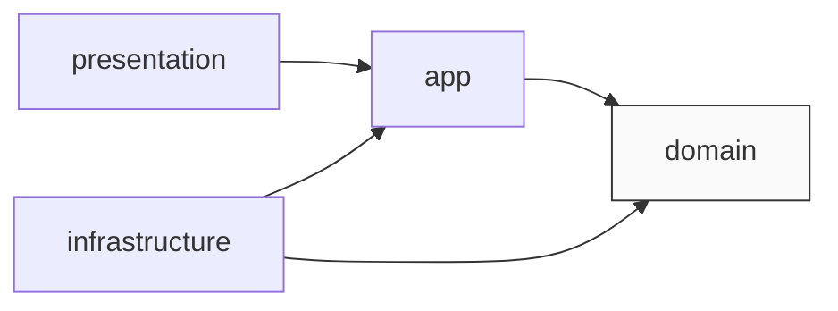
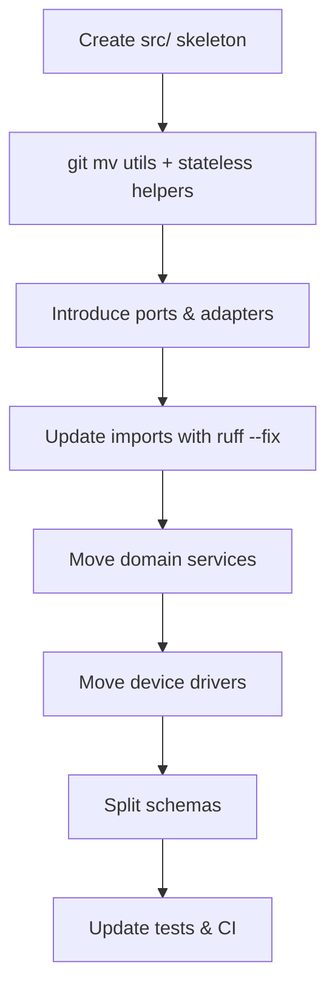

# Codebase Restructuring Plan: Domain-Centric Architecture

> **Audience:** project maintainers & contributors  
> **Goal:** migrate *wb-mqtt-bridge* from the current mixed layout to a clean, domain-centric (DDD/Hexagonal) structure without rewriting core logic.

---

## 1. Why This Change?
1. **Discoverability** – domain logic, API code, and drivers are currently mixed under `app/` and `devices/`.
2. **Testing** – unit tests must import FastAPI & MQTT side-effects today.
3. **Extensibility** – adding new UIs or persistence layers requires reaching across module boundaries.

A domain-centric structure isolates **what** the application does (business rules) from **how** it talks to the outside world (HTTP, MQTT, SQLite, etc.).

---

## 2. Target Folder Layout (after migration)
```text
src/wb_mqtt_bridge/
├─ __init__.py
├─ __version__.py
├─ app/                  # application bootstrap (FastAPI instance)
├─ domain/               # pure business logic (no I/O)
│   ├─ devices/
│   ├─ scenarios/
│   └─ rooms/
├─ infrastructure/       # adapters / gateways
│   ├─ mqtt/
│   ├─ persistence/
│   └─ devices/          # concrete device drivers
└─ presentation/
    └─ api/              # FastAPI routers & HTTP schemas
```

### Dependency Rule

*   **domain** has *no* imports from the other layers.
*   **infrastructure** is allowed to import from **domain** to implement interfaces (ports).
*   **presentation** (FastAPI) depends on **app** and indirectly on **domain** via services.

---

## 3. File-by-File Mapping
| Current Location | New Location | Change Required |
| --- | --- | --- |
| `app/device_manager.py` | `domain/devices/service.py` | Replace MQTT calls with `DeviceBusPort` interface. |
| `devices/*.py` | `infrastructure/devices/*/driver.py` | Move unchanged; implement `DeviceDriver` ABC. |
| `app/mqtt_client.py` | `infrastructure/mqtt/client.py` | No logic change. |
| `app/state_store.py` | `infrastructure/persistence/sqlite.py` | No logic change. |
| `app/routers/*` | `presentation/api/routers/*` | Update import paths. |
| `app/schemas.py` (API‐facing) | `presentation/api/schemas.py` | Split internal vs HTTP models. |
| `app/schemas.py` (domain models) | `domain/*/models.py` | Move intact. |
| `app/main.py` | `wb_mqtt_bridge/app/main.py` | Remains the FastAPI entry-point; adjust imports & wiring. |

---

## 4. Migration Checklist


1. **Create `src/` layout**  
   *Add `tool.setuptools.package-dir` → `"" = "src"` in* `pyproject.toml`.
2. **Move low-level utilities** (`serialization_utils.py`, `class_loader.py`) to `wb_mqtt_bridge/utils/`.
3. **Define abstract ports** in `domain/ports.py` (e.g. `MessageBusPort`, `StateRepositoryPort`).
4. **Refactor managers** to accept those ports via constructor; remove direct MQTT/DB imports.
5. **Relocate device drivers** under `infrastructure/devices/*` and register them via entry-points:
   ```toml
   [project.entry-points."wb_mqtt_bridge.devices"]
   lg_tv = "wb_mqtt_bridge.infrastructure.devices.lg_tv.driver:LgTv"
   ```
6. **Split `schemas.py`** – keep pure models in domain; move HTTP DTOs to presentation.
7. **Bootstrap wiring** in `app/__init__.py`: instantiate adapters, inject into services, expose FastAPI app.
8. **Update tests / CI** to import from `wb_mqtt_bridge.*` packages only.
9. **Run full test suite**; ensure behaviour parity.

---

## 5. Effort & Timeline
| Task | Effort |
| --- | --- |
| File moves & import rewrites | 2–3 days |
| Introduce ports & refactor managers | 3–5 days |
| Split schemas & update routers | 1–2 days |
| CI updates, docs, cleanup | 1–2 days |
| **Total** | **7–12 dev days** |

---

## 6. FAQs
**Q 1:** *Do we rewrite algorithms?*  
**A:** No. Logic stays untouched; only module boundaries change.

**Q 2:** *Can we migrate gradually?*  
**A:** Yes – layers compile independently. Move one service at a time while keeping temporary import shims.

**Q 3:** *What happens to config JSON files?*  
**A:** The `config/` directory remains at the repository root and is copied (or mounted) alongside the application. `ConfigManager` will continue to default to that path.  
- You *may* override the location with an environment variable (`WB_CONFIG_DIR=/path/to/config`) if you want to mount it elsewhere (e.g. in Docker).  
- Keeping configs outside the package avoids rebuilding the wheel every time you adjust a JSON file.  
- Third-party drivers can still ship their own **default** configs via `importlib.resources`; that has no impact on the in-tree files.

---

*Last updated: {{DATE}}* 