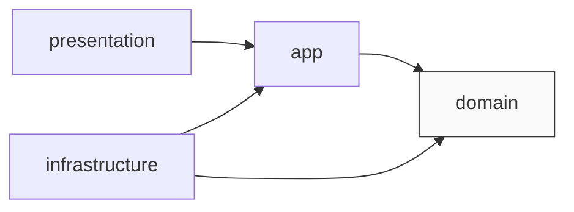
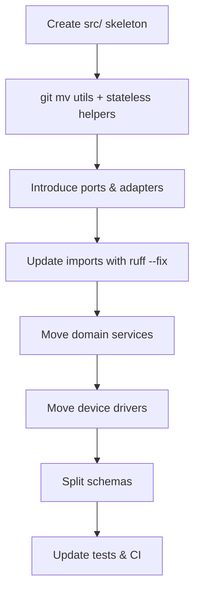

# Codebase Restructuring Plan: Domain-Centric Architecture

> **Audience:** project maintainers & contributors  
> **Goal:** migrate *wb-mqtt-bridge* from the current mixed layout to a clean, domain-centric (DDD/Hexagonal) structure without rewriting core logic.

---

## 1. Why This Change?
1. **Discoverability** – domain logic, API code, and drivers are currently mixed under `app/` and `devices/`.
2. **Testing** – unit tests must import FastAPI & MQTT side-effects today.
3. **Extensibility** – adding new UIs or persistence layers requires reaching across module boundaries.

A domain-centric structure isolates **what** the application does (business rules) from **how** it talks to the outside world (HTTP, MQTT, SQLite, etc.).

---

## 2. Target Folder Layout (after migration)
```text
src/wb_mqtt_bridge/
├─ __init__.py
├─ __version__.py
├─ app/                  # application bootstrap (FastAPI instance)
├─ cli/                  # command-line utilities
│   ├─ mqtt_sniffer.py
│   └─ device_test.py
├─ domain/               # pure business logic (no I/O)
│   ├─ devices/
│   ├─ scenarios/
│   └─ rooms/
├─ infrastructure/       # adapters / gateways
│   ├─ mqtt/
│   ├─ persistence/
│   └─ devices/          # concrete device drivers
└─ presentation/
    └─ api/              # FastAPI routers & HTTP schemas
```

### Dependency Rule

*   **domain** has *no* imports from the other layers.
*   **infrastructure** is allowed to import from **domain** to implement interfaces (ports).
*   **presentation** (FastAPI) depends on **app** and indirectly on **domain** via services.

---

## 3. File-by-File Mapping
| Current Location | New Location | Change Required |
| --- | --- | --- |
| `app/device_manager.py` | `domain/devices/service.py` | Replace MQTT calls with `DeviceBusPort` interface. |
| `devices/*.py` | `infrastructure/devices/*/driver.py` | Move unchanged; implement `DeviceDriver` ABC. |
| `app/mqtt_client.py` | `infrastructure/mqtt/client.py` | No logic change. |
| `app/state_store.py` | `infrastructure/persistence/sqlite.py` | No logic change. |
| `app/routers/*` | `presentation/api/routers/*` | Update import paths. |
| `app/schemas.py` (API‐facing) | `presentation/api/schemas.py` | Split internal vs HTTP models. |
| `app/schemas.py` (domain models) | `domain/*/models.py` | Move intact. |
| `app/main.py` | `wb_mqtt_bridge/app/main.py` | Remains the FastAPI entry-point; adjust imports & wiring. |
| `mqtt_sniffer.py` | `cli/mqtt_sniffer.py` | Move unchanged; expose via `mqtt-sniffer` console script. |
| `device_test_cli.py` | `cli/device_test.py` | Move unchanged; expose via `device-test` console script. |

---

## 4. Step-by-Step Migration Plan (no shims)

Below is a lean "one-way-door" migration path that takes us from today's mixed layout to the new domain-centric structure **without ever introducing shim/compat modules**. Each step ends with a green test suite so we always have a stable baseline.

**Legend**  
• 🔄 = automated mass-rewrite (`ruff --fix`, `sed`, etc.)  
• ✅ = run full `pytest -q` before moving on

---

### Step-by-Step Outline

1. **Prepare the workspace**  
   1.1 Create and checkout `feature/ddd-migration`  
   1.2 Freeze current requirements in `requirements-lock.txt`  
   1.3 Enable strict CI (tests + ruff + mypy) ✅  

2. **Create the canonical package root (`src/`)**  
   - `mkdir -p src/wb_mqtt_bridge`  
   - `git mv app/__init__.py src/wb_mqtt_bridge/__init__.py`  
   - `git mv app/__version__.py src/wb_mqtt_bridge/__version__.py`  
   - Update `pyproject.toml`:

     ```toml
     [tool.setuptools]
     package-dir = { "" = "src" }
     ```

   ✅ Imports still resolve.

3. **Move stateless helpers**  
   - `mkdir -p src/wb_mqtt_bridge/utils`  
   - `git mv app/{serialization_utils.py,class_loader.py,types.py,validation.py} src/wb_mqtt_bridge/utils/`  
   - 🔄  Run `ruff --fix` to rewrite imports  
   ✅ Tests green.

4. **Create empty target skeleton**

   ```bash
   mkdir -p src/wb_mqtt_bridge/{domain,infrastructure/{mqtt,persistence,devices},presentation/api,cli,app}
   ```

5. **Relocate CLI utilities**  
   - `git mv mqtt_sniffer.py src/wb_mqtt_bridge/cli/mqtt_sniffer.py`  
   - `git mv device_test_cli.py src/wb_mqtt_bridge/cli/device_test.py`  
   - `git mv broadlink_cli.py src/wb_mqtt_bridge/cli/broadlink_cli.py`  
   - `git mv broadlink_discovery.py src/wb_mqtt_bridge/cli/broadlink_discovery.py`  
   - Register via `console_scripts` in `pyproject.toml`  
   - Replace `if __name__ == "__main__":` with `def main() -> None:`  
   ✅ `mqtt-sniffer --help` works.

6. **Add abstract ports**  
   - **Create** `src/wb_mqtt_bridge/domain/ports.py` defining three ABCs:  
     | Port | Purpose | Implemented in | Used by (domain layer) | Key methods |
     |------|---------|----------------|------------------------|-------------|
     | `MessageBusPort` | Publish/subscribe to the external message bus (MQTT today) | `infrastructure/mqtt/client.MQTTClient` | `ScenarioManager`, `RoomManager`, future notification services | `publish(topic,payload,qos,retain)`, `subscribe(topic,callback)` |
     | `DeviceBusPort`  | Low-level send/receive operations a **device driver** performs on its transport (MQTT, HTTP, Serial, etc.) | every file in `infrastructure/devices/*/driver.py` | Device drivers only | `send(command,params)`, `subscribe_topics()`, etc. |
     | `StateRepositoryPort` | Persist & retrieve aggregate/device state | `infrastructure/persistence/sqlite.SQLiteStateStore` | `DeviceManager`, `ScenarioManager` | `load(id)`, `save(id,state)`, `bulk_save(states)` |
   - The ABCs contain **no logic**—just `@abstractmethod` signatures and docstrings.  
   ✅ Static analysis passes.

7. **Move domain managers & models**  
   - For each manager (`DeviceManager`, `ScenarioManager`, `RoomManager`, etc.) **update the constructor** to receive the ports defined above instead of concrete classes.  
   - Detailed moves:  
     - `git mv app/device_manager.py src/wb_mqtt_bridge/domain/devices/service.py`  
     - `git mv app/room_manager.py src/wb_mqtt_bridge/domain/rooms/service.py`  
     - `git mv app/scenario_manager.py src/wb_mqtt_bridge/domain/scenarios/service.py`  
     - `git mv app/scenario.py src/wb_mqtt_bridge/domain/scenarios/scenario.py`  
     - `git mv app/scenario_models.py src/wb_mqtt_bridge/domain/scenarios/models.py`  
     - Extract *domain* models from `app/schemas.py` → appropriate `domain/**/models.py`  
   - **Logic changes:** replace direct imports/usage of `MQTTClient`, `SQLiteStateStore`, etc., with calls to the injected ports (`MessageBusPort`, `StateRepositoryPort`, etc.).  
   - 🔄 Rewrite imports site-wide.  
   ✅ Tests.

8. **Relocate adapters & device drivers**  
   - MQTT → `infrastructure/mqtt/client.MQTTClient`  
   - Persistence → `infrastructure/persistence/sqlite.SQLiteStateStore`  
   - `git mv app/mqtt_client.py src/wb_mqtt_bridge/infrastructure/mqtt/client.py`  
   - `git mv app/state_store.py src/wb_mqtt_bridge/infrastructure/persistence/sqlite.py`  
   - `git mv app/config_manager.py src/wb_mqtt_bridge/infrastructure/config/manager.py`  
   - `git mv app/maintenance.py src/wb_mqtt_bridge/infrastructure/maintenance/wirenboard_guard.py`  
   - Device drivers → `infrastructure/devices/<device>/driver.py`, implementing `DeviceBusPort`.  
     - `git mv devices/base_device.py src/wb_mqtt_bridge/infrastructure/devices/base.py`  
     - `git mv devices/lg_tv.py src/wb_mqtt_bridge/infrastructure/devices/lg_tv/driver.py`  
     - `git mv devices/apple_tv_device.py src/wb_mqtt_bridge/infrastructure/devices/apple_tv/driver.py`  
     - `git mv devices/auralic_device.py src/wb_mqtt_bridge/infrastructure/devices/auralic/driver.py`  
     - `git mv devices/emotiva_xmc2.py src/wb_mqtt_bridge/infrastructure/devices/emotiva_xmc2/driver.py`  
     - `git mv devices/broadlink_kitchen_hood.py src/wb_mqtt_bridge/infrastructure/devices/broadlink_kitchen_hood/driver.py`  
     - `git mv devices/wirenboard_ir_device.py src/wb_mqtt_bridge/infrastructure/devices/wirenboard_ir_device/driver.py`  
     - `git mv devices/revox_a77_reel_to_reel.py src/wb_mqtt_bridge/infrastructure/devices/revox_a77_reel_to_reel/driver.py`  
   - `infrastructure/mqtt/client.MQTTClient` now **implements `MessageBusPort`** (add `class MQTTClient(MessageBusPort): ...`).  
   - `infrastructure/persistence/sqlite.SQLiteStateStore` now **implements `StateRepositoryPort`**.  
   - Each driver in `infrastructure/devices/*/driver.py` now subclasses both its concrete base (`BaseDevice`) **and** implements `DeviceBusPort`.  
   - **Register drivers via entry-points** so that external plugins can auto-discover them:  
     ```toml
     [project.entry-points."wb_mqtt_bridge.devices"]
     lg_tv          = "wb_mqtt_bridge.infrastructure.devices.lg_tv.driver:LgTv"
     apple_tv       = "wb_mqtt_bridge.infrastructure.devices.apple_tv.driver:AppleTv"
     auralic        = "wb_mqtt_bridge.infrastructure.devices.auralic.driver:Auralic"
     emotiva_xmc2   = "wb_mqtt_bridge.infrastructure.devices.emotiva_xmc2.driver:EmotivaXmc2"
     broadlink_hood = "wb_mqtt_bridge.infrastructure.devices.broadlink_kitchen_hood.driver:BroadlinkKitchenHood"
     wirenboard_ir  = "wb_mqtt_bridge.infrastructure.devices.wirenboard_ir_device.driver:WirenboardIrDevice"
     revox_a77      = "wb_mqtt_bridge.infrastructure.devices.revox_a77_reel_to_reel.driver:RevoxA77ReelToReel"
     ```  
   ✅ Device & MQTT tests.

9. **Split presentation layer**  
   - Move FastAPI routers to `presentation/api/routers`  
   - Move HTTP DTOs to `presentation/api/schemas.py`; keep pure domain models in `domain/`  
   - `git mv app/routers/*.py src/wb_mqtt_bridge/presentation/api/routers/`  
   - `git mv app/sse_manager.py src/wb_mqtt_bridge/presentation/api/sse_manager.py`  
   ✅ OpenAPI generation succeeds.

10. **Bootstrap wiring** (`wb_mqtt_bridge/app`)  
    - **Create** `src/wb_mqtt_bridge/app/bootstrap.py` containing `create_app() -> FastAPI` and the full `lifespan` context manager copied verbatim from today's `app/main.py` (plus CORS middleware & router includes).  
    - **Export point:** `src/wb_mqtt_bridge/app/__init__.py` does only:  
      ```python
      from .bootstrap import create_app
      app = create_app()
      ```  
    - **Thin launcher:** `src/wb_mqtt_bridge/app/main.py` keeps just:  
      ```python
      def main() -> None:
          import uvicorn
          uvicorn.run("wb_mqtt_bridge.app:app", host="0.0.0.0", port=8000, reload=False)

      if __name__ == "__main__":
          main()
      ```  
    - **Console-script (optional):** add  
      ```toml
      [project.scripts]
      wb-api = "wb_mqtt_bridge.app.main:main"
      ```  
    - **Remove** legacy startup logic from the old `app/main.py` once migrated.  
    ✅ `uvicorn wb_mqtt_bridge.app:app --reload` boots and CLI `wb-api` starts the server.

11. **Global cleanup**  
    - Remove old `app/` & `devices/` dirs  
    - 🔄 `ruff --fix`, `mypy`, docs update  
    ✅ CI green.

12. **Merge & release**  
    - PR review → squash merge → tag `vNEXT-domain-architecture`  
    - Publish wheel & Docker images.

---

**Indicative timeline**

| Day | Steps |
|-----|-------|
| 1   | 1-3 |
| 2   | 4-6 |
| 3-4 | 7-8 |
| 5   | 9-10 |
| 6   | 11 |
| 7   | 12 |

Total: ~7 focused dev-days.

---

**Why no shims?**

We never import from old paths after a file moves; imports are rewritten in the same commit and verified by tests.

---

## 5. Migration Checklist


1. **Create `src/` layout**  
   *Add `tool.setuptools.package-dir` → `"" = "src"` in* `pyproject.toml`.
2. **Move low-level utilities** (`serialization_utils.py`, `class_loader.py`) to `wb_mqtt_bridge/utils/`.
3. **Define abstract ports** in `domain/ports.py` (e.g. `MessageBusPort`, `StateRepositoryPort`).
4. **Refactor managers** to accept those ports via constructor; remove direct MQTT/DB imports.
5. **Relocate device drivers** under `infrastructure/devices/*` and register them via entry-points:
   ```toml
   [project.entry-points."wb_mqtt_bridge.devices"]
   lg_tv = "wb_mqtt_bridge.infrastructure.devices.lg_tv.driver:LgTv"
   ```
6. **Move CLI utilities** (`mqtt_sniffer.py`, `device_test_cli.py`) under `cli/` and add corresponding `console_scripts` in `pyproject.toml`.
7. **Split `schemas.py`** – keep pure models in domain; move HTTP DTOs to presentation.
8. **Bootstrap wiring** in `app/__init__.py`.
9. **Update tests / CI** to import from `wb_mqtt_bridge.*` packages only.
10. **Run full test suite**; ensure behaviour parity.

---

## 6. Effort & Timeline
| Task | Effort |
| --- | --- |
| File moves & import rewrites | 2–3 days |
| Introduce ports & refactor managers | 3–5 days |
| Split schemas & update routers | 1–2 days |
| CI updates, docs, cleanup | 1–2 days |
| **Total** | **7–12 dev days** |

---

## 7. FAQs
**Q 1:** *Do we rewrite algorithms?*  
**A:** No. Logic stays untouched; only module boundaries change.

**Q 2:** *Can we migrate gradually?*  
**A:** Yes – layers compile independently. Move one service at a time while keeping temporary import shims.

**Q 3:** *What happens to config JSON files?*  
**A:** The `config/` directory remains at the repository root and is copied (or mounted) alongside the application. `ConfigManager` will continue to default to that path.  
- You *may* override the location with an environment variable (`WB_CONFIG_DIR=/path/to/config`) if you want to mount it elsewhere (e.g. in Docker).  
- Keeping configs outside the package avoids rebuilding the wheel every time you adjust a JSON file.  
- Third-party drivers can still ship their own **default** configs via `importlib.resources`; that has no impact on the in-tree files.

---

*Last updated: {{DATE}}* 