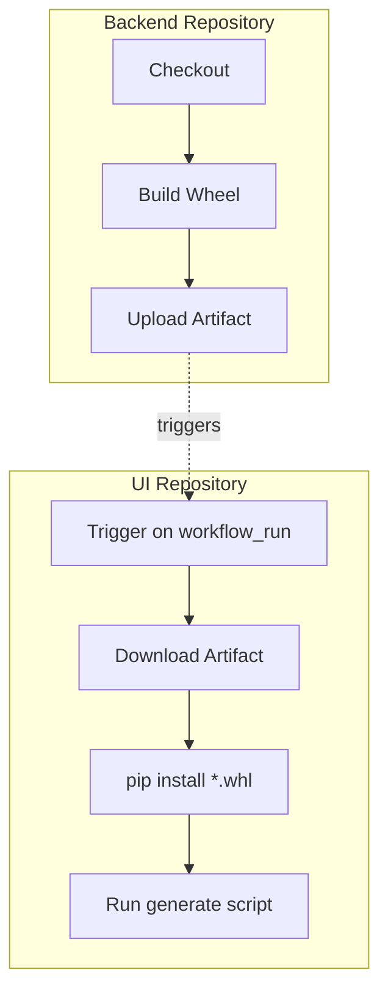

# UI Integration Guide for Domain-Centric Backend
*Consuming `wb-mqtt-bridge` as an installable package*

> This document explains how **wb-mqtt-ui** integrates with the restructured _wb-mqtt-bridge_ backend, which is now organized as a proper Python package (`src/wb_mqtt_bridge`) with domain-centric architecture.

---

## 1. Current Implementation

The wb-mqtt-bridge backend has been successfully restructured and now supports:

1. **Package-based imports** – the UI generator imports Python classes via:
   ```python
   importlib.import_module("wb_mqtt_bridge.domain.devices.models").WirenboardIRState
   ```
   instead of reading files by absolute path.

2. **Installable package** – the backend can be installed via:
   * Local editable install (`pip install -e ../wb-mqtt-bridge`)
   * Package artifacts from CI/CD workflows
   * Future PyPI releases

3. **Simplified mapping** – device configurations use standardized import paths:
   ```jsonc
   {
     "WirenboardIRDevice": {
       "stateClassImport": "wb_mqtt_bridge.domain.devices.models:WirenboardIRState",
       "deviceConfigs": [ "config/devices/ld_player.json" ]
     }
   }
   ```

4. **Entry point registration** – devices are discoverable via setuptools entry points:
   ```toml
   [project.entry-points."wb_mqtt_bridge.devices"]
   lg_tv = "wb_mqtt_bridge.infrastructure.devices.lg_tv.driver:LgTv"
   apple_tv = "wb_mqtt_bridge.infrastructure.devices.apple_tv.driver:AppleTVDevice"
   # ... additional devices
   ```

5. **Virtual Device Integration** – scenarios now support WB virtual device emulation:
   * `ScenarioWBConfig` Pydantic models for virtual device configurations
   * `WBVirtualDeviceService` infrastructure service for device abstraction
   * REST API endpoints for accessing virtual scenario configurations

---

## 2. GitHub Actions Implementation

### 2.1 Monorepo Setup (backend & UI in same repo)
```yaml
name: build-ui
on: [push]
jobs:
  build-ui:
    runs-on: ubuntu-latest
    steps:
      - uses: actions/checkout@v4
      - uses: actions/setup-python@v5
        with: { python-version: '3.11' }
      - name: Install backend (editable)
        run: pip install -e ./wb-mqtt-bridge
      - uses: actions/setup-node@v4
        with: { node-version: '20' }
      - name: Build UI
        run: |
          cd wb-mqtt-ui
          npm ci
          npm run generate  # imports backend classes dynamically
          npm test
          npm run build
```

### 2.2 Two-repo Setup (backend & UI separated)

#### A. Release-based Integration
Backend workflow (tags only):
```yaml
# wb-mqtt-bridge/.github/workflows/release.yml
- name: Build wheel
  run: python -m build
- name: Publish to PyPI
  run: twine upload dist/*
```

UI workflow:
```yaml
- uses: actions/setup-python@v5
  with: { python-version: '3.11' }
- run: pip install "wb-mqtt-bridge>=1.0.0"  # Use actual version
```

#### B. Artifact-based Integration (nightly/PR builds)
Backend workflow:
```yaml
- name: Build wheel
  id: build
  run: |
    python -m build
    echo "wheel=$(ls dist/*.whl)" >> $GITHUB_OUTPUT
- uses: actions/upload-artifact@v4
  with: { name: wb-wheel, path: dist/*.whl }
```

UI workflow (triggered via `workflow_run`):
```yaml
- uses: actions/download-artifact@v4
  with: { name: wb-wheel }
- run: pip install dist/*.whl
```

#### Workflow diagram


---

## 3. UI Code Integration

### Required Changes in wb-mqtt-ui

| File | Change | Status |
| ---- | ------ | ------ |
| `config/device-state-mapping*.json` | Use `stateClassImport` instead of `stateFile` + `stateClass` | ⏳ Pending |
| `StateTypeGenerator.generateFromPythonClass()` | Add `generateFromImportPath(import_str)` using `importlib` | ⏳ Pending |
| Build script `generate-device-pages.ts` | Pass `stateClassImport` to generator | ⏳ Pending |

### Example mapping configuration:
```jsonc
{
  "WirenboardIRDevice": {
    "stateClassImport": "wb_mqtt_bridge.domain.devices.models:WirenboardIRState",
    "deviceConfigs": [ "config/devices/ld_player.json" ],
    // Legacy fallback (optional during transition)
    "stateFile": "app/schemas.py",
    "stateClass": "WirenboardIRState"
  },
  "ScenarioDevice": {
    "stateClassImport": "wb_mqtt_bridge.infrastructure.scenarios.models:ScenarioWBConfig",
    "scenarioConfigs": [ "config/scenarios/*.json" ],
    "description": "Virtual WB device configurations for scenarios"
  }
}
```

### Implementation approach:
```typescript
// In StateTypeGenerator
if ('stateClassImport' in deviceEntry) {
  // Use new package-based import
  return generateFromImportPath(deviceEntry.stateClassImport);
} else if ('stateFile' in deviceEntry) {
  // Fall back to legacy file-based approach
  return generateFromPythonClass(deviceEntry.stateFile, deviceEntry.stateClass);
}
```

---

## 4. Local Development Workflow

```bash
# Setup (once per machine)
python -m venv .venv && source .venv/bin/activate

# Install backend in editable mode (stays in sync with changes)
pip install -e ../wb-mqtt-bridge

# Install UI dependencies
npm ci

# Generate TypeScript types from Python models
npm run generate

# Start development server
npm run dev
```

**Verification:**
```bash
# Test that backend classes are importable
python -c "from wb_mqtt_bridge.domain.devices.models import WirenboardIRState; print('✅ Device models import successful')"
python -c "from wb_mqtt_bridge.infrastructure.scenarios.models import ScenarioWBConfig; print('✅ Scenario models import successful')"

# Check available console scripts
wb-api --help
device-test --help
```

---

## 5. Performance Optimizations

### CI Caching Strategy
* **Python packages**: Cache `~/.cache/pip`
* **Node modules**: Cache `node_modules`
* **Wheel builds**: Optional (builds are fast ~5s), useful for bandwidth-constrained environments

### Build optimizations:
```yaml
- uses: actions/cache@v4
  with:
    path: ~/.cache/pip
    key: ${{ runner.os }}-pip-${{ hashFiles('**/pyproject.toml') }}
    
- uses: actions/cache@v4
  with:
    path: node_modules
    key: ${{ runner.os }}-node-${{ hashFiles('**/package-lock.json') }}
```

---

## 6. Current Status

### ✅ Completed (Backend)
- Domain-centric package structure (`src/wb_mqtt_bridge/`)
- Entry point registration for device discovery
- Console scripts (`wb-api`, `device-test`, etc.)
- Installable wheel generation
- All 10 steps of backend restructuring
- **WB Virtual Device Service** - Infrastructure service for WB device abstraction
- **Scenario WB Integration** - Virtual device configurations for scenarios
- **ScenarioWBConfig Models** - Pydantic models for scenario virtual configurations
- **New REST API endpoints** - `/scenario/virtual_config/{id}` and `/scenario/virtual_configs`

### ⏳ Pending (UI Integration)
- Update `device-state-mapping*.json` to use `stateClassImport`
- **Add ScenarioWBConfig to UI type generation** for scenario virtual configurations
- Implement `generateFromImportPath()` in `StateTypeGenerator`
- Update build scripts to use package imports
- Add fallback support during transition
- CI/CD workflow updates
- **Integrate new scenario virtual config API endpoints** for UI consumption

### 🎯 Next Steps
1. Update UI generator to support `stateClassImport` field
2. **Add ScenarioWBConfig model to device-state-mapping configuration**
3. **Implement UI consumption of new scenario virtual config endpoints**
4. Test with local editable install (`pip install -e ../wb-mqtt-bridge`)
5. Update CI workflows for artifact handoff
6. Validate all device state models are accessible
7. **Test scenario virtual configuration TypeScript generation**
8. Remove legacy file-path dependencies

---

## 7. New API Endpoints for UI Integration

The backend now provides additional REST API endpoints that the UI can consume:

### Scenario Virtual Configuration Endpoints
```typescript
// Get virtual WB configuration for a specific scenario
GET /scenario/virtual_config/{scenario_id} -> ScenarioWBConfig

// Get all scenario virtual configurations
GET /scenario/virtual_configs -> Dict[str, ScenarioWBConfig]
```

These endpoints provide:
- Virtual device metadata (device_id, device_name, device_class)
- Generated command definitions (startup/shutdown, role-based commands)
- WB control types and parameter validation
- Compatible with existing device configuration patterns

### Usage in UI
```typescript
// Fetch scenario virtual config for UI display
const scenarioConfig = await fetch(`/api/scenario/virtual_config/${scenarioId}`);
const config: ScenarioWBConfig = await scenarioConfig.json();

// Generate UI controls based on virtual configuration
const controls = config.commands.map(cmd => generateControl(cmd));
```

---

## 8. Troubleshooting

**Q: Import errors when running `npm run generate`**  
**A:** Ensure backend is installed: `pip install -e ../wb-mqtt-bridge`

**Q: Missing device models in generated TypeScript**  
**A:** Check that device entry points are registered in `pyproject.toml`

**Q: Missing scenario models in generated TypeScript**  
**A:** Ensure `ScenarioWBConfig` is included in device-state-mapping configuration with correct import path

**Q: CI workflow fails to find wheel**  
**A:** Verify artifact upload/download names match between workflows

**Q: Scenario virtual config endpoints return 503 errors**  
**A:** Ensure scenario WB adapter is properly initialized in backend bootstrap process

---

*Last updated: January 2025 - Updated for Virtual Device Service and Scenario WB Integration* 