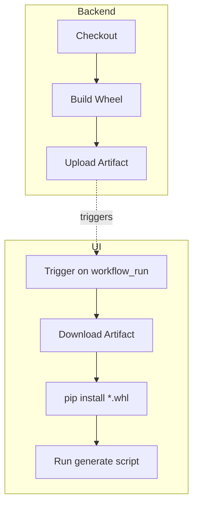

# UI Integration Plan after Backend Restructuring  
*Option 2 – consume `wb-mqtt-bridge` as an installable package*

> This document explains how the **wb-mqtt-ui** build workflow will work once _wb-mqtt-bridge_ is reorganised into a proper Python package (`src/wb_mqtt_bridge`).  It captures CI examples, local-dev steps and required code changes so the team can revisit at any time.

---

## 1. Concept in a Nutshell
1. **Package not path** – the UI generator imports Python classes via
   ```python
   importlib.import_module("wb_mqtt_bridge.domain.devices.models").WirenboardIRState
   ```
   instead of reading `app/schemas.py` by absolute file path.
2. **Backend wheel available** – GitHub Actions (or local dev) performs
   `pip install wb-mqtt-bridge`, either from:
   * PyPI / GitHub Packages,
   * or an artifact built earlier in the workflow,
   * or an editable install (`pip install -e …`).
3. **Mapping JSON simplified** – each entry now carries a single import path:
   ```jsonc
   {
     "WirenboardIRDevice": {
       "stateClassImport": "wb_mqtt_bridge.domain.devices.models:WirenboardIRState",
       "deviceConfigs": [ "config/devices/ld_player.json" ]
     }
   }
   ```
4. **Generator update** – `StateTypeGenerator` first tries dynamic import; if that fails, it can still fall back to the legacy `stateFile` semantics for a grace period.

---

## 2. GitHub Actions Reference

### 2.1  Monorepo (backend & UI in same repo)
```yaml
name: build-ui
on: [push]
jobs:
  build-ui:
    runs-on: ubuntu-latest
    steps:
      - uses: actions/checkout@v4
      - uses: actions/setup-python@v5
        with: { python-version: '3.11' }
      - name: Install backend (editable)
        run: pip install -e ./wb-mqtt-bridge
      - uses: actions/setup-node@v4
        with: { node-version: '20' }
      - name: Build UI
        run: |
          cd wb-mqtt-ui
          npm ci
          npm run generate  # invokes python, imports backend classes
          npm test
          npm run build
```

### 2.2  Two-repo Setup (backend & UI separated)

#### A  Release-based
Backend workflow (tags only):
```yaml
# wb-mqtt-bridge/.github/workflows/release.yml
- name: Build wheel
  run: python -m build
- name: Publish
  run: twine upload dist/*
```
UI workflow:
```yaml
- uses: actions/setup-python@v5
  with: { python-version: '3.11' }
- run: pip install "wb-mqtt-bridge>=0.5.0"
```

#### B  Artifact hand-off (nightly/PR builds)
Backend:
```yaml
- name: Build wheel
  id: build
  run: |
    python -m build
    echo "wheel=$(ls dist/*.whl)" >> $GITHUB_OUTPUT
- uses: actions/upload-artifact@v4
  with: { name: wb-wheel, path: dist/*.whl }
```
UI (triggered via `workflow_run`):
```yaml
- uses: actions/download-artifact@v4
  with: { name: wb-wheel }
- run: pip install dist/*.whl
```

#### Diagram – artifact flow


---

## 3. Code Changes in wb-mqtt-ui

| File | Change |
| ---- | ------ |
| `config/device-state-mapping*.json` | Replace `stateFile` + `stateClass` with `stateClassImport`. Leave old keys for fallback (one release). |
| `StateTypeGenerator.generateFromPythonClass()` | New helper `generateFromImportPath(import_str)` that uses `importlib`. Try import first, fallback to old path method. |
| Build script `generate-device-pages.ts` | Pass `stateClassImport` to generator instead of file path. |

> **Tip:** guard legacy behaviour with `if ('stateClassImport' in entry) { … }` to keep backwards compatibility.

---

## 4. Local Developer Workflow
```bash
# once per machine
python -m venv .venv && source .venv/bin/activate
pip install -e ../wb-mqtt-bridge   # editable install keeps changes live
npm ci
npm run generate
npm run dev  # start Vite
```

---

## 5. CI Caching Hints
* Cache **pip** directory: `~/.cache/pip`.
* Cache **node_modules**.
* Wheel build is light (< 5 s); caching wheels is optional unless bandwidth-constrained.

---

## 6. Roll-out Strategy
1. Merge backend restructuring branch; publish pre-release wheel `0.5.0-alpha`.  
2. Update UI generator to support `stateClassImport`, keep fallback.  
3. Ship UI release that works with both `>=0.4.0` (paths) and `>=0.5.0` (package).  
4. After two stable releases, drop legacy path logic.

---

## 7. FAQ
* **Q – Does the UI still need Python installed?**  
  **A – Yes.** Only for the build step where TypeScript types are generated; the runtime bundle is unaffected.
* **Q – What if the backend wheel isn't published yet?**  
  Use the artifact method or editable install inside the monorepo.

---

_Last updated: {{DATE}}_ 