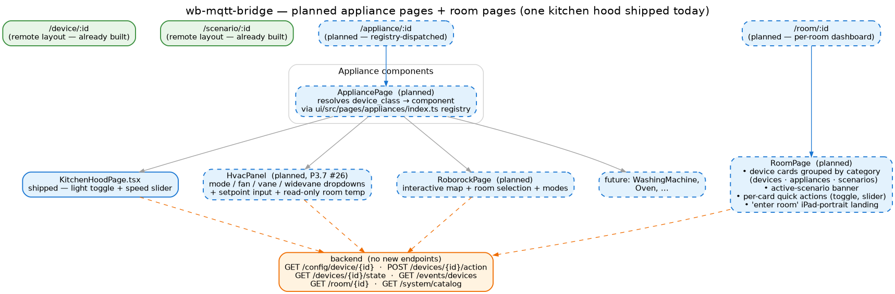

# Planned — appliance pages + room pages

> **Status — partially shipped (kitchen hood only); rest designed-but-not-built.**
> The architecture for appliance pages is settled and one example exists
> (`ui/src/pages/appliances/KitchenHoodPage.tsx`), but the surrounding shell —
> the `AppliancePage` container, the `/appliance/:id` route, and pages for the
> other appliances the project plans to support — has not landed yet. Room
> pages have no design and no code; the backend data is already there.

## Why appliances are different

Devices (TVs, AVRs, streamers, the IR fleet, the AV stack as a whole) share a
remote-control vocabulary, which is what the runtime layout manifest captures
and `RemoteControlLayout` renders. **Appliances don't share that vocabulary.**
A kitchen hood is a light + a speed slider. A vacuum is an interactive map and
a room picker. An oven is a temperature, a timer, and a cycle. A washing
machine has its own button matrix. Forcing all of them through a remote-style
manifest would constrain expression beyond usefulness; giving each its own
page makes it cheap to author one and ignore the others.

The split is encoded in `device_category` on every device config:

| `device_category` | UI path | Renderer |
|---|---|---|
| `device` | runtime layout manifest | `RemoteControlLayout.tsx` (one component, every device) |
| `appliance` | bespoke per-class component | one React file per appliance class |

See **[Architecture: UI](../architecture/ui.md)** for the manifest path.

## The planned appliance UI

Three pieces, exactly mirroring the existing device path:

1. **A `/appliance/:id` route** — same shape as `/device/:id` but resolves to
   a different renderer.
2. **An `AppliancePage` container** — loads the device's config (
   `GET /config/device/{id}`), reads the `device_class`, dispatches to the
   matching component via a registry in `ui/src/pages/appliances/index.ts`.
3. **One React file per appliance class** — `KitchenHoodPage.tsx`,
   `HvacPanel.tsx` (planned, see §P3.7 #26), `RoborockPage.tsx` (planned),
   and onwards. Each is hand-authored against the canonical surfaces
   `GET /devices/{id}/state`, `POST /devices/{id}/action`, and the
   `/events/devices` SSE channel — no new endpoints needed.

The kitchen hood is the worked example today: a light toggle + a four-speed
slider, posting `light_on` / `light_off` / `set_speed` actions; live state
streamed from SSE. Every other appliance follows the same backend pattern.

## Appliance classes on the roadmap

Each is a separate page; none of them share UI shape:

| Class | Status | What it renders |
|---|---|---|
| `BroadlinkKitchenHood` | **Shipped.** `KitchenHoodPage.tsx`. | Light + 4-speed slider. |
| Mitsubishi HVAC (3 configs already authored) | **Planned** — needs `HvacPanel.tsx` via the value-label translation layer (the P3.7 #26 design). | Mode / fan / vane / widevane dropdowns + setpoint input + read-only room temp; mirrors the firmware's own `/control` page. |
| Roborock | **Planned** — driver also planned (not yet in the entry-point list). | Interactive map, room selection, cleaning modes. |
| Washing machine, oven, etc. | **Future** — no driver yet, no device on the network. | Cycle / temperature / timer surfaces. |

The HVAC panel is the next one to land. It's blocked on the value-label
translation layer (so mode/fan/vane/widevane dropdowns can label themselves
locally and post canonical names back) — see the action plan's §P3.7 #26
for the full design. The panel design itself is "mirror the firmware
`/control` page exactly" — the firmware (`mitsubishi2wb`) already proves
the UI shape works on a tiny ESP touchscreen.

## What the `AppliancePage` container does

A small dispatcher, not a renderer. Its job:

1. **Load the device config** by id (`GET /config/device/{id}`).
2. **Read `device_class`** off the config.
3. **Resolve the component** from the appliance registry
   (`ui/src/pages/appliances/index.ts` — a `{[device_class]: Component}`
   map).
4. **Render the component**, passing the loaded config + a small set of
   shared helpers (action dispatcher, SSE subscriber, state shape, error
   boundary).
5. **Fall through gracefully** if the registry has no entry — render an
   empty-state with a "this appliance has no page yet" note + a link to
   the device's raw `/state` view as a debugging aid.

The container is one file; appliance components are independent and don't
import each other. New appliance → new file + one line in `index.ts`. No
codegen, no build-time wiring.

## Room pages (planned, less-designed)

A `/room/:id` route renders one room as a dashboard: every device in the
room as a card, every appliance with its quick controls, the active scenario
(if any) banner-summarised, with an "Activate" affordance for every
scenario whose `room_id` matches.

The motivation is iPad-portrait *landing*: the family member who walked into
the bedroom doesn't want to open a remote — they want to see what's on, what
the room "is doing" right now, and tap a thing.

Backend already returns enough to build it:

- `GET /room/{id}` — the room's metadata + derived device list.
- `GET /system/catalog` — devices + scenarios grouped by room with their
  capability surfaces.
- `GET /events/devices` + `/events/scenarios` — live state.

What's missing is the React: the page itself, the card-per-category
layout, the per-category quick-action affordances, the active-scenario
banner. No specific design exists yet; the shape will probably mirror what
the catalog provides (capability-grouped cards) — but this is a
late-2026 problem, not an imminent one.

## Open design questions

**For appliance pages:**

- **The empty-registry fallback.** Should an appliance without a page show
  the device's raw state JSON, or refuse to route at all, or default to
  the remote-layout renderer if a (probably-poor) `manualInstructions`-style
  manifest happens to exist? The honest answer is empty-state + state-dump
  link — same as 404 on an unknown route.
- **Shared appliance widgets.** A slider, a toggle, a temperature input,
  a timer ring — these recur across appliances. A shared
  `ui/src/components/appliance/` library starts to make sense once a third
  class is added; today it's premature.
- **Where the HVAC panel reads value-labels from.** Per the §P3.7 #26
  design, the catalog provides them. The panel must not invent the
  mode/fan/vane/widevane lists locally — it has to round-trip through
  `/system/catalog` so the firmware-side labels stay authoritative.

**For room pages:**

- **Card vs list density.** A bathroom with one wb-passthrough light vs a
  living room with a TV, an AVR, a streamer, a kitchen-hood appliance, and
  three scenarios — the page should handle both without two layouts.
- **Quick-action surface area.** A light card with a toggle is obvious;
  a TV card with a power-and-volume slider is reasonable; an HVAC card
  with mode + setpoint might be the right depth. Where to draw the line
  before the card becomes a small replica of the appliance page?
- **Multi-room navigation.** Going from `/room/cabinet` to `/room/bedroom`
  should be a one-tap swipe on an iPad. A persistent room switcher in the
  shell? A swipe gesture between adjacent rooms? Both?

## Where the parts already live in code

| Part | Status today |
|---|---|
| `device_category` on every config | **Built.** `BaseDeviceConfig.device_category`. |
| `KitchenHoodPage.tsx` (one appliance page) | **Built.** Reads `/devices/{id}/state` + posts `light_on`/`set_speed`. |
| `ui/src/pages/appliances/index.ts` (the registry) | **Skeleton.** Used by the kitchen hood; needs to grow as more pages land. |
| `/appliance/:id` route | **Not built.** |
| `AppliancePage` container | **Not built.** |
| `HvacPanel.tsx` | **Not built.** Blocked on the §P3.7 #26 value-label translation layer. |
| `RoborockPage.tsx` + driver | **Not built.** Driver not on the entry-point list. |
| `/room/:id` route | **Not built.** |
| `RoomPage` component | **Not built.** |
| Backend room + catalog data | **Built.** `GET /room/list` · `GET /room/{id}` · `GET /system/catalog`. |
| Admin route / auth shell | **Not built.** (Shared with [device-setup](device-setup.md) + [topology-setup](topology-setup.md).) |

## Where to go next

- **[Architecture: UI](../architecture/ui.md)** — the device-vs-appliance split
  and the manifest path appliances opt out of.
- **[Architecture: rooms](../architecture/rooms.md)** — the data behind room
  pages.
- **[Planned: device setup](device-setup.md)** and **[topology
  setup](topology-setup.md)** — sibling planned admin surfaces.
- **`docs/design/ui/appliances.md`** *(internal design reference)* — the
  full design proposal from which this page is distilled.
