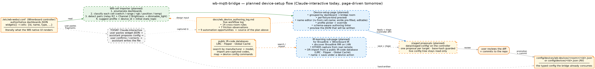

# Planned — device-setup page

> **Status — designed but not built.** Device configs today are authored by hand
> (AV gear, 13 files) or interactively-with-Claude from raw Wirenboard widget JSON
> (the 57 WB-passthrough configs onboarded in the §P3.7 #23 session). This page
> describes the *self-serve* setup flow the project plans next: a page that turns
> the controller's own `/etc/wb-webui.conf` into reviewable proposals, plus an
> IR-learning sub-page for the Broadlink + Wirenboard IR drivers. No React, no
> routes, no backend endpoints exist for this yet.

## How devices are added today

Two flows are live, neither of them a *page*:

- **Native WB passthroughs** — authored interactively. The user pastes a slice of
  the controller's `/etc/wb-webui.conf` (or describes a fixture); the assistant
  proposes a typed config (device_id, localised names, capability profile, WB
  control topics, `state_topics` spec); the user confirms or corrects; the
  assistant writes the file under
  `config/devices/wb-devices/<room>/<id>.json`. The full as-run record of
  this — every per-device decision, the cross-room rules that accumulated, the
  friction points, the automation opportunities — lives in
  `docs/wb_device_authoring_log.md` and is the **source of truth for what the
  setup page must do** when it lands.
- **AV devices** — authored by hand in `config/devices/<name>.json`. No
  importer; the 13 shipped AV configs predate the WB onboarding work.

There is also one historical artefact, `docs/device_setup/broadlink-device-setup.ipynb`,
a Jupyter notebook that drove a one-off Broadlink RM discovery + IR/RF code
capture for the kitchen hood. It worked, but it was never the path forward —
it's pinned in archive as a reference for the IR-learning sub-page below.

## The planned flow

Three pieces:

1. **A WB-cell importer** (backend or build-time tool) that reads
   `/etc/wb-webui.conf` from the controller and emits structured proposals:
   for each widget cell, the WB slave/control id, the `name` (Russian, verbatim
   from the WB UI), the `type` (`switch` / `range` / `rgb` / `temperature` /
   …), and any detectable pairing (a `K2` relay channel next to a `Channel 2
   Brightness` slider on the same slave is a `dimmable_light`; an R/G/B triplet
   is `rgb_light`).
2. **The device-setup page** (UI) consumes the proposals. Layout:
   *dashboard → bridge room → proposed devices*, each card showing the
   capability profile the importer picked, the JSON that will be written, the
   localised names (ru filled from `cell.name`; en/de pre-populated and
   editable), and a per-field linter that surfaces type mismatches before
   commit.
3. **An IR-learning sub-page** for the IR fleet — Broadlink RM (RF) and
   Wirenboard IR blasters. Discovery on the LAN, capture from a real remote,
   save under a chosen action name on the chosen device.

The user-review-and-commit step stays in the loop on purpose: the WB UI's
Russian names are usually right, but the en/de translations and the device_id
naming convention are judgment calls the importer should not make alone.

## Page surfaces, in detail

### The main setup page

A single device-setup page (a Workbench Bridge-plugin page), organised in three
panes:

| Pane | Purpose |
|---|---|
| **Left — proposal tree** | The importer's output grouped `dashboard ▸ bridge_room ▸ device`. Each leaf shows the WB control id + the picked profile. Status chip: *proposed* / *edited* / *committed* / *skipped*. |
| **Centre — editor** | The selected device's editable form: localised names, profile picker, state_topic specs, command map. Live preview of the JSON that will be written, with a diff against the current file if one exists. |
| **Right — linter + log** | Type mismatches, missing fields, ambiguous pairings. Below it, a running log of "what changed this session" — committed to the workflow log on save. |

The page does *not* edit the controller, and it does not write the repo either:
**"Apply" stages the proposed config via the controller API; promotion is a
commit.** The page reads `/etc/wb-webui.conf` content (pasted or uploaded in the
dev phase; a controller-side helper is a later option) and stages
`config/devices/wb-devices/<room>/<device_id>.json` proposals under the
controller's writable data area — the live config tree stays read-only, and
moving a proposal into the repo is an explicit human commit. Nothing is mutable
at the broker.

### The IR-learning sub-page

A separate flow because the IR fleet is structurally different — there is no
WB cell to import; the device is a *remote button*, not a control. Two input
paths share one output:

**Path A — capture from a real remote**

1. **Discover** — list Broadlink RMs on the LAN and Wirenboard IR-blaster
   devices on the broker. The user picks one.
2. **Authenticate** — Broadlink wants a one-shot pairing handshake; the WB
   blaster is a topic publish.
3. **Capture** — the user presses the real remote's button; the page receives
   the IR/RF code. Display it base64-encoded for verification.
4. **Save** — pick the target device config (`config/devices/<ir_device>.json`)
   and the action name (`power_on`, `volume_up`, …). Write the code under
   `commands.<action>.location` (Wirenboard IR) or under the device's
   `rf_codes` map (Broadlink).

**Path B — import from a public IR-code database**

Don't reinvent codebooks that already exist for the long tail of A/V gear.
Three public sources cover most of it:

- **[LIRC](https://lirc-remotes.sourceforge.net/)** — the original Linux IR
  remotes database; massive coverage of TVs, AVRs, players, projectors.
  Codes are in the LIRC config format, convertible to raw pulse arrays.
- **Flipper Zero IR DB** — the Flipper community's growing collection
  (open, manufacturer-keyed). Raw timings, easy to convert.
- **[Global Caché](https://irdb.globalcache.com/)** — commercial CCF/HEX
  format codes; broad consumer-electronics catalog, license per the
  Global Caché terms.

The flow:

1. **Search** by manufacturer and model. The page hits the database (cached
   locally or queried remotely; see open questions below) and lists matching
   remotes.
2. **Map** — for each canonical action the bridge expects (`power_on`,
   `volume_up`, `input_hdmi1`, …) pick the corresponding button from the
   imported codebook. The page suggests obvious matches by name.
3. **Test** — fire each mapped code through the picked Broadlink or WB
   blaster; user confirms the device responded.
4. **Save** — same destination as Path A. The provenance (database +
   remote model) is recorded as a comment in the resulting config so a
   future re-author knows where the codes came from.

Path B turns "I need to add this Sony BDP-S470" from a recording session
into "search Sony / BDP-S470, accept the suggested mapping, save". For
gear the project doesn't own — and won't — this is how coverage scales.

Both paths write JSON the bridge already consumes — the runtime path
doesn't change.

## Automation hooks the importer should pick up

Lifted from the workflow log's §4. These are the rules the Claude-interactive
flow uses today; the importer should encode them so the user can override but
not have to invent:

1. **Cell-type → profile mapping.** `switch` → `light_switch`; paired
   `switch + range` on a `Brightness` channel → `dimmable_light`; `rgb` →
   `rgb_light`; `position` slider → `cover` (`dooya`); `temperature` /
   `humidity` / `co2` on a `wb-msw` → `sensor_room` fields; per-loop heating
   setpoint + actuator → `heating_loop`.
2. **Pairing detection.** A relay's K-channel adjacent to a `Channel K
   Brightness` on the same slave is one logical `dimmable_light`, not two
   devices.
3. **Russian name verbatim.** `cell.name` is authored by the WB owner and
   correct in their head; reuse it. en/de from a small curated translation
   table for the common fixtures, with an LLM fallback for edge cases — but
   always shown for review before commit.
4. **Schema-aware linter.** A `state_topic` declared as `bool` on a profile
   whose `fields[]` declares `enum` should surface as a fixable conflict —
   not a silent profile drift. (This was the `heating_loop.mode` issue in the
   onboarding session.)
5. **Subfolder is the bridge `room_id`**, not the WB dashboard id. The
   importer maps `dashboard "livingroom"` → `room_id "living_room"` per the
   mapping declared in `rooms.json` descriptions.

## Open design questions

Things the implementation will need to answer, not papered over:

- **How does the importer read `/etc/wb-webui.conf`?** Three options: (a) SSH
  to the controller from the bridge process at request time; (b) a small
  controller-side helper that publishes the parsed dashboards over MQTT;
  (c) a UI-side file upload of a pasted JSON. Each shifts the trust boundary
  differently.
- **en/de translation source.** Curated table is fast but limited; LLM call
  is flexible but ties setup to network connectivity and an API key. Probably
  both: table first, LLM only on miss, always with the user reviewing.
- **Where does the page live?** *Answered:* in the **Locveil Workbench** — the
  workstation-run operator shell — as a page of the Bridge plugin (design:
  [`workbench_split.md`](../design/ui/workbench_split.md)). The consumer-facing
  UI bundle never grows an admin route or auth; the Workbench answers that
  once, centrally.
- **How is the IR-learning page protected from accidental overwrite?** A
  device config already on disk should not be silently mutated by a capture
  session — the page should diff and prompt.
- **IR-database integration — cache, attribution, license.** LIRC + Flipper
  are open and citation-friendly; Global Caché has its own terms. Decide
  per-source whether codes are fetched on demand or shipped as a vendored
  cache, and how the source + remote model are recorded inside the device
  config (the provenance comment) and in the UI (a "courtesy of X" surface
  on imported actions).
- **Multi-tenancy.** Not in scope today (single home, single user), but if
  the project ever opens to the Wirenboard community, the setup page is the
  natural place to grow auth + per-home isolation. Capture the slot, don't
  build it.

## Where the parts already live in code

| Part | Status today |
|---|---|
| Capability profiles (the proposals' destination) | **Built.** `config/capabilities/profiles/*.json` (7 profiles: `light_switch`, `dimmable_light`, `rgb_light`, `cover`, `heating_loop`, `hvac`, `sensor_room`). |
| `WbPassthroughDeviceConfig` (the typed shape the importer writes) | **Built.** `backend/src/locveil_bridge/infrastructure/config/models.py`. |
| Room metadata + derived membership | **Built.** See [Rooms](../architecture/rooms.md). |
| `Broadlink` discovery + capture (low-level) | **Available** via the `broadlink` Python lib; demonstrated in the archived `broadlink-device-setup.ipynb`. |
| WB-cell importer | **Not built.** |
| Setup page UI | **Not built.** |
| IR-learning sub-page UI | **Not built.** |
| IR-database adapter (LIRC / Flipper / Global Caché) | **Not built.** |
| Operator shell | **Superseded** — this is a Workbench page (Bridge plugin); no admin route or auth shell lands in the consumer UI. See [`workbench_split.md`](../design/ui/workbench_split.md). |

## Where to go next

- **[Architecture: devices and scenarios](../architecture/devices-and-scenarios.md)**
  — the driver flavors this page will produce configs for.
- **[Architecture: key concepts](../architecture/key-concepts.md)** — the
  capability profiles + the resolution chain the importer must respect.
- **[Architecture: rooms](../architecture/rooms.md)** — the dashboard →
  bridge-room mapping the importer needs.
- **[Planned: topology setup](topology-setup.md)** — sibling planning doc;
  same architecture for the topology authoring flow.
- **`docs/wb_device_authoring_log.md`** *(internal)* — the running workflow
  log; source of the automation rules pinned here.
