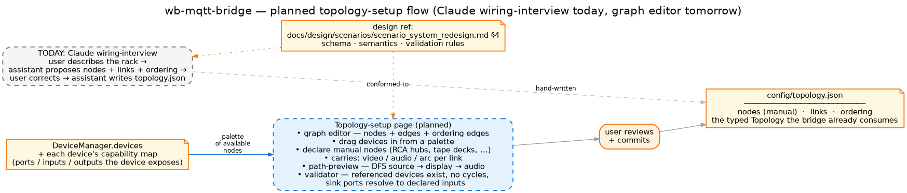

# Planned — topology-setup page

> **Status — designed but not built.** `config/topology.json` today is hand-written;
> the original living-room topology was authored 2026-05-20 from a Claude-led
> *wiring interview*, and the round-2 audio chains (`auralic`, `reel_to_reel`,
> the manual nodes for the Revox B215 / Kuzma / Sugden phono pre) were extended
> the same way at §P3.6. This page describes the self-serve flow the project
> plans next: a graph-editor that pulls available nodes from `DeviceManager`,
> lets the user connect them, validates the result against the topology schema,
> and writes `config/topology.json` for review.

## How the topology is authored today

There is no UI for topology. The current process is:

1. **Wiring interview.** Assistant asks the user what's plugged into what — every
   HDMI / SPDIF / RCA cable, every CEC handshake, every passive switch in the
   path. The user describes the rack; the assistant proposes a `links[]` block.
2. **Manual nodes.** Things without a driver (the Dodocus RCA hub, the Revox B215
   tape deck, the Kuzma turntable, the Sugden phono pre) are declared as
   `nodes` of `kind: manual` with `positions` text the reconciler surfaces as
   `manual_steps` when the activation crosses them.
3. **Ordering edges.** The user describes wall-clock dependencies the bridge
   can't infer (TV must be on before the AVR for ARC handshake; the upscaler
   needs ~4500 ms after the LD's IR power-on); the assistant proposes
   `ordering[]` entries with `first → then` and optional `delay_ms`.
4. **Write + validate.** The assistant writes `config/topology.json`;
   bootstrap validation runs at next reload.

The schema this targets is defined in **[scenario_system_redesign §4](../design/scenarios/scenario_system_redesign.md)**
(the still-authoritative spec for `config/topology.json` — links / ordering /
manual nodes / semantics / validation rules).

## The planned flow

Three things flip on:

- **A graph editor** at `/setup/topology` that consumes `DeviceManager.devices`
  as the palette of available driver-backed nodes. Each device contributes the
  ports declared by its capability map (LG TV exposes `hdmi1` / `hdmi2` /
  `hdmi3` / `arc`; the eMotiva XMC-2 exposes `source1`..`sourceN` and
  `zone2`; …). Manual nodes are added by hand with a separate dialog.
- **A path preview** that runs the same DFS the reconciler uses
  (`resolve_targets`) for any chosen `source` → `display` → `audio` triple
  and shows the resolved input-value sequence in real time. Lets the user
  verify "if I name this scenario `movie_ld`, does the LD path light up
  end-to-end?"
- **A validator** that enforces what scenario bootstrap currently catches at
  load: referenced devices exist, `ordering` is acyclic, sink ports resolve
  to declared inputs on the destination device. Today that's a startup
  validator; on this page it's interactive.

## Page surfaces, in detail

A single `/setup/topology` route, organised in three panes:

| Pane | Purpose |
|---|---|
| **Left — node palette** | All driver-backed devices grouped by room (from `DeviceManager` + `RoomManager`), plus a "+ manual node" button. Each device shows its declared ports. Drag a device into the canvas to add a node. |
| **Centre — graph canvas** | Nodes + links (HDMI/SPDIF/RCA as different stroke styles per `carries`). Click a link to edit `carries`; click a node to edit ports or, for manual nodes, the `positions` text. Ordering edges drawn as a dotted overlay. |
| **Right — path-preview + validator** | At the top: a tiny `source / display / audio` selector + the resolved `PlannedAction` list (read-only — no execute). Below it: the validator output — errors block save, warnings annotate the canvas. |

The page does *not* manipulate live hardware. It edits a JSON file in the
repo (`config/topology.json`); a topology reload happens at bridge
restart or via the existing `POST /reload`. The runtime contract is
unchanged.

## What the validator must enforce

These checks already exist somewhere in code (the topology loader, the
reconciler's path resolution, the scenario validator) — the page should run
them interactively, not let an error reach `POST /reload`:

- **Referenced devices exist.** Every `<node>:<port>` in a link refers to
  either a driver-backed device the bridge knows or a declared manual node.
- **Ordering is acyclic.** No `first → then` cycle; the topological sort the
  reconciler runs must terminate.
- **Sink ports resolve to declared inputs.** A link `to: processor:source2`
  requires the eMotiva's `input` capability to declare `source2` somewhere
  (capability `select.by_value` or `source_modes`).
- **Manual-node `positions` cover every src_port that lands on this node.**
  If the Dodocus has links from `ld`, `vhs`, `reel`, `tape`, `phono` all
  ending on it, every one of those keys must have a `positions[<key>]`
  instruction text.
- **Each scenario's `source / display / audio` triple has a resolvable
  path.** Run a dry `resolve_targets` for every shipped scenario; surface
  any that newly break under the proposed change.

## Open design questions

- **Edge editor UX.** Topology has three edge kinds in one file: signal
  links (`from`/`to`/`carries`), ordering edges (`first`/`then`/`delay_ms`),
  and the implicit "manual node positions" links. Showing all three on the
  canvas without clutter needs design — current sketch is solid lines for
  signal, dotted overlay for ordering, manual nodes as a distinct shape.
- **Live vs file edit mode.** Does the page edit `topology.json` in place
  (instant-but-invasive) or stage in memory and write on "save" (safer)?
  The latter is the same pattern as the device-setup page; consistency
  suggests staging.
- **Visual ports per device.** Some devices have many ports (eMotiva
  XMC-2: 5–7 inputs + 2 zones; LG TV: 4 HDMI + ARC). Render them as
  labelled handles around the node? As a dropdown when an incoming edge
  is being attached? Tradeoff: discoverability vs. canvas density.
- **Multi-room topology.** Today the only configured room with an A/V
  topology is `living_room`. The children's room has a TV + Apple TV but
  no `topology.json` entries (its scenarios are deferred per §P3.6).
  Multi-room support is a single `topology.json` for the house — the
  page should filter by room without forcing per-room files.
- **Persistence of node positions.** The page lays out nodes; positions
  are a UI concern, not a runtime one. Either keep them in a sibling
  `topology.layout.json` (so the runtime stays clean) or extend
  `Topology` with an optional `layout` block the validator ignores.

## Where the parts already live in code

| Part | Status today |
|---|---|
| `Topology` Pydantic model + loader | **Built.** `backend/src/locveil_bridge/domain/topology/{models.py,loader.py}`. |
| `TopologyLink`, `OrderingEdge`, `ManualNode` schemas | **Built.** Same module. Mirror in `docs/design/scenarios/scenario_system_redesign.md` §4. |
| `resolve_targets` (DFS the page's preview runs) | **Built.** `backend/src/locveil_bridge/domain/scenarios/reconciler.py`. |
| Scenario validator (referenced-devices / acyclic-ordering) | **Built.** `ScenarioManager._validate_room_membership` + the loader's structural checks. |
| Devices' exposed ports (the palette source) | **Built.** Each capability map declares them; `DeviceManager` makes them available. |
| Graph editor UI | **Not built.** |
| Path-preview UI | **Not built.** |
| Interactive validator UI | **Not built.** |
| Admin route / auth shell | **Not built.** (Shared with [device-setup](device-setup.md).) |

## Where to go next

- **[Architecture: key concepts](../architecture/key-concepts.md)** — topology
  is one of the four declarative inputs; this is the page that authors it.
- **[Architecture: devices and scenarios](../architecture/devices-and-scenarios.md)**
  — the reconciler diagram, in particular `resolve_targets` and `order`, both
  of which this page's preview + validator mirror.
- **[Planned: device setup](device-setup.md)** — sibling planning doc with the
  same admin-shell dependency.
- **`docs/design/scenarios/scenario_system_redesign.md` §4** *(internal design
  ref)* — the authoritative topology schema spec the page must conform to.
