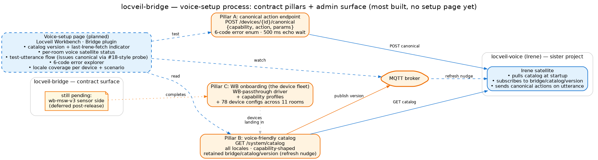

# Planned — voice-setup process

> **Status — contract AGREED, infrastructure mostly built, no setup process or
> page yet.** The bridge↔Irene contract was reconciled 2026-06-06; the bridge
> side has shipped Pillar A (canonical endpoint), Pillar B (catalog endpoint +
> retained version topic), and most of Pillar C (WB-passthrough driver + 6
> capability profiles + 57 device configs across 10 rooms). What's missing is
> (a) four tail tasks in §P3.7 to close Pillar C, and (b) the *setup process*
> itself — the operator-facing surface that turns a fresh bridge into a working
> voice deployment.

## What the contract says

The full contract lives in `docs/design/voice_integration_contract_draft.md`
(AGREED 2026-06-06). Three pillars:

| Pillar | What | Status |
|---|---|---|
| **A. Canonical action endpoint** | `POST /devices/{id}/canonical {capability, action, params}`; capability→native through the existing map; 6-code structured error enum (HTTP-mirrored); synchronous with a 500 ms value-topic-echo timeout. | **Shipped** (§P3.7 #15, HW-verified at #18 against a live `wb-mr6c` in the cabinet). |
| **B. Voice-friendly catalog read** | `GET /system/catalog` — flat capability-shaped projection of devices + rooms; **all locales**; sensors as one `sensor` capability with read-only `fields`; one device, one room. Retained `bridge/catalog/version` MQTT topic carries a content hash so Irene re-fetches only on real change. | **Shipped** (§P3.7 #17). |
| **C. Native WB onboarding** | Generic data-driven WB-passthrough driver; composite payloads (RGB, HVAC) handled inside the driver via typed `state_topics` + `payload_template`; `global` is a regular room holding whole-house aggregates; loop guard on the state-sync chokepoint (no WB-publish callback for passthrough). | **Mostly shipped** (§P3.7 #13–#23 done). Tail open: #22 / #24 / #25 / #26 — see below. |

The strategic decision the contract encodes: **`locveil-bridge` is the single
authoritative device catalog + actuation backend for the whole house** — native
WB gear *and* the AV stack. Irene owns voice; the bridge owns everything else.

## Where we are today

### What's built

- A live canonical-action endpoint, end-to-end-verified against a real
  Wirenboard relay.
- A live catalog endpoint with retained-version refresh-nudge.
- 8 device drivers (the AV stack + the generic WB-passthrough) backing 70
  devices total (13 AV + 57 WB-passthrough) across 10 rooms.
- 7 capability profiles (`light_switch`, `dimmable_light`, `rgb_light`,
  `cover`, `heating_loop`, `hvac`, `sensor_room`) that the WB-passthrough
  fleet draws from.

### What's pending on the bridge side

These four §P3.7 tasks complete Pillar C; the contract is otherwise satisfied:

- **§P3.7 #22 — aggregate devices in `global`.** Whole-house utterances like
  "включи свет везде" need a single canonical call against an aggregate
  device (e.g. `all_lights`) that hits a `wb-rules` fan-out scene. Each
  aggregate is a normal `WbPassthroughDevice` config in `room: "global"`;
  the `wb-rules` scene is user tech debt (controller-side), out of scope
  for this bridge.
- **§P3.7 #24 — `wb-msw-v3_*` sensor side.** Decide whether each multi-sensor
  pack is one device with both IR + sensor capabilities, or split into two
  device entries; implement and onboard the eight `wb-msw-v3` packs the
  house currently has.
- **§P3.7 #25 — catalog completeness sweep + bulk e2e.** Walk every device
  through `POST /devices/{id}/canonical` for every declared capability,
  watch the broker, confirm round-trips. Including each `global` aggregate
  landing on its `wb-rules` topic.
- **§P3.7 #26 — value-label translation layer.** Three-layer enum mapping
  (wire / canonical / labels) on `CapabilityField` + `StateTopicSpec` so
  HVAC mode, heating-loop mode, vane / widevane all surface localised
  labels in the catalog without changing the wire format. Blocks the
  native React HvacPanel and restores typed mode fields the catalog
  currently lacks.

### What's missing structurally — the setup process itself

There is no admin surface for verifying voice readiness. Today an operator
who wants to know "is Irene connected, is the catalog fresh, did the last
voice utterance land on something that worked?" has to read MQTT topics,
hit `GET /system/catalog`, scroll the bridge log. That's the gap this
page describes.

## The planned voice-setup page

A `/setup/voice` route (admin shell) with four panes:

| Pane | Purpose |
|---|---|
| **Catalog status** | Current `bridge/catalog/version` content hash + when it was last bumped; per-Irene-satellite last-fetch timestamp (read from a retained `bridge/catalog/fetched-by/{satellite_id}` topic Irene publishes on each refresh, planned). A green badge = "every satellite is on this version." |
| **Per-room satellite status** | One row per room, showing whether an Irene satellite has registered (planned: a retained `bridge/voice/satellites/{room}` heartbeat from each Irene instance), its locale, its last activity. |
| **Test-utterance flow** | A "fire canonical" form: pick a device, pick a capability, pick an action, fire `POST /devices/{id}/canonical`. Display the 6-code error enum on failure with the spec's plain-English explanation, the post-state on success. Mirrors the §P3.7 #18 verification probe — but on demand. |
| **Locale + capability coverage** | A table: device × locale × capability — which devices have all three of `ru`/`en`/`de` names, which capabilities have value-labels (post-§P3.7 #26), which ones still lack a localisation. Drives the "what does Irene still need" backlog. |

The page does *not* edit voice configuration. Irene's own configuration
(which bridge URL to talk to, which room to scope to, ASR/TTS model
choices) lives in the sister project's setup flow. This page is the
**bridge's view of voice readiness** — what the bridge is offering, who is
consuming it, and whether it's working end-to-end.

## A small backend surface to support it

Two endpoints + one new MQTT topic family the page needs:

- **`GET /voice/status`** — aggregate of (a) current catalog version,
  (b) list of registered satellites with last-fetch timestamps,
  (c) recent canonical-action history (last N calls with their results)
  for the test-utterance pane.
- **`POST /voice/test-utterance`** — convenience wrapper that fires a
  canonical action and bundles the result with extra diagnostics
  (which capability map resolved it, which MQTT topic was hit, what
  echoed back). Same path as `POST /devices/{id}/canonical` under the
  hood, more verbose envelope.
- **`bridge/voice/satellites/{room}`** *(retained)* — Irene publishes a
  small heartbeat (locale, version, room scope) here on connect/reconnect.
  The page reads them to populate the per-room satellite pane.

## Open design questions

- **Per-room Irene satellites — what does "registration" look like?**
  Today the contract assumes one Irene-per-bridge; the per-room voice
  satellite plan (`locveil-voice`'s ESP32 path) makes Irene a fleet. The
  retained-heartbeat topic is one option; an explicit `POST /voice/register`
  is another (heavier but auditable).
- **Auth + ACL between Irene and the bridge.** Today: nothing — LAN trust.
  When the project opens to the WB community, this is the page where the
  policy lives (per-satellite tokens? scoped capability sets?).
- **Voice catalog mismatch diagnostics.** What if Irene tries a capability
  the bridge doesn't expose (rename drift, version skew)? The 6-code error
  enum has `unknown_capability` — the page should surface the last-N of
  those with the offending utterance so operators see drift early.
- **Multi-Irene catalog refresh timing.** The retained version-bump is
  immediate; a fleet of satellites all refresh at once. Acceptable for
  small homes; may need throttling at scale.
- **Voice utterance log.** Useful for debugging, sensitive for privacy.
  Off by default; operator-enable per session through this page; bounded
  retention; never persisted to disk.

## Where the parts already live in code

| Part | Status today |
|---|---|
| `POST /devices/{id}/canonical` | **Built.** `presentation/api/routers/devices.py` + the 6-code error enum in `presentation/api/schemas.py`. |
| `GET /system/catalog` | **Built.** `presentation/api/catalog.py` + `presentation/api/routers/system.py`. |
| Retained `bridge/catalog/version` topic | **Built.** Bumped at the end of `reload_system_task`. |
| WB-passthrough driver + capability profiles + 57 configs | **Built.** See [Devices and scenarios](../architecture/devices-and-scenarios.md). |
| `global` room | **Built (housing).** Aggregates inside it: **Not built** (#22). |
| Value-label translation layer | **Not built** (#26). |
| Multi-sensor `wb-msw-v3` onboarding | **Not built** (#24). |
| Catalog completeness sweep + bulk e2e | **Not run** (#25). |
| `/voice/status` + `/voice/test-utterance` endpoints | **Not built.** |
| Retained `bridge/voice/satellites/*` family | **Not built.** |
| Voice-setup page UI | **Not built.** |
| Admin route / auth shell | **Not built.** (Shared with the other planned admin pages.) |

## Where to go next

- **`docs/design/voice_integration_contract_draft.md`** *(internal design
  spec)* — the AGREED bridge↔Irene contract. Read this first if you're
  implementing any of the §P3.7 tail tasks.
- **[Architecture: rooms](../architecture/rooms.md)** — how `room_id`
  scopes voice utterances; where the `global` aggregate-housing room sits.
- **[Architecture: interfaces](../architecture/interfaces.md)** — the
  endpoints and MQTT topics the voice path already uses.
- **[Planned: device setup](device-setup.md)** + **[topology
  setup](topology-setup.md)** + **[appliance + room pages](appliance-pages.md)**
  — sibling admin surfaces. All four planned pages share the same admin
  shell + auth dependency.
- **Sister project**:
  [`locveil-voice`](https://github.com/locveil/locveil-voice) — Irene
  itself; its `docs/design/mqtt_integration.md` is the counterpart spec
  on the voice side.
