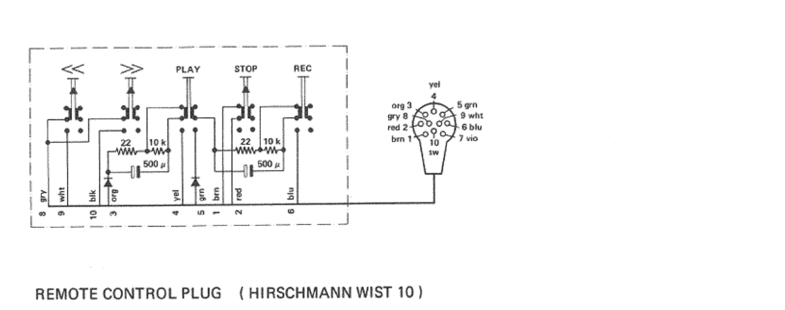
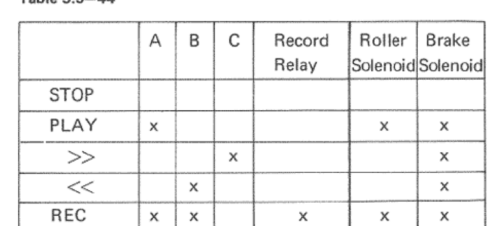

# Revox A77 MK4 → Wirenboard via REMOTE CONTROL DIN — Build & Handoff

**Goal:** Control a Revox A77 MK4 reel-to-reel from a Wirenboard PLC using a small ESP32
that emulates the A77's momentary **remote-control contacts**, publishing
**Wirenboard-conformant MQTT**. Plus a **firmware rewind-safety interlock** that prevents
engaging Play until the reels have stopped. Fully external/reversible — no cutting into the
deck's vintage logic.

**Primary design (this rewrite):** **wired Ethernet (WT32-ETH01), powered from the deck's
pin-7 +27 V via a 27 V→5 V buck**, no battery. **Wi-Fi is a fully-supported option here**
(unlike the B215): the A77's pin 7 delivers ~4 W (27 V × 150 mA), enough to run Wi-Fi after
the buck — see §11. The wired path is chosen for robustness/consistency with the B215, not
necessity.

**Companion document:** [`wb-revoxb215-esp32-bridge.md`](./wb-revoxb215-esp32-bridge.md) (the B215 build).
Much of the MQTT/casing/firmware-scaffolding is shared; this doc details what's different
for the A77.

**Status:** Pinout, contact logic, dummy-plug bridge and power pin CONFIRMED from the A77
service manual (10.18.1611, §7.1 Fig. 7.1-86 and §5.9 Table 5.9-44). Remaining open items
are bench-tuning + sensor selection (see §0). Do a 30-second continuity check of the socket
before connecting, but the schematic is authoritative.

---

## 0. How to resume this with Claude later

Paste this file back and say "continue the Revox A77 build." Outstanding items:

1. DONE — exact REMOTE CONTROL DIN pinout — **see §4.**
2. DONE — what the dummy plug shorts — **pins 1 & 2 (STOP pair), see §1/§4.**
3. DONE — power approach — **wired Ethernet + 27 V buck from pin 7 (§11); Wi-Fi optional.**
4. **Pick the reel-motion sensor** and mounting point (§5), then tune the stop-detect
   debounce and post-stop delay (~0.5 s, B77-style).
5. Bench-confirm the REC = PLAY+REC interlock behaviour on your actual MK4 (logic confirmed
   in §1; just verify on the unit).

Then Claude can finalise the firmware (interlock constants) and the wiring harness.

---

## 1. How the A77 remote actually works (CONFIRMED from manual §7.1 + §5.9)

- The A77 (late-60s/70s) has **no microcontroller, no IR, no serial bus**. The transport
  is **relay logic**: 3 relays (A, B, C) + a Record Relay + roller/brake solenoids
  (manual §5.9). The deck was explicitly designed for momentary-contact wired remote of
  all functions.
- The rear connector is a **Hirschmann WIST 10 (10-pin DIN)**, labelled REMOTE CONTROL
  (rear-panel item 25). The original remote is just a box of momentary buttons that
  **parallel the front-panel switches** — the manual states remote-control contacts
  **F3...F10** are simply paralleled onto the deck's own button contacts, and "to have a
  minimum of relays, their control is locked by diodes."
- **Each button connects a PAIR of connector pins** (it's a simple SPST closure between
  two pins, not a switch to a single common rail). See the exact pairs in §4.
- **Dummy plug:** the manual says verbatim that the dummy connector **"must be inserted
  for operation without the REMOTE CONTROL unit"** and that it **shorts terminals 1 & 2**
  (the STOP pair). Keep that bridge present in your adapter.
- **Switches are momentary / non-latching**, both on the machine and the remote.
- **Pin 7 (vio) = +27 Vdc out**, intended for slide projectors, **150 mA max**. This is
  the only power available on the connector — **27 V, not 5 V**. It powers the bridge via a
  buck converter (§4/§11); never feed 27 V to an ESP32 directly.
- **REC interlock — confirmed by the relay truth table (Table 5.9-44):** REC energizes
  **relays A *and* B plus the Record Relay**. Relay A is the PLAY relay. So **Record
  depends on the PLAY path**; in the remote wiring REC is steered via diodes so pressing
  REC alone does nothing. **Net: Record requires PLAY + REC asserted together.** Preserve
  this — don't defeat it.
- **Auto-reverse:** none. Manual reel machine. No direction command.
- **Power:** A77 has a hard mechanical power switch; **no soft standby**. Mains power is
  NOT automated here (would be a separate, properly-rated relay-on-mains subproject).
- **No tape-motion sensor exists** in the A77 — the §5.9 transport schematic shows only
  the **photoelectric end-of-tape switch** (LDR + lamp). This absence is the root cause of
  the "wait for rewind to stop before Play" hazard (see §7), and is why the interlock
  needs an *added* sensor.

### Remote control schematic (manual Fig. 7.1-86)



### Relay / solenoid truth table (manual Table 5.9-44)



| Mode | Relay A | Relay B | Relay C | Record Relay | Roller Sol. | Brake Sol. |
|---|:--:|:--:|:--:|:--:|:--:|:--:|
| STOP | – | – | – | – | – | – |
| PLAY | yes | – | – | – | yes | yes |
| `>>` FF | – | – | yes | – | – | yes |
| `<<` REW | – | yes | – | – | – | yes |
| REC | yes | yes | – | yes | yes | yes |

(REC = A+B+Record Relay confirms the PLAY-dependency of Record.)

---

## 2. Target command set

Five transport functions, all momentary-contact:

| Function | Emulation |
|---|---|
| Stop   | pulse STOP contact (~200 ms) — safe first test |
| Play   | pulse PLAY contact — **gated by motion interlock (§7)** |
| FF     | pulse FAST-FORWARD contact |
| Rewind | pulse REWIND contact |
| Record | assert PLAY + REC **together** (interlock) — gate behind confirm/arm |

No standby/power. Optionally publish reel-motion / end-of-tape state to MQTT (free
once the sensor exists).

---

## 3. Why the output stage differs from the B215

| | B215 (serial link) | **A77 (remote contacts)** |
|---|---|---|
| Control | ITT serial bitstream on one open-collector data line | **momentary dry contacts** bridging a pin-pair |
| Output device | one open-collector / opto pulling a data pin low | **floating dry contact per function**: opto-MOSFET (AQY212 / TLP222 / G3VM-61A1) or small relay |
| Why | deck idles line high, pulls low to signal | deck closes a contact between two of its own pins; a floating SSR replicates the button exactly |

**Use opto-MOSFET solid-state relays (preferred) or small signal relays** — one per
function, wired **across the pin-pair that the corresponding button closes** (see §4).
They're floating and polarity-agnostic, so they don't care which pin of the pair is which.
This matches what the commercial adapter and the Raspberry-Pi DIY build both do.

> Note: the **connectivity/power** choice (wired vs Wi-Fi, deck-powered via buck) is shared
> with the B215 and lives in §4/§11. The **control method** above is the A77-specific part.

---

## 4. Wiring — CONFIRMED PIN MAP (manual Fig. 7.1-86)

The connector is a **Hirschmann WIST 10**. Bottom-row pin/colour/function mapping read
directly from the schematic. Each button closes the pin-pair shown:

| Function | Closes pins | Wire colours | Notes |
|---|---|---|---|
| `<<` REWIND | **8 - 9** | gry - wht | plain closure |
| `>>` FAST-FWD | **10 - 3** | blk - org | has RC net (22 Ohm + 10 k + 500 uF) + steering diode in remote |
| PLAY | **4 - 5** | yel - grn | plain closure (+ steering diode) |
| STOP | **1 - 2** | brn - red | has RC net; **this is the dummy-plug pair** |
| REC | **6 - (PLAY)** | blu | fed via PLAY; assert with PLAY |
| **+27 V out** | **7** | vio | 150 mA max — feeds the buck (NOT the ESP directly) |
| connector type | — | — | Hirschmann WIST 10, 10-pin DIN |

> Pin numbers on the connector drawing (from the manual): 1 brn, 2 red, 3 org, 4 yel,
> 5 grn, 6 blu, 7 vio, 8 gry, 9 wht, 10 blk; centre pin marked "sw" (chassis/screen).

**Dummy plug:** shorts **1 - 2** (the STOP pair). The deck reads "stop pair closed" as its
rest condition for remote operation; keep this bridge in your adapter so the deck behaves
normally. Your STOP opto-MOSFET parallels this same pair.

### Per-function output stage

Each ESP32/WT32-ETH01 GPIO drives one opto-MOSFET whose floating output is wired **across
that function's pin-pair**, exactly mimicking the button:

```
GPIO ──[330 Ohm]──► opto-MOSFET LED (e.g. AQY212)
                    opto-MOSFET output ──► across the two pins of the pair
                                            (e.g. PLAY = pin 4 - pin 5)
```

- Pulse = GPIO high for ~150–250 ms, then low (a momentary press). Tune on bench.
- **Record:** drive PLAY opto AND REC opto together for the press window
  (REC = pin 6 closure while PLAY 4-5 is also closed).
- **STOP:** parallels pins 1-2; leave the dummy bridge in place as well (harmless — both
  just close the same pair).

### Power (primary: deck pin-7 +27 V via buck)

```
DIN pin 7 (+27 V) ──[fuse 100–200 mA]──► 27V→5V BUCK ──► 5 V ──► board (WT32-ETH01 or ESP32)
DIN ground/chassis ─────────────────────► buck GND / board GND
```

- **Use a switching buck**, set to 5 V (or 3.3 V), rated for >=30 V input (27 V can rise a
  bit). A linear regulator dropping 27→5 V at ~120 mA would burn ~2.6 W as heat — avoid.
- **Add a small input fuse (100–200 mA)** on the pin-7 tap — the deck rail is only rated
  150 mA, so a fault shouldn't be able to overdraw it.
- The contact pins carry the deck's own low-level switching and are kept **isolated from
  the board by the opto-MOSFETs**, regardless of how the board is powered.
- **Power budget:** 27 V × 150 mA ≈ 4 W. After the buck, that's enough for **either** wired
  Ethernet (~120 mA @ 5 V) **or** Wi-Fi with its TX spikes — see §11. This is why the A77,
  unlike the B215, can run Wi-Fi straight off the deck.

### Alternative power: external USB

Power the board from its own 5 V USB supply (simplest, fully isolated) if you'd rather not
tap 27 V. Then pin 7 is left unused.

---

## 5. Reel-motion sensor (enables the interlock + tape feedback)

The A77 has no motion sensor (confirmed — §5.9 has only the photoelectric end-of-tape
switch), so you add one for the board to read. This is the whole basis of the firmware
interlock:

- **Pickup:** an optical/IR-reflective or Hall sensor watching a moving element — a reel
  hub, the brake-drum, or a toothed wheel on the counter/brake-drum path (this is exactly
  where the B77 and the factory ITAM-modified A77 put their motion pickups).
- **Output to board:** pulses while reels turn; absence of pulses = stopped.
- Mount non-invasively (bracket/tape), no deck logic changes.
- Bonus: feed pulse count to MQTT as a tape-counter / movement indicator, and detect
  end-of-reel (motion stops unexpectedly).

A cheap IR-reflective sensor (TCRT5000 module) aimed at a reel hub with a contrasting mark,
or a Hall sensor + a small magnet on the brake-drum, both work. The Hall approach is more
robust to ambient light and tape dust.

> WT32-ETH01 note: if using the wired board, route the sensor to a free **input** pin and
> remember IO35/36/39 are input-only (fine for the sensor; not for the opto outputs).

---

## 6. Bill of materials — primary (wired Ethernet, deck-powered via buck)

| Part | Qty | Notes |
|---|---|---|
| **WT32-ETH01** (ESP32 + LAN8720 + RJ45) | 1 | wired Ethernet; or a Wi-Fi ESP32 (§11 option) |
| 3.3 V USB-serial programmer (CP2102 3V3) | 1 | WT32-ETH01 has no USB — needed to flash it |
| Opto-MOSFET SSR (AQY212 / TLP222 / G3VM-61A1) | 5 (+1 spare) | one per function (STOP, PLAY, FF, REW, REC) |
| Resistor 330 Ohm | 5 | opto-MOSFET LED series |
| **27 V→5 V buck converter** | 1 | switching, >=30 V input; e.g. MP1584 / LM2596 module |
| **Fuse 100–200 mA + holder** | 1 | on the pin-7 tap |
| Reel-motion sensor (IR reflective TCRT5000, or Hall + magnet) | 1 | §5 |
| Hirschmann **WIST 10** mating plug (10-pin DIN) **or** PCB-in-footprint | 1 | see §6b — scarce part |
| Capacitor 470–1000 uF | 1 | reservoir on the 5 V rail |
| Capacitor 0.1 uF | 1 | decoupling |
| RJ45 patch lead | 1 | deck to LAN |
| Enclosure | 1 | metal OK (wired) / NON-metal if Wi-Fi |
| Dummy-plug bridge wiring | — | replicate the 1-2 short |
| 5 V USB PSU (alt. power) | 0–1 | only if powering from USB instead of pin 7 |

---

## 6a. Precise shopping list — Amazon.de

Search terms / typical listings on **amazon.de**. Quantities assume one build + spares.
Prices indicative; verify at purchase.

| # | Item | amazon.de search term | Qty | ~EUR | Notes |
|---|---|---|---|---|---|
| 1 | WT32-ETH01 board | `WT32-ETH01 ESP32 Ethernet Modul` | 1–2 | 10–14 ea | wired; buy 2 for a spare. (Wi-Fi option: `ESP32 NodeMCU WROOM-32` 3-pack) |
| 2 | USB-serial programmer 3.3 V | `CP2102 USB UART 3,3V Programmer` | 1 | 5–7 | **3.3 V TTL**; WT32-ETH01 has no USB |
| 3 | Opto-MOSFET SSR | `Toshiba TLP222A` / `Panasonic AQY212` / `Omron G3VM-61A1` | 6 | 8–15 | 5 + spare; DIP through-hole easiest |
| 4 | 27 V→5 V buck | `MP1584 Step-Down einstellbar` or `LM2596 Step-Down Modul` | 2 | 6 (set) | set to 5 V; >=30 V input rating |
| 5 | Fuse + holder | `Feinsicherung 0,2A + Halter` | 1 | 4 | on pin-7 tap |
| 6 | Resistor kit | `Widerstand Sortiment 1/4W Metallschicht` (incl. 330 Ohm) | 1 kit | 8–11 | covers opto + sensor resistors |
| 7 | IR reflective sensor | `TCRT5000 Infrarot Reflexion Sensor Modul` (5er-Set) | 1 set | 6–8 | OR item 7b |
| 7b | Hall sensor + magnets (alt.) | `A3144 Hall Sensor Modul` + `Neodym Magnete 3mm` | 1 each | 7–10 | robust to light/dust |
| 8 | WIST 10 plug | `Hirschmann WIST 10` (DIN 10-pol) | 1 | 12–25 | **scarce — see §6b for sources & DIY** |
| 9 | Electrolytic caps | `Elektrolytkondensator 470uF/1000uF 16V` | a few | 5 | reservoir |
| 10 | Ceramic caps | `Keramikkondensator 100nF Sortiment` | a few | 5 | decoupling |
| 11 | RJ45 patch lead | `Netzwerkkabel Cat6 0,5m` | 1 | 5 | deck to LAN |
| 12 | Enclosure | `Aluminium Gehause 80x50x25` (wired) or `Kunststoffgehause ABS` (Wi-Fi) | 1 | 6–12 | metal OK if wired |
| 13 | Perfboard / jumpers | `Lochrasterplatine Set` + `Jumper Kabel Dupont` | 1 each | 8–12 | prototyping |
| 14 | Hook-up wire | `Schaltlitze Set 0,25mm2 flexibel` | 1 | 8 | DIN harness |

**Notes / gotchas for ordering:**
- **WT32-ETH01 needs a 3.3 V USB-serial adapter to flash** (item 2). A 5 V adapter can
  damage it. To enter flashing: ground IO0 while toggling EN.
- **Buck (item 4):** must be a *switching* step-down set to 5 V, NOT a linear regulator
  (27→5 V linear at 120 mA ≈ 2.6 W of heat). Confirm >=30 V input rating.
- Opto-MOSFETs: any of TLP222 / AQY212 / G3VM-61A1 work; floating SPST-NO solid state.
  Avoid "relay modules with JD-VCC" unless you specifically want mechanical relays.
- Hall sensor (7b) needs a small magnet fixed to a rotating part (brake-drum) — kapton tape
  or epoxy; keep it balanced.

---

## 6b. The WIST 10 connector — sourcing & the PCB-in-footprint alternative

The **Hirschmann WIST 10** is the scarce, expensive part of the whole A77 project — far
more than the board or opto-MOSFETs. Three routes:

1. **Genuine WIST 10 plug.** Out of production for decades, but available from **Revox
   Service Villingen** (bagged, any quantity) and shops like **Klassik Audio (CH)** as a
   "Dummystecker" — note the ~EUR 25 minimum-order surcharge makes one connector pricey.
   Most robust; latches properly. Ask whether they have a *blank/unwired* WIST 10 (not just
   the sealed dummy) so you can build the adapter into it.
2. **PCB-in-WIST10-footprint (recommended for an ESP/relay build).** A small PCB cut to the
   WIST 10 outline, with **1.4–1.5 mm pins** on the deck edge in the WIST 10 contact pattern
   and a **10-pin header** on the body for ribbon-cable wiring. Forum builder "hbose"
   (revoxforum.ch "WIST10 Stecker Ersatz") did exactly this for an A77 WLAN remote; cost him
   ~EUR 4 vs EUR 25+. Pin diameter 1.4–1.5 mm is the hard constraint (1.5 mm^2 installation
   wire works; thinner pins give poor contact). Getting the contact *pattern* right is the
   one risk — measure your socket or ask hbose for his board file/dimensions
   (roehrenkramladen.de).
3. **One integrated PCB** carrying the WIST 10 pins + opto-MOSFETs + board — the tidiest end
   state; design it only after validating the contact geometry with route 2.

---

## 7. The rewind-safety interlock (firmware, the chosen approach)

**Problem:** pressing PLAY while reels still coast from a fast wind → pinch roller grabs
fast tape → spill/stretch. The A77 lacks the motion sensor that the **B77** added to
solve this. (Reference B77 behaviour: a motion-sense line reads "stopped" only ~0.5 s
after reels actually halt, and the logic blocks PLAY until then.)

**Chosen fix = firmware interlock in the board** (reversible, no deck-logic surgery):

```
State: reels_moving = (motion pulses seen within last N ms)

On "play" (or "record") command:
  if reels_moving:
       assert STOP contact (if not already stopped)   // STOP = close pins 1-2
       wait until reels_moving == false
       wait additional POST_STOP_DELAY (~500 ms, B77-style settle)
  assert PLAY contact (and REC if record)             // PLAY = close 4-5 (+ REC = 6)
```

Constants to tune on the bench: motion debounce window `N`, `POST_STOP_DELAY` (~0.5 s),
press pulse width.

**Known limitation (by design):** firmware can only gate **its own** Play commands. A
human pressing the **front-panel** Play still bypasses it (that path doesn't go through
the board). If front-panel protection is ever wanted, that requires putting the interlock
in the deck's own logic path (B77/ITAM-style hardware mod) — explicitly out of scope here.

> Note: a genuinely sluggish/failing end-of-tape auto-stop is usually the aged LDR R155 /
> resistor R118 on the relay board — a separate repair, not this interlock. (Manual §8.1
> "Rewind" is a different mod again: it fixes weak rewind torque with 18 cm reels by
> replacing R125 820 Ohm → 1.2 kOhm 9 W on drive control 1.077.370. Don't conflate the three.)

---

## 8. MQTT (Wirenboard-conformant) — same convention as B215

- Device id e.g. `revox_a77`.
- Controls (type `pushbutton`): `stop`, `play`, `ff`, `rewind`, `record`.
- Optional (read-only value topics): `reels_moving`, `tape_counter`, `end_of_tape`.
- Topic shape:
  - `/devices/revox_a77/meta/name` (retained)
  - `/devices/revox_a77/controls/<c>/meta/type` (retained)
  - `/devices/revox_a77/controls/<c>` (publish state, retained)
  - `/devices/revox_a77/controls/<c>/on` (subscribe; UI/rules write here)
- Connect to the Wirenboard Mosquitto broker (broker-direct, simplest).
- **Record safety:** gate behind a confirm/arm topic, same as B215.

Firmware scaffolding (PubSubClient + command table + handler) is identical in shape to the
B215 sketch — reuse it. Transport bring-up: `ETH.begin()` for the WT32-ETH01 (wired), or
`WiFi.begin()` for the Wi-Fi option. The only A77-specific logic is: (a) each command pulses
an opto-MOSFET across a pin-pair instead of calling `sendLinkFrame()`, (b) the §7 interlock
wraps play/record, (c) Record asserts PLAY+REC together.

---

## 9. Casing

- **Wired Ethernet:** metal enclosure OK (no antenna to detune). **Wi-Fi option:** use
  ABS/PETG (NON-metal). Strain-relieve the DIN pigtail; ventilation slots; mount behind the
  deck away from the transformer/motors. Route the motion-sensor lead cleanly to its
  bracket. Label the DIN pigtail pinout (use the §4 map).

---

## 10. Bring-up sequence

1. Pin map filled (§4). Still do a continuity check (deck unpowered) confirming each button
   closes the pin-pair in §4 against your actual socket.
2. Flash the board; bench it **without** the deck: confirm MQTT topics in WB, each button
   pulses its GPIO/opto-MOSFET (meter the contact closing across the right pin-pair).
3. Set the buck to 5 V on the bench BEFORE connecting to pin 7; fuse the pin-7 tap.
   **Measure pin 7 ≈ 27 V and that it holds under the buck's load.**
4. Install adapter on the WIST 10 socket (keep the 1-2 dummy bridge). Send **STOP** first.
5. Test PLAY (4-5), FF (10-3), REWIND (8-9). Then **RECORD** (PLAY 4-5 + REC 6 together, gated).
6. Add motion sensor; verify `reels_moving` tracks reality; tune debounce + post-stop delay.
7. Enable the §7 interlock; test PLAY-immediately-after-REWIND → confirm it waits for
   stop + settle before engaging. Confirm no tape spill.

---

## 11. Power decision — deck pin-7 +27 V (Wi-Fi works here too)

**The A77 is the opposite of the B215 on power.** The B215's rail is 5 V/150 mA (~0.75 W),
which **cannot** survive Wi-Fi spikes — that forced wired Ethernet. The A77's pin 7 is
**27 V/150 mA (~4 W)**, which after a buck is enough for **either** transport:

| Transport | Draw after buck | Pin-7 budget (≈4 W)? | Notes |
|---|---|---|---|
| **Wired Ethernet (WT32-ETH01)** | ~120 mA @ 5 V ≈ 0.6 W | yes, large margin | steady, no spikes; metal case OK |
| **Wi-Fi (ESP32)** | ~80–120 mA avg + 300–500 mA spikes | yes — buck + reservoir cap absorb spikes | needs non-metal case |
| External USB (either) | n/a | n/a | simplest, isolated; pin 7 unused |

**Why wired is still the primary choice** (despite Wi-Fi being feasible):
- Consistency with the B215 — one architecture across both decks.
- Steady draw, the most margin on the 150 mA rail, metal enclosure allowed.
- A LAN cable reaches the deck easily (confirmed).

**Why Wi-Fi is a legitimate option on the A77** (and was kept):
- The 4 W budget genuinely supports it after the 27 V→5 V buck + a local reservoir cap to
  ride the TX spikes — the A77 has the headroom the B215 lacked.
- Choose Wi-Fi if you'd rather not run a LAN cable; everything else (opto-MOSFETs, interlock,
  MQTT) is identical, only `WiFi.begin()` replaces `ETH.begin()` and the case must be plastic.

**Shared caveats:**
- Buck must be **switching**, 5 V out, >=30 V in. Linear would cook.
- **Fuse the pin-7 tap (100–200 mA)** — the rail is only 150 mA.
- **Measure pin 7 under load** before trusting it (§10 step 3).

---

## 12. Prior art / references

- **A77 service manual 10.18.1611 — §7.1 Remote Control, Fig. 7.1-86**: connector =
  Hirschmann WIST 10; button→pin-pair map (REW 8-9, FF 10-3, PLAY 4-5, STOP 1-2, REC 6);
  pin 7 = +27 V / 150 mA; **dummy plug shorts 1 & 2**. **§5.9 Drive Control + Table 5.9-44**:
  relay/solenoid truth table (REC = A+B+Record Relay → PLAY-dependency); only a
  photoelectric end-of-tape switch, no motion sensor. **§8.1 Rewind**: R125 820 Ohm→1.2 kOhm
  torque mod (unrelated). end-of-tape LDR R155 / relay-board R118 = auto-stop sensitivity
  (separate repair).
- **WT32-ETH01** (Wireless-Tag): ESP32 + LAN8720A, RJ45, 3V3 **or** 5V supply pin; ~120 mA
  at 100M; no USB, flash via 3.3 V serial (IO0 low + EN); IO35/36/39 input-only.
- **revoxforum.ch "WIST10 Stecker Ersatz"** (hbose): PCB-in-WIST10-footprint adapter,
  1.4–1.5 mm pins, 10-pin header, ~EUR 4; genuine plug available from Revox Service Villingen
  (~EUR 25 min-order). Site: roehrenkramladen.de.
- **Tapeheads "ReVox A77 WIFI Remote, I am making my own"**: A77 remote-socket wires
  desoldered to relay modules driven by a Raspberry Pi; thread recommends ESP/NodeMCU;
  relay-interface approach ports to Teac/Ampex transports too.
- **Tapeheads "Revox B77 (mk2) diy remote control advice"**: corroborates the contact
  logic — momentary switches, REC fed from PLAY, diode blocks REC-on-PLAY-only; some
  builders rewired to ground-closure to drop the dummy plug.
- **Commercial adapter (revoxremotes/teacremotes)**: Sony-IR adapter into the remote
  connector controlling Play/Record/Stop/FF/Rewind; needs dummy plug removed. Confirms
  contact-emulation is all that's required (the unit you want to replace visually).
- **B77 transport behaviour (Tapeheads transport-problem thread)**: motion-sense point P4
  = 5 V stopped, 0 while moving, returns to 5 V ~0.5 s after full stop — the model for the
  §7 interlock timing.
- **ITAM 3.77 (factory-modified A77)**: counter belt over a motion-sensor pulley/toothed
  wheel feeding an extra plug-in control board — precedent for adding motion sensing to
  an A77.

---

## 13. Relationship to the B215 project

Shared, reuse directly: board + Wirenboard MQTT scaffolding; record-safety gating;
broker-direct integration; "appears as native WB device" approach; **wired-Ethernet +
deck-power architecture and the 27 V buck idea generalised from the B215's 5 V approach.**

Different from B215: **dry-contact opto-MOSFET outputs across pin-pairs** (not open-collector
serial); **no protocol/capture** (just pulse contacts); **REC=PLAY+REC interlock**; **no soft
power**; **+27 V rail (buck) instead of +5 V — so Wi-Fi is viable here**; **added reel-motion
sensor + firmware rewind interlock**; **scarce WIST 10 connector** (see §6b); no rich status
bus (feedback is only what your added sensor provides).
