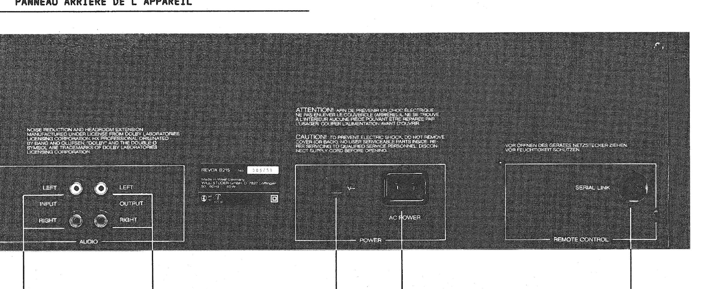
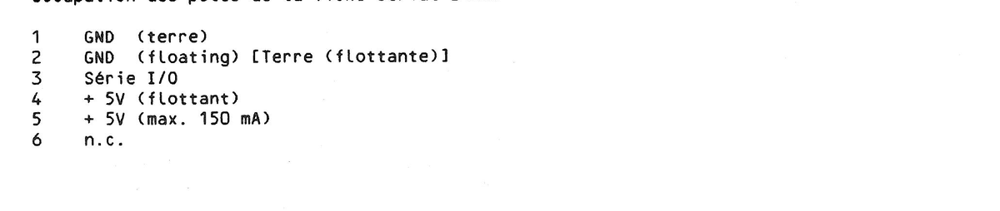

# Revox B215 → Wirenboard via SERIAL LINK — Option B Build & Handoff

**Goal:** Control a Revox B215 cassette deck from a Wirenboard PLC by driving the deck's
rear **SERIAL LINK** port directly with a small ESP32 that publishes/subscribes
**Wirenboard-conformant MQTT** over Wi-Fi. IR is bypassed entirely.

**Companion document:** [`wb-revoxa77-esp32-bridge.md`](./wb-revoxa77-esp32-bridge.md) (the A77
reel-to-reel build — shared MQTT / casing / firmware scaffolding).

**Status of this document:** ✅ **SERIAL LINK connector pinout now CONFIRMED from the
official B215 deck service manual (§1.4 rear-panel description).** Electrical nature
(bidirectional, opto-isolated, +5 V/150 mA) confirmed. Still outstanding: scope-capture of
the B205 command/status frames (the protocol bytes/timing live in the separate IR Remote
Control Systems manual + your own captures), and `LINK_INVERT` polarity.

---

## 0. How to resume this with Claude later

Paste this file back in and say "continue the Revox B215 Option B build." Outstanding:

1. ✅ ~~DIN pin count/layout, which pin is +5 V vs GND~~ — **DONE, official pinout in §1/§4.**
2. **Scope captures of the B205 frames on pin 3** for the seven functions (§8) — still
   needed for the command table + timing.
3. **Fill the command table** (§5) with captured frame values; set `LINK_INVERT` after
   observing line polarity.

Then Claude can produce final `sendLinkFrame()` timing constants, the real command table,
and the finalized wiring harness.

> 30-second sanity check before connecting: meter pin 5→pin 2 with the deck powered (rear
> switch on) and confirm ~+5 V. The manual pinout is authoritative, but the scan is old and
> a quick continuity/voltage check is cheap insurance.

---

## 1. Confirmed facts about this deck & system

- **Deck:** Revox B215, serial 013773, Made in West Germany (Willi Studer GmbH,
  D-7827 Löffingen), 45 W. Genuine B215. Two manuals apply: the **B215 deck service
  manual** (transport/audio/schematics — source of the pinout below) and the separate
  **"IR Remote Control Systems"** manual (order no. 10.30.0430 — source of the serial-link
  *protocol*, device id 04, and the drive-function enumeration).
- **Rear panel** (confirmed from photo + manual §1.4): a panel labelled **SERIAL LINK /
  REMOTE CONTROL** with the DIN socket, a POWER panel with voltage selector + **hard mains
  rocker switch**, and an AUDIO panel (L/R in, L/R out RCA).

### Rear panel (manual §1.4)



- **The SERIAL LINK is the chosen control path.** It is part of the Revox B200-series
  remote system; the deck addresses itself on this bus as **device identifier 04**.

### ✅ CONFIRMED pinout (B215 service manual §1.4 — "Occupation des pôles de la fiche Serial Link")



| Pin | Manual definition | Use in this build |
|---|---|---|
| **1** | GND (earth / terre) | chassis earth — **do NOT use as the signal reference** |
| **2** | GND (**floating** / flottante) | **signal + opto reference ground** |
| **3** | **Série I/O** (bidirectional serial data) | **DATA** — the line you drive/read |
| **4** | +5 V (floating) | spare floating rail (leave unused) |
| **5** | +5 V (**max. 150 mA**) | power/reference only — see §4 |
| **6** | n.c. | unused |

**Key corrections vs the earlier provisional (`0815simon`) pinout:**
- Pin 3 = data ✓ and pin 5 = +5 V ✓ — both as previously assumed.
- There are **two grounds**: pin 1 = **earth**, pin 2 = **floating GND**. Reference your
  opto stage to **pin 2**, not pin 1, to keep isolation intact.
- There are **two +5 V pins**: pin 4 (floating) and pin 5 (the 150 mA-rated one).
- Pin 6 is **n.c.** — not a strap/data pin.
- **IR-disable strap (1+2 / 4+5): hobbyist-sourced, NOT confirmed by the deck manual.**
  Given the official pinout, shorting 1+2 bonds floating GND to earth and 4+5 ties the two
  +5 V rails — possibly how the deck senses "external controller present," but **treat as
  unverified; scope/meter before applying.** It's optional anyway (only suppresses stray IR).

- **Electrical nature:** NOT RS-232, NOT RS-485. A single **bidirectional** ("Série I/O")
  **open-collector** data line, idled high by the deck's internal pull-up, behind
  **optocoupler isolation** inside the deck. ITT/Nokia pulse-coded framing with
  ~15 µs-scale carrier features.
- **CRITICAL SAFETY RULE:** never drive pin 3 hard high. Assert a bit by pulling the
  line to GND (pin 2); release it to let the deck's pull-up restore high. Use an
  **open-collector / open-drain (ideally opto-isolated) output stage**. Driving +5 V
  onto the line can damage the deck's output when it tries to pull low.
- **Power on/off behaviour:** "off" = **Standby** (deck logic stays powered; rear hard
  switch must remain ON permanently). "On" is best modelled as **wake-on-transport**:
  sending Play wakes the deck and acts. Whether Stop/Pause alone wake it is unconfirmed —
  on the test list. There is **no cold-start over serial** if the rear switch is off.
- **Auto-reverse:** direction is handled internally. There is **no direction command** —
  Play plays the current direction. Nothing extra to model.
- **Eject:** mechanical/front-panel; do **not** assume a serial eject exists. Verify.

---

## 2. Target command set (device identifier 04)

Seven functions in scope, mapped to the B215 drive-function enumeration:

| Function | Notes |
|---|---|
| Standby   | stateful on/off; "power" surfaces as this |
| Stop      | safe first test command |
| Play      | also serves as "wake / power on" |
| FF        | fast-forward (Vorspulen) |
| Rewind    | (Rückspulen) |
| Record    | gate behind a confirm/arm step (safety) |
| Pause     | auxiliary function |

Optional extras if easy after captures: Loop/Positioning, cue, and **status read-back**
(play state + real-time mm:ss tape counter) — a genuine bonus of the serial path.

---

## 3. Bill of materials (Option B)

| Part | Qty | Notes |
|---|---|---|
| ESP32 dev board (WROOM-32 DevKitC or similar) | 1 | Wi-Fi; choose one with a decent onboard regulator |
| PC817 optocoupler | 1 (control) +1 if adding status read-back | output stage; 6N137 if edges too soft |
| Resistor 1 kΩ | 1 | opto LED series |
| Resistor 220–470 Ω | 1 | only for status-direction opto LED, if used |
| Resistor 4.7 kΩ | 0–1 | pin-3 pull-up ONLY if scope shows weak idle-high |
| 5-pin 180° DIN plug + short cable | 1 | mates SERIAL LINK socket (it's a 6-pin assignment but a 5-pin 180° DIN body is what these use; confirm against your socket) |
| **5 V USB supply for ESP32** | 1 | **required** — pin 5 (150 mA) can't power Wi-Fi (see §4) |
| Capacitor 470–1000 µF | 0–1 | local reservoir at the ESP32 |
| Capacitor 0.1 µF | 1 | decoupling at board |
| ABS/PETG enclosure ~80×50×25 mm | 1 | NON-metal (Wi-Fi); see §7 |

> Removed from the earlier BOM: the "3.3 V LDO / pin-5 power" path — the manual confirms
> pin 5 is capped at **150 mA**, which can't supply ESP32 Wi-Fi TX spikes. Use external USB.

---

## 3a. Precise shopping list — Amazon.de

Exact-ish search terms / typical listings on **amazon.de**. Quantities assume one build
plus spares. Prices indicative (2024–2025); verify at purchase.

| # | Item | amazon.de search term | Qty | ~€ | Notes |
|---|---|---|---|---|---|
| 1 | ESP32 dev board | `ESP32 NodeMCU WROOM-32 Entwicklungsboard` (e.g. AZDelivery 3er-Set) | 1 (3-pack) | 12–18 | 3-pack = spares; PCB-antenna version |
| 2 | Optocoupler PC817 | `PC817 Optokoppler DIP` (10–20er-Set) | 1 set | 6–8 | covers control + status-readback + spares |
| 3 | Optocoupler 6N137 (optional, faster) | `6N137 Optokoppler High Speed` | 0–2 | 5 | only if pin-3 edges look soft on the scope |
| 4 | Resistor kit | `Widerstand Sortiment 1/4W Metallschicht` (incl. 1 kΩ, 4.7 kΩ, 220–470 Ω) | 1 kit | 8–11 | one kit covers all values |
| 5 | DIN plug | `DIN Stecker 5-polig 180 Grad Lötversion` (metal shell) | 2 | 6–9 | buy 2; confirm it mates your SERIAL LINK socket |
| 6 | 5 V USB PSU | `USB Netzteil 5V 2A` + `Micro-USB Kabel` | 1 | 7–10 | **mandatory** ESP32 supply (not pin 5) |
| 7 | Electrolytic caps | `Elektrolytkondensator 470µF 16V` (Sortiment) | a few | 5 | local reservoir |
| 8 | Ceramic caps | `Keramikkondensator 100nF 0,1µF Sortiment` | a few | 5 | decoupling |
| 9 | Enclosure | `Kunststoffgehäuse ABS 80x50x25` (or Hammond 1551) | 1 | 6–10 | NON-metal for Wi-Fi |
| 10 | Perfboard / jumpers | `Lochrasterplatine Set` + `Jumper Kabel Dupont` | 1 each | 8–12 | prototyping |
| 11 | Hook-up wire | `Schaltlitze Set 0,25mm² flexibel` | 1 | 8 | DIN harness |

**Notes / gotchas for ordering:**
- **DIN plug (item 5):** the manual lists a 6-pin *assignment*, but Revox SERIAL LINK uses
  a standard DIN body — most builds use the 5-pin 180° plug. **Verify the pin count/layout
  of your actual socket before ordering** (the §0 sanity check covers this). If yours is a
  6-pin/DIN variant, order that instead from Reichelt/Conrad.
- PC817 (item 2) is generic and cheap; a bag of 10–20 leaves plenty for the optional
  status-readback opto and mistakes.
- Do **not** buy a buck/LDO to run the ESP32 off pin 5 — it's 150 mA, insufficient. Item 6
  (USB PSU) is the supply.
- Everything except possibly the DIN plug is routine amazon.de stock; the DIN plug is the
  one item worth checking Reichelt/Conrad/Mouser DE for if Amazon listings look dubious.

---

## 4. Wiring

### Control output stage (MCU → deck)

```
ESP32 GPIO17 ──[1kΩ]──► PC817 LED anode
                        PC817 LED cathode ──► ESP32 GND

PC817 transistor collector ──► DIN pin 3 (DATA, Série I/O)
PC817 transistor emitter   ──► DIN pin 2 (GND FLOATING — not pin 1 earth)
```

- GPIO high → opto conducts → pin 3 pulled to pin 2 (line low).
- GPIO low  → opto off → deck pull-up restores high (idle).
- This **inverts** sense (matches the protocol's noted inversion). Final polarity is
  resolved in firmware via `LINK_INVERT` after scoping.
- **Reference everything to pin 2 (floating GND), never pin 1 (earth)** — this preserves
  the deck's internal optocoupler isolation.

### Power

- **Pin 5 is +5 V / 150 mA max (confirmed).** That is **not enough** for an ESP32 with
  Wi-Fi (TX spikes 300–500 mA). **Power the ESP32 from its own USB supply.** Pin 5 may be
  used only as a weak sense/reference if ever needed — not as the supply.
- Pin 4 (+5 V floating) — leave unused.

### Optional status read-back (deck → MCU)

- pin 3 → series resistor (referenced to pin 5 / pin 2) → second PC817 LED → its
  transistor → ESP32 input pin.
- Lets you parse the deck's return frames (play state, mm:ss tape counter) into MQTT value
  topics.

### IR disable (optional, UNVERIFIED — see §1)

- The hobbyist note "short DIN 1+2 and 4+5" is **not confirmed** by the deck manual and,
  per the official pinout, bonds floating-GND↔earth and the two +5 V rails. Only attempt
  after scoping; it merely suppresses stray IR and is not required for control.

---

## 5. Firmware

**Base repo:** `https://github.com/0815simon/revox-rc5-remote` — file `revox_web_remote.ino`.

**What to keep:** the **serial-link bit-banging routine** (frame → GPIO toggles).
**What to delete:** the RC5/IR receive code and the bundled webserver.
**What to add:** Wi-Fi + MQTT (PubSubClient or AsyncMqttClient) + a clean command table.

> The repo is the author's self-described "hacky, trial-and-error" project. Lift and
> adapt the TX core; don't flash as-is.

### Skeleton

```cpp
// ---- config ----
const char* WIFI_SSID = "...";
const char* WIFI_PSK  = "...";
const char* MQTT_HOST = "192.168.x.x";   // Wirenboard broker (Mosquitto on the WB)
const uint16_t MQTT_PORT = 1883;
const char* DEVICE_ID = "revox_b215";

const int   PIN_LINK    = 17;            // to opto LED
const bool  LINK_INVERT = true;          // set after scoping line polarity

// ---- ITT serial-link bit-banger (adapted from 0815simon) ----
// Sends one Revox frame: device id 04 + function code.
// Bit order (MSB/LSB) and bit timing come from YOUR scope captures.
// Keep all timing in this one function so retuning is trivial.
void sendLinkFrame(uint16_t frame) {
  // assert = pull line low; idle = release (deck pull-up brings high)
  // honour LINK_INVERT
  // use delayMicroseconds() with measured bit widths (~15 µs-scale features:
  //   confirm start-bit, 0/1 bit periods, repeat gap from captures)
}

// ---- command table: REPLACE 0x0000 with captured B205 frame values ----
struct Cmd { const char* name; uint16_t frame; };
Cmd CMDS[] = {
  {"standby", 0x0000},
  {"stop",    0x0000},
  {"play",    0x0000},
  {"ff",      0x0000},
  {"rewind",  0x0000},
  {"record",  0x0000},
  {"pause",   0x0000},
};

// ---- MQTT command handler (Wirenboard convention) ----
void onMqtt(char* topic, byte* payload, unsigned int len) {
  String t(topic), p;
  for (unsigned i = 0; i < len; i++) p += (char)payload[i];
  // expected: /devices/revox_b215/controls/play/on   payload "1"
  for (auto &c : CMDS) {
    String want = String("/devices/") + DEVICE_ID + "/controls/" + c.name + "/on";
    if (t == want && p == "1") {
      // RECORD SAFETY: gate here behind an "armed" flag / confirm topic
      sendLinkFrame(c.frame);
      String fb = String("/devices/") + DEVICE_ID + "/controls/" + c.name;
      mqtt.publish(fb.c_str(), "1", true);   // echo state back
    }
  }
}
```

### On connect: publish retained meta topics (so WB sees a native device)

- `/devices/revox_b215/meta/name` = `Revox B215` (retained)
- For each control:
  `/devices/revox_b215/controls/<name>/meta/type` (retained)
  - momentary keys (stop, play, ff, rewind, record, pause) → type `pushbutton`
  - standby → type `switch` (stateful on/off) if desired
- Value topic `/devices/revox_b215/controls/<name>` — publish state (retained)
- Command topic `/devices/revox_b215/controls/<name>/on` — **subscribe**

### Record safety

Gate `record` behind a second confirming topic or a short "armed" window so a stray
MQTT message can't start a recording over a tape.

---

## 6. Wirenboard MQTT convention (reference)

Same convention `wb-mqtt-serial` uses:

| Topic | Direction | Retained | Purpose |
|---|---|---|---|
| `/devices/<id>/meta/name` | publish | yes | device display name |
| `/devices/<id>/controls/<c>/meta/type` | publish | yes | `pushbutton` / `switch` |
| `/devices/<id>/controls/<c>` | publish | yes | current value/state |
| `/devices/<id>/controls/<c>/on` | **subscribe** | — | command in (UI/rules write here) |

**Integration choice:** simplest is **broker-direct** — ESP connects to the WB
controller's Mosquitto broker over Wi-Fi (reachable on LAN by default on WB). The deck
then appears as a native WB device; rules/scenes/UI work with no extra glue.

---

## 7. Casing

- **Material:** ABS or PETG, ~80×50×25 mm. **Not metal** (would kill Wi-Fi). If printing,
  PETG handles warm-equipment proximity better than PLA. Keep the ESP32 PCB antenna near
  an edge, not buried.
- **Layout:** ESP32 on standoffs; opto + passives on a small perfboard daughter area.
  DIN pigtail exits one end via a grommet (strain relief); USB exits the other.
- **Ventilation:** a few slots; ESP runs warm; no fan needed.
- **Mounting:** VHB pad or keyhole tab to hang behind the rack. Keep away from the deck's
  transformer area.
- **Label** the DIN pigtail with the pinout (use the §1 confirmed map).
- Off-the-shelf alternative: Hammond 1551-series ABS box.

---

## 8. Measurements still required (before/at bring-up)

1. ✅ ~~DIN pin count/layout, +5 V vs GND~~ — pinout confirmed (§1). Still do the
   30-second meter check: pin 5→pin 2 ≈ +5 V, deck powered, rear switch on.
2. **B205 frame captures on pin 3** — deck only, scope pin 3 to **pin 2** while firing the
   **B205** at the front for each of: standby, stop, play, ff, rewind, record, pause.
   Record: idle level, logic swing, start-bit timing, 0/1 bit periods, frame length,
   repeat gap, bit order. These fill the command table and set timing.
3. **Polarity** — from the captures, set `LINK_INVERT`.
4. **Wake test** — put deck in standby, send Stop; does it wake? Repeat Pause, then Play.
   Note which wake it (settles the "power on" mapping).

> (Pin-5 current capability no longer needs measuring — manual says 150 mA, so ESP32 runs
> off USB regardless.)

---

## 9. Bring-up sequence (Option B)

1. Bench ESP **without** deck: confirm Wi-Fi, MQTT topics appear in WB, buttons publish.
2. Scope the output stage into a dummy load: confirm pull-low/release; set `LINK_INVERT`.
3. Capture B205 frames on pin 3 (deck only) → fill command table (§5).
4. Connect (reference to pin 2); send **stop** first; then play / pause / ff / rewind;
   **record last** (gated).
5. (Optional) add status-read opto; parse return frames into WB value topics.

---

## 10. Known field notes / gotchas

- The B215 transport has a **watchdog**: a faulty unit was reported to auto-stop within
  ~4 s unless control sequencing was as expected (that was a fault from a swapped
  microprocessor, not normal behaviour). If your first Play "bounces," suspect command
  framing/timing, not wiring.
- The B201 (non-CD) remote does **not** drive Play on the tape decks — irrelevant here
  since you have a **B205** (drives everything) and are going serial, but don't capture
  frames from a B201.
- Protocol sense is **inverted** in places — that's expected; handle in `LINK_INVERT`.
- **Two grounds on the connector** — always reference to pin 2 (floating), never pin 1
  (earth), or you defeat the deck's isolation.

---

## 11. Why Option B (vs A)

- Timing-critical signal generation lives **clean and local** at the deck (no Linux
  scheduling jitter, no 3 m cable run on a fussy open-collector line).
- Wi-Fi keeps wiring trivial; deck appears as a native WB device via standard MQTT.
- Only real homework now: scope the B205 frames (pinout + power are settled).
- Option A (controller-driven over 3 m) remains a fallback; if ever built, make its
  deck-end board B-ready so swapping in an ESP32 is a 10-minute upgrade.

---

## 12. Source references

- **B215 deck service manual (Studer Revox, trilingual DE/EN/FR)** — §1.4 rear-panel
  description: **SERIAL LINK pin assignment (pin 1 GND earth, 2 GND floating, 3 Série I/O,
  4 +5 V floating, 5 +5 V max 150 mA, 6 n.c.)**; transport/audio/alignment/schematics.
- **Revox "IR Remote Control Systems" service manual** (order no. 10.30.0430): device
  identifier table (04 = B215), serial-link protocol, drive/aux function enumeration,
  B215 status string format. (archive.org: `studer_Revox_IR_Remote_System_Serv`)
- `0815simon/revox-rc5-remote` (GitHub): working ESP8266 serial-link TX; DIN data/GND/+5V
  notes (data=3, GND, +5V) and the **unverified** IR-disable strap idea.
- Tapeheads.net "Info on Revox Serial Link protocol wanted": bidirectional single-wire
  warning, open-collector / opto recommendation, Nokia/ITT protocol family.
- IRMP discussion #80: native remote waveform timing (~15 µs bursts; 150/300 µs bit
  periods), TBA2800 preamp note.
- Wirenboard wiki: WB-MSW v3 is RS-485/Modbus IR module (IR-only actuator); WB controller
  has native RS-485 + Linux + Mosquitto broker; MQTT device convention.
- NEEO forum: B215 PLAY triggers power-on event (wake-on-transport evidence).
