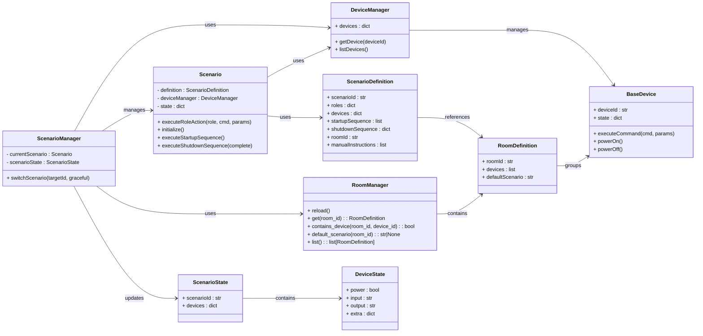

# Scenario System – **Merged Specification**
*Version: 2025‑05‑03‑rev1*

---

## 1  Scope
This document **fully replaces** all earlier scenario‑system specifications. It merges the change‑set introduced in *Scenario System – Updated Specification* (2025‑05‑03) with the restored **Scenario Definition** section from the original 2024 spec **and** incorporates the refined definition agreed on 2025‑05‑03 (virtual device façade, donated roles, delegated execution).

**Goals**
1. Provide a single source‑of‑truth for declaring, validating and executing *Scenarios*.
2. Detail runtime state models, transition algorithms and persistence contracts.
3. Define driver requirements, REST/MQTT APIs and concurrency guidelines.
4. Offer a spatial model (*Rooms*) required by end‑user UX without impacting core execution.

---

## 2  Key Terminology
| Term | Meaning |
|------|---------|
| **Scenario** | A *virtual device façade* that aggregates a named collection of desired device states **and** exposes high‑level roles. Each role (e.g. `volume_control`, `screen`) is provided by one or more member devices; at runtime the scenario delegates role actions to a selected device. |
| **Role** | A logical capability (a.k.a. *action group*) such as `volume_control`, `screen`, `lighting`, etc. Advertised by devices, consumed by scenarios. |
| **Room** *(new)* | A **static grouping of devices** that gives spatial context to scenarios and voice/UX commands (e.g. `kitchen`, `living_room`). Rooms are **metadata only** – the runtime engine never looks at them. |
| **RoomManager** | Service that loads and validates rooms.json, keeps the canonical room map in memory, and answers queries like `contains_device()` or `default_scenario()`. |
| **Scenario Definition** | The *declarative JSON* that describes roles, delegated devices, desired end‑state and orchestration sequences. |
| **Scenario State** | A *runtime snapshot* of all devices while the scenario is active (persistable). |
| **Device** | A concrete driver derived from `BaseDevice`. |
| **Scenario Manager** | Service component that performs scenario transitions and maintains global state. Depends on `RoomManager` and `DeviceManager`. |



---

## 3  Scenario Definition
This section re‑introduces the declarative structure that tools & UIs use to **author** scenarios. It is *orthogonal* to the runtime `ScenarioState` model (see §4).

### 3.1  Declarative JSON Structure
```json
{
  "scenario_id": "movie_night",
  "name": "Movie Night",
  "description": "Setup for watching movies with optimal audio and video settings",
  "room_id": "living_room",
  "roles": {
    "screen": "living_room_tv",
    "volume_control": "audio_receiver",
    "source_control": "audio_receiver"
  },
  "devices": {
    "living_room_tv": {
      "groups": ["screen", "volume_control"]
    },
    "audio_receiver": {
      "groups": ["audio_control", "source_control", "volume_control"]
    }
  },
  "startup_sequence": [
    {
      "device": "audio_receiver",
      "command": "power",
      "params": {"state": "on"},
      "condition": "device.power != 'on'",
      "delay_after_ms": 2000
    },
    {
      "device": "audio_receiver",
      "command": "input",
      "params": {"input": "hdmi1"},
      "condition": "device.input != 'hdmi1'",
      "delay_after_ms": 1000
    },
    {
      "device": "living_room_tv",
      "command": "power",
      "params": {"state": "on"},
      "condition": "device.power != 'on'",
      "delay_after_ms": 2000
    },
    {
      "device": "living_room_tv",
      "command": "input_source",
      "params": {"source": "hdmi1"},
      "condition": "device.input_source != 'hdmi1'"
    }
  ],
  "shutdown_sequence": {
    "complete": [
      {
        "device": "living_room_tv",
        "command": "power",
        "params": {"state": "off"},
        "condition": "device.power == 'on'",
        "delay_after_ms": 1000
      },
      {
        "device": "audio_receiver",
        "command": "power",
        "params": {"state": "off"},
        "condition": "device.power == 'on'"
      }
    ],
    "transition": [
      {
        "device": "living_room_tv",
        "command": "input_source",
        "params": {"source": "tv"},
        "condition": "device.input_source != 'tv'"
      },
      {
        "device": "audio_receiver",
        "command": "input",
        "params": {"input": "tv"},
        "condition": "device.input != 'tv'"
      }
    ]
  },
  "manual_instructions": {
    "startup": [
      "💿  Turn ON the turntable’s AC switch (rear left).",
      "🪄  Lift the tone‑arm rest lever.",
      "🔈  Set amplifier to PHONO input."
    ],
    "shutdown": [
      "💿  Return tone‑arm to rest and power OFF the turntable."
    ]
  }  
}
```

### 3.2  `ScenarioDefinition` (Pydantic)
```python
from typing import Any, Dict, List, Optional
from pydantic import BaseModel, Field, validator

class ManualInstructions(BaseModel):
    startup: list[str] = Field(default_factory=list)
    shutdown: list[str] = Field(default_factory=list)

class CommandStep(BaseModel):
    device: str
    command: str
    params: Dict[str, Any] = Field(default_factory=dict)
    condition: Optional[str] = None
    delay_after_ms: int = 0

class ScenarioDefinition(BaseModel):
    scenario_id: str = Field(..., min_length=1)
    name: str
    description: str = ""
    room_id: Optional[str] = Field(  # NEW
        None,
        description="If set, declares the primary room this scenario runs in."
    )
    roles: Dict[str, str]  # role_name → device_id
    devices: Dict[str, Dict[str, List[str]]]
    startup_sequence: List[CommandStep]
    shutdown_sequence: Dict[str, List[CommandStep]]  # keys: "complete", "transition"
    manual_instructions: Optional[ManualInstructions] = None  # NEW

    @validator("shutdown_sequence")
    def _validate_shutdown(cls, v):
        missing = {"complete", "transition"} - v.keys()
        if missing:
            raise ValueError(f"shutdown_sequence missing keys: {missing}")
        return v
```
Guidelines:
* If room_id is set, all devices referenced in roles and devices must belong to that room (§7 R7).
* Leave room_id unset for multi‑room or whole‑house scenarios.

*Authors MAY omit the model and provide raw JSON; the back‑end will coerce it via `model_validate()`.*

### 3.3  Semantics
* A **Scenario** behaves like a **virtual device** exposing the union of roles defined in `roles`.  
  Clients issue commands **to the scenario**, which delegates each command to the device bound to the corresponding role.
* **Startup** runs *sequentially* (honouring `delay_after_ms`).
* **Shutdown** has two flavours: `complete` (full power‑off) and `transition` (prepare for next scenario). The diff‑aware algorithm (§6.2) chooses which one to use on a per‑device basis.
* Devices may provide *overlapping* roles; the assignment in `roles` decides which device receives each role's commands for the lifetime of the scenario.

---

## 4  Pydantic **Runtime** Models
```python
from typing import Any, Dict, Optional
from pydantic import BaseModel, Field, validator

class DeviceState(BaseModel):
    power: Optional[bool] = Field(None, description="True = ON, False = OFF")
    input: Optional[str]  = Field(None, description="Active input port")
    output: Optional[str] = Field(None, description="Active output port")
    extra: Dict[str, Any] = Field(default_factory=dict)

class ScenarioState(BaseModel):
    scenario_id: str
    devices: Dict[str, DeviceState] = Field(default_factory=dict)

    @validator("scenario_id")
    def non_empty(cls, v):
        if not v:
            raise ValueError("scenario_id must be non‑empty")
        return v
```
These models are **100 % JSON‑serialisable** (`model_dump_json`) and therefore trivial to persist or publish via MQTT/HTTP.

---

## 6  Scenario Manager & Execution Flow

### 6.1  Core Attributes
```python
class ScenarioManager:
    current_scenario: Optional[Scenario] = None
    scenario_state: Optional[ScenarioState] = None
```

### 6.2  Diff‑Aware `switch_scenario()`
```python
async def switch_scenario(self, target_id: str, *, graceful: bool = True):
    outgoing = self.current_scenario
    incoming = self.scenario_map[target_id]

    if outgoing and outgoing.scenario_id == incoming.scenario_id:
        return  # already active

    plan: list[Callable[[], Awaitable[None]]] = []

    # 1  Remove / update shared devices
    if outgoing:
        for dev_id, dev_cfg in outgoing.definition.devices.items():
            if dev_id not in incoming.definition.devices:            # removed
                plan.append(lambda d=self.device_manager.get_device(dev_id): d.power_off())
            else:                                         # shared
                if not graceful:
                    plan.append(lambda d=self.device_manager.get_device(dev_id): d.power_off())
                else:
                    delta = incoming.definition.devices[dev_id]["config"].diff(dev_cfg["config"])
                    if delta.requires_io_switch:
                        plan.append(lambda d=self.device_manager.get_device(dev_id), dl=delta: d.switch_io(**dl.io_args))

    # 2  Add new devices
    for dev_id, dev_cfg in incoming.definition.devices.items():
        if not outgoing or dev_id not in outgoing.definition.devices:
            plan.extend([
                lambda d=self.device_manager.get_device(dev_id): d.power_on(),
                lambda d=self.device_manager.get_device(dev_id): d.configure(**dev_cfg["config"])
            ])

    # 3  Execute sequentially (or `asyncio.gather` where safe)
    for step in plan:
        await step()

    # 4  Refresh snapshot
    self.scenario_state = ScenarioState(
        scenario_id=incoming.definition.scenario_id,
        devices={
            dev.device_id: DeviceState.model_validate(dev.state)
            for dev in self.device_manager.list_devices()
            if dev.device_id in incoming.definition.devices
        },
    )
    self.current_scenario = incoming
```

### 6.3  `Scenario` Class Responsibilities
```python
class Scenario:
    def __init__(self, definition: ScenarioDefinition, device_manager: DeviceManager):
        self.definition = definition
        self.device_manager = device_manager
        self.state: dict[str, Any] = {}

    async def execute_role_action(self, role: str, command: str, **params):
        device_id = self.definition.roles[role]
        device = self.device_manager.get_device(device_id)
        await device.execute_command(command, params)

    async def initialize(self):
        await self.execute_startup_sequence()

    async def execute_startup_sequence(self):
        for step in self.definition.startup_sequence:
            dev = self.device_manager.get_device(step.device)
            if await self._evaluate_condition(step.condition, dev):
                await dev.execute_command(step.command, step.params)
                if step.delay_after_ms:
                    await asyncio.sleep(step.delay_after_ms / 1000)

    async def execute_shutdown_sequence(self, complete: bool = True):
        key = "complete" if complete else "transition"
        for step in self.definition.shutdown_sequence[key]:
            dev = self.device_manager.get_device(step.device)
            if await self._evaluate_condition(step.condition, dev):
                await dev.execute_command(step.command, step.params)
                if step.delay_after_ms:
                    await asyncio.sleep(step.delay_after_ms / 1000)

    # ... plus validate(), _evaluate_condition(), etc.
```

---

## 7  Validation Rules
1. **Device Validation** – every referenced device & command must exist in the driver registry.
2. **Role Validation** – every role in `roles` must map to an existing device that advertises the role's action group.
3. **Group Validation** – each device must list at least one valid command group.
4. **Dependency Validation** – scenario must be acyclic; no circular command dependencies.
5. **Function Validation** – no duplicate commands within the same sequence; conditions must parse.
6. **Room Validation** – every device listed in a `RoomDefinition` must exist in the system.
7. **Scenario‑Room Containment** – if a scenario declares `room_id`, every referenced device must belong to that room.
8. **Manual Instructions** – if `manual_instructions` is present, `startup` and `shutdown` must be lists of strings (may be empty).
---

## 8  Room Model
```python
class RoomDefinition(BaseModel):
    room_id: str
    names: Dict[str, str]              # NEW – locale-code → string
    description: str = ""
    devices: list[str]
    default_scenario: Optional[str] = None
```
Stored in `rooms.json` alongside `devices.json` & `scenarios.json`.
* Keys in the `names` dict must be BCP 47 language tags ("en", "ru", "de-CH", …).
* At least one entry is required (typically the project’s primary locale).
* UI picks the best match for the current user language and falls back to the first entry if none match.

Example room config:
```json
{
  "living_room": {
    "room_id": "living_room",
    "names": {
      "en": "Living-room",
      "ru": "Гостиная",
      "de": "Wohnzimmer"
    },
    "description": "Main lounge with TV, AVR and floor lamp",
    "devices": [
      "living_room_tv",
      "audio_receiver",
      "floor_lamp",
      "media_stick"
    ],
    "default_scenario": "movie_night"
  },

  "kitchen": {
    "room_id": "kitchen",
    "names": {
      "en": "Kitchen",
      "ru": "Кухня"
    },
    "description": "Cooking & dining area",
    "devices": [
      "kitchen_ceiling_light",
      "kitchen_led_strip",
      "coffee_machine",
      "oven"
    ],
    "default_scenario": "cooking_mode"
  },

  "bedroom": {
    "room_id": "bedroom",
    "names": {
      "en": "Master bedroom",
      "ru": "Спальня"
    },
    "description": "",
    "devices": [
      "bedside_lamp_left",
      "bedside_lamp_right",
      "climate_split_ac",
      "air_purifier"
    ],
    "default_scenario": null
  }
}
```

RoomManager skeleton implementation:
```python
from pathlib import Path
import json
from typing import Dict, Optional

class RoomManager:
    def __init__(self, cfg_dir: Path, device_manager: "DeviceManager"):
        self._dir = cfg_dir
        self._device_mgr = device_manager
        self.rooms: Dict[str, RoomDefinition] = {}
        self.reload()

    # ------------- Public -------------
    def reload(self) -> None:
        raw = json.loads(Path(self._dir / "rooms.json").read_text(encoding="utf-8"))
        self.rooms.clear()
        for rid, spec in raw.items():
            room = RoomDefinition(**spec)
            self._validate_devices_exist(room)
            self.rooms[rid] = room

    def list(self) -> list[RoomDefinition]:
        return list(self.rooms.values())

    def get(self, room_id: str) -> Optional[RoomDefinition]:
        return self.rooms.get(room_id)

    def contains_device(self, room_id: str, device_id: str) -> bool:
        room = self.rooms.get(room_id)
        return room and device_id in room.devices

    def default_scenario(self, room_id: str) -> Optional[str]:
        room = self.rooms.get(room_id)
        return room.default_scenario if room else None

    # ------------- Internal -------------
    def _validate_devices_exist(self, room: RoomDefinition) -> None:
        unknown = [d for d in room.devices if d not in self._device_mgr.devices]
        if unknown:
            raise ValueError(
                f"Room '{room.room_id}' references unknown devices {unknown}"
            )
```

---

## 9  Error Handling Strategy
```python
class ScenarioError(Exception):
    def __init__(self, msg: str, error_type: str, critical: bool = False):
        super().__init__(msg)
        self.error_type = error_type
        self.critical = critical

class ScenarioExecutionError(ScenarioError):
    def __init__(self, msg: str, role: str, device_id: str, command: str):
        super().__init__(msg, "execution")
        self.role = role
        self.device_id = device_id
        self.command = command
```
*Execution failures MAY trigger an automatic retry depending on `critical`.*

---

## 10  Device‑Config Diff Contract
```python
class DeviceConfig(BaseModel):
    input: str
    output: str
    power_on_delay: int = 0

    def diff(self, other: "DeviceConfig") -> "ConfigDelta":
        ...
```
`diff()` MUST be fast and produce an immutable `ConfigDelta` indicating whether I/O or other parameters need an update.

---

## 11  Concurrency Guidelines
| Transition stage | `asyncio.gather()` safe? |
|------------------|-------------------------|
| **Remove** (power‑offs) | ✔ Yes |
| **Shared I/O switches** | ✖ No – avoid bus contention |
| **Add** (power‑ons & config) | ✔ Yes, but honour `power_on_delay` |

---

## 12  Persistence
The `ScenarioState` is JSON‑serialisable and will use the existing `StateStore` persistence layer:
```python
# Persist scenario state
await self.store.set("scenario:last", scenario_state.model_dump())
...
# Retrieve scenario state
state_dict = await self.store.get("scenario:last")
state = ScenarioState.model_validate(state_dict)
```
The StateStore interface abstracts the storage backend (SQLite implementation) and handles serialization/deserialization of JSON data. This aligns with the tsState Persistence Layer specification that has been implemented separately.

---

## 13  REST  /  MQTT Exposure
| Method | Path | Body | Notes |
|--------|------|------|-------|
| `GET`  | `/scenario/state` | – | returns `ScenarioState.model_dump()` |
| `GET`  | `/scenario/definition/{id}` | – | returns stored `ScenarioDefinition` JSON |
| `POST` | `/scenario/switch` | `{ "id": "movie", "graceful": true }` | triggers transition |
| `POST` | `/scenario/role_action` | `{ "role": "volume_control", "command`: "set_volume", "params": {"level": 25} }` | scenario‑level API that delegates to bound device |
| `GET`  | `/room/list` | – | list all rooms |
| `GET`  | `/room/{room_id}` | – | fetch a RoomDefinition |
| `POST` | `/room` | `RoomDefinition` JSON | create/replace a room |
| `GET`  | `/scenario/definition?room={id}` | – | filter scenarios by room |

---

## 14  Migration Steps
1. Patch `wb_mqtt_bridge/base.py` – add implicit handler discovery & `_auto_register_handlers()`.
2. Add `scenarios/models.py` – with `ScenarioDefinition`, `DeviceState`, `ScenarioState`.
3. Refactor `ScenarioManager` to use diff‑aware algorithm, role delegation, and populate runtime state.
4. Integrate with existing `StateStore` persistence layer by accepting it as a dependency in `ScenarioManager`.
5. Update unit tests to expect Pydantic models and role delegation logic.
6. Generate `rooms.json`.

---

## 15  Open Questions
1. Preferred persistence backend (Redis vs file).
2. Parallelism thresholds per device type.
3. Handling dynamic role re‑binding while scenario is active.

---
© 2025 – droman42 / contributors
